# Delete this

    

        
    

    <h1 style="font-size: 20px; text-transform: uppercase; margin: 5px 0;">Universidad Peruana de Ciencias Aplicadas</h1>
    <h2 style="font-size: 18px; margin: 5px 0;">Facultad de Ingeniería</h2>
    

    

        
<strong>Curso:</strong> 1ASI0572 - Arquitectura de Computadoras

        
<strong>NRC:</strong> 6776

        
<strong>Nombre del profesor:</strong> Marco Antonio León Baca

    

    <h2 style="font-size: 22px; margin: 40px 0;">"Informe del Trabajo Final"</h2>
    

        
<strong>Nombre del grupo:</strong> Soulware

        
<strong>Nombre del producto:</strong> Cocina360

        
<strong>Integrantes:</strong>

    

    <table style="width: 100%; border-collapse: collapse; margin-bottom: 50px;">
        <thead>
            <tr>
                <th style="border: 1px solid #000; padding: 8px; text-align: center;">Código</th>
                <th style="border: 1px solid #000; padding: 8px; text-align: center;">Apellidos y Nombres</th>
            </tr>
        </thead>
        <tbody>
            <tr>
                <td style="border: 1px solid #000; padding: 8px;">202313665</td>
                <td style="border: 1px solid #000; padding: 8px;">Chi Cruzatt, Kevin Jorge</td>
            </tr>
            <tr>
                <td style="border: 1px solid #000; padding: 8px;">202222745</td>
                <td style="border: 1px solid #000; padding: 8px;">Guerrero Tomas, Nelson Fabrizio</td>
            </tr>
            <tr>
                <td style="border: 1px solid #000; padding: 8px;">20211b994</td>
                <td style="border: 1px solid #000; padding: 8px;">León Vivas, Fabrizio Amir</td>
            </tr>
            <tr>
                <td style="border: 1px solid #000; padding: 8px;">202220783</td>
                <td style="border: 1px solid #000; padding: 8px;">Orozco Torres, Álvaro Joaquín</td>
            </tr>
            <tr>
                <td style="border: 1px solid #000; padding: 8px;">20221e247</td>
                <td style="border: 1px solid #000; padding: 8px;">Reaño Delgadillo, Henry Paolo</td>
            </tr>
        </tbody>
    </table>
    

        
Lima - abril 2026

    

# Student Outcome

<table style="width: 100%; font-family: Arial, sans-serif; border: none;">
    <thead>
        <tr>
            <th style="padding: 10px; text-align: left; width: 25%; border: none;">Criterio específico</th>
            <th style="padding: 10px; text-align: left; width: 40%; border: none;">Acciones realizadas</th>
            <th style="padding: 10px; text-align: left; width: 35%; border: none;">Conclusiones</th>
        </tr>
    </thead>
    <tbody>
        <tr>
            <td style="padding: 10px; vertical-align: top; border: none;">
                Trabaja en equipo para proporcionar liderazgo en forma conjunta
            </td>
            <td style="padding: 10px; vertical-align: top; font-size: 14px; border: none;">
                <strong>TB1</strong>  
                <strong>Chi Cruzatt, Kevin Jorge:</strong> Contribuí al liderazgo técnico del equipo mediante la definición de estructuras lógicas y la validación de información a través de entrevistas.  
                <strong>Guerrero Tomas, Nelson Fabrizio:</strong> Facilité la toma de decisiones basada en la investigación de usuarios y la validación de requerimientos externos mediante entrevistas.  
                <strong>León Vivas, Fabrizio Amir:</strong> Fomenté el liderazgo conjunto mediante el análisis detallado de la experiencia de usuario y el alineamiento de los objetivos técnicos.  
                <strong>Orozco Torres, Álvaro Joaquín:</strong> Ejercí la coordinación estratégica y la definición de la visión del producto, liderando la interacción con los interesados para guiar el desarrollo.  
                <strong>Reaño Delgadillo, Henry Paolo:</strong> Aporté liderazgo en la definición de la arquitectura sistémica y la validación técnica de los procesos del equipo.
            </td>
            <td style="padding: 10px; vertical-align: top; font-size: 14px; border: none;">
                <strong>TB1</strong>  
                Logramos una integración efectiva de nuestras capacidades para liderar el proyecto, asegurando una visión unificada y la validación constante con los interesados.
            </td>
        </tr>
        <tr>
            <td style="padding: 10px; vertical-align: top; border: none;">
                Crea un entorno colaborativo e inclusivo, establece metas, planifica tareas y cumple objetivos.
            </td>
            <td style="padding: 10px; vertical-align: top; font-size: 14px; border: none;">
                <strong>TB1</strong>  
                <strong>Chi Cruzatt, Kevin Jorge:</strong> Colaboré en la planificación y entrega de modelos técnicos, asegurando la calidad del diseño dentro de los plazos establecidos.  
                <strong>Guerrero Tomas, Nelson Fabrizio:</strong> Participé activamente en el establecimiento de metas de investigación, promoviendo la inclusión de las necesidades del usuario en la planificación.  
                <strong>León Vivas, Fabrizio Amir:</strong> Apoyé el cumplimiento de objetivos mediante la ejecución organizada de tareas de investigación y el soporte continuo al entorno colaborativo.  
                <strong>Orozco Torres, Álvaro Joaquín:</strong> Gestioné la planificación de tareas y la especificación de requerimientos, garantizando que cumpliéramos las metas propuestas de manera inclusiva.  
                <strong>Reaño Delgadillo, Henry Paolo:</strong> Alinié el diseño de arquitectura con los objetivos generales y cronogramas, manteniendo la productividad del entorno colaborativo.
            </td>
            <td style="padding: 10px; vertical-align: top; font-size: 14px; border: none;">
                <strong>TB1</strong>  
                Establecimos un flujo de trabajo organizado que nos permitió cumplir todos los hitos del proyecto, manteniendo un ambiente inclusivo y orientado a resultados.
            </td>
        </tr>
    </tbody>
</table>

# Capitulo I: Introducción

## 1.1. Startup Profile

### 1.1.1. Descripción de la Startup

Soulware es una startup peruana fundada por jóvenes innovadores, estudiantes de la carrera de ingeniería de software profundamente comprometidos con la creación de tecnología que contribuya con el bienestar social y el desarrollo económico del país.

**Misión**

Desarrollar soluciones tecnológicas innovadoras y de alta calidad que impulsen el bienestar social y el crecimiento económico del Perú, transformando desafíos locales en oportunidades mediante la excelencia en ingeniería de software y el compromiso ético de nuestro talento joven.

**Visión**

Convertirnos en la startup referente de ingeniería de software en el Perú para el año 2030, reconocida por liderar la transformación digital con impacto social mediante soluciones tecnológicas que se adaptan a la cultura local y la llevan a su máximo potencial.

### 1.1.2. Perfiles de integrantes del equipo

Se presenta en formato de tabla una breve descripción de cada uno de los integrantes del equipo.

<table>
    <thead>
        <tr>
            <th scope="col">Fotografía</th>
            <th scope="col">Nombres y Apellidos</th>
            <th scope="col">Código de estudiante</th>
            <th scope="col">Carrera</th>
            <th scope="col">Principales habilidades técnicas</th>
        </tr>
    </thead>
    <tbody>
        <!--Integrante 1-->
        <tr>
            <td></td>
            <td>Kevin Jorge Chi Cruzatt</td>
            <td>202313665</td>
            <td>Ingeniería de Software</td>
            <td>
                Diseño de arquitectura de software 
                Programación en Java 
                Programación en PHP 
            </td>
        </tr>
        <!--Integrante 2-->
        <tr>
            <td></td>
            <td>Nelson Fabrizio Guerrero Tomas</td>
            <td>202222745</td>
            <td>Ingeniería de Software</td>
            <td>
                Arquitectura de software 
                Desarrollo en flutter 
                Patrones de software 
            </td>
        </tr>
        <!--Integrante 3-->
        <tr>
            <td></td>
            <td>Fabrizio Amir León Vivas</td>
            <td>20211b994</td>
            <td>Ingeniería de Software</td>
            <td>
                Programación low code 
                Uso de sistemas de gestión 
                Dominio en framework Scrum 
            </td>
        </tr>
        <!--Integrante 4-->
        <tr>
            <td></td>
            <td>Álvaro Joaquín Orozco Torres</td>
            <td>202220783</td>
            <td>Ingeniería de Software</td>
            <td>
                Dominio en framework Scrum 
                DevOps 
                Gestión de bases de datos 
            </td>
        </tr>
        <!--Integrante 5-->
        <tr>
            <td></td>
            <td>Henry Paolo Reaño Delgadillo</td>
            <td>20221e247</td>
            <td>Ingeniería de Software</td>
            <td>
                Programación Java SpringBoot 
                Programación C# 
                Diseño de arquitectura de software 
            </td>
        </tr>
    </tbody>
</table>

## 1.2. Solution Profile

### 1.2.1. Antecedentes y problemática

**RESUMEN**

A través de datos estadísticos y cifras principalmente del INEI, y en visión de la criticidad de impulsar el desarrollo económico del país, se identifica la problemática de la gestión y prevención de riesgos para MyPEs en el sector de restaurantes con el fin de proteger las inversiones y emprendimientos, siendo su principal causa la ausencia de alternativas diseñadas hacia este sector.

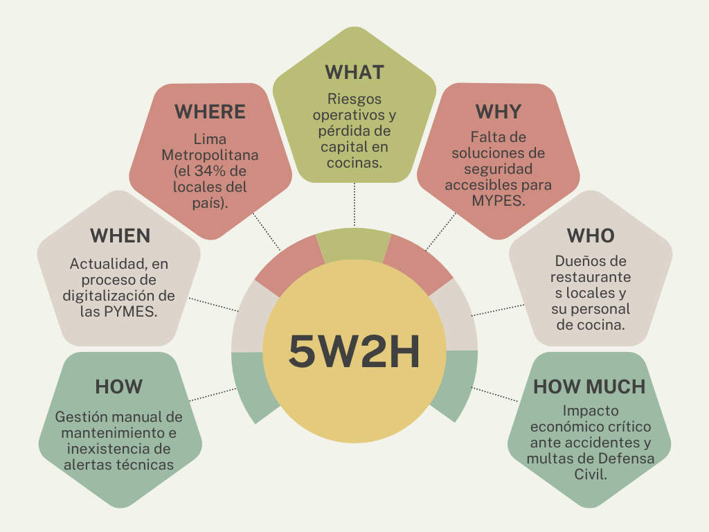

**VISIÓN ECONÓMICA NACIONAL**

En la actualidad, el Perú enfrenta desafíos estructurales persistentes. Según el Programa de las Naciones Unidas para el Desarrollo (2025), el país registró un Índice de Desarrollo Humano de 0,794, ubicándose en el puesto 79 de 193 países, aún por debajo del umbral de “alto desarrollo humano”. Asimismo, el Banco Mundial (2025) clasifica al Perú como una economía de ingreso mediano-alto; una categoría que, pese al crecimiento sostenido, evidencia brechas significativas respecto a las naciones desarrolladas. Esta condición intermedia exige estrategias que aceleren la inclusión social y económica.

Dentro del espectro de estrategias necesarias para consolidar esta estabilidad, la gestión de riesgos operativos y la seguridad preventiva a través de controles internos emerge como una estrategia destacada. De acuerdo con Hardvard Business School (2023), los controles internos son políticas y procesos que permiten a los gerentes limitar las oportunidades en que los empleados exponen sus negocios a riesgos. 

**ENFOQUE DE LA STARTUP**

Soulware identifica un alto potencial de optimización en las actividades de la economía popular, sectores frecuentemente desatendidos por la oferta tecnológica convencional. Las razones que sustentan este enfoque son:

1. **Impacto Estructural y Masa Crítica:** La relevancia de este sector se refleja en la estructura del mercado laboral. Según el INEI (2026), el empleo informal alcanzó al 70.2% de la población ocupada al cierre de 2025. Esta mayoría, concentrada en servicios y comercio tradicional, representa una alta densidad de unidades productoras cuyos procesos aún no se integran a la economía digital.

2. **Brecha y Disposición Tecnológica:** Existe una disparidad entre la infraestructura actual y la intención de modernización. Mientras predomina la informalidad, el 96% de las pymes reconoce la digitalización como factor clave para su crecimiento (Movistar Empresas, 2025). No obstante, el 73% carece del conocimiento técnico necesario. El hecho de que el 97% planee mantener o incrementar su inversión digital valida la demanda de soluciones con pertinencia cultural que faciliten esta transición.

**SELECCIÓN DEL ESPACIO DEL PROBLEMA**

En sentido de lo expuesto, se evaluaron diversas unidades económicas considerando su impacto económico (relevancia) y proximidad geográfica (idoneidad para la investigación), con el fin de delimitar el dominio del problema.

Se seleccionó el sector de restaurantes y servicios afines debido a su representatividad. De acuerdo con el INEI (2025), esta actividad aporta el 2.5% al PBI nacional, creció un 3.5% en 2024 y genera un millón de empleos directos. La muestra se concentra en Lima, región que agrupa el 34% de los establecimientos y el 41.6% del gasto total anual del sector a nivel nacional.

### 1.2.2. Lean UX Process

A continuación, se desarrolla el Lean UX Process, utilizando las plantillas para nuevas iniciativas y usando protopersonas, de acuerdo a como especifican Gothelf y Seiden (2021).

#### 1.2.2.1. Lean UX Problem Statements

Al estado actual de ***soluciones de seguridad y prevención de riesgos para restaurantes*** se han centrado principalmente en el mercado de las grandes cadenas de restaurantes.

Lo que las soluciones actuales no logran abordar es ***la facilidad de adopción y accesibilidad para negocios más pequeños***.

Nuestro producto va a superar esta brecha a través de ***ser una propuesta orientada al mercado de los negocios locales***.

Nuestro foco inicial va a centrar en ***los negocios más pequeños, restaurantes locales***.

Sabremos que hemos tenido éxito al observar ***adopción y retención del servicio a largo plazo***

#### 1.2.2.2. Lean UX Assumptions

**BUSINESS OUTCOMES**

- Reducción del impacto capital de accidentes en un 30%
- Cumplimiento de obligaciones de Defensa Civil

**USERS**

- Roberto (Dueño de restaurante)
- José (Cocinero / empleado)

**USER OUTCOMES**

- Prevenir accidentes en la cocina
- Responder ante accidentes
- Tener una visión del estado de los equipos

**FEATURES**

- Monitorear temperatura y humo de la cocina
- Registrar fecha de ejecución de mantenimientos en los equipos
- Activación automática y manual de alarmas
- Activación automática y manual de turbinas
- Llamada automática a los bomberos

#### 1.2.2.3. Lean UX Hypothesis Statements

- Creemos que el cumplimiento de las obligaciones de Defensa Civil se logrará si Roberto (Emprendedor) logra prevenir multas y sanciones mediante el registro de la fecha de ejecución de mantenimientos en los equipos.

- Creemos que una reducción del impacto capital de accidentes en un 30% se logrará si Jose (Cocinero) puede responder ante accidentes y prevenir incidentes en la cocina a través del monitoreo de temperatura y humo, junto con la activación automática de alarmas.

- Creemos que una reducción del impacto capital de accidentes se logrará si Roberto (Emprendedor) obtiene una visión del estado de los equipos mediante la llamada automática a los bomberos y la activación automática y manual de turbinas ante emergencias detectadas.

#### 1.2.2.4 Lean UX Canvas

Se presenta la primera iteración del Lean UX Canvas v2, utilizando las recomendaciones y formatos recomendados por la plantilla.

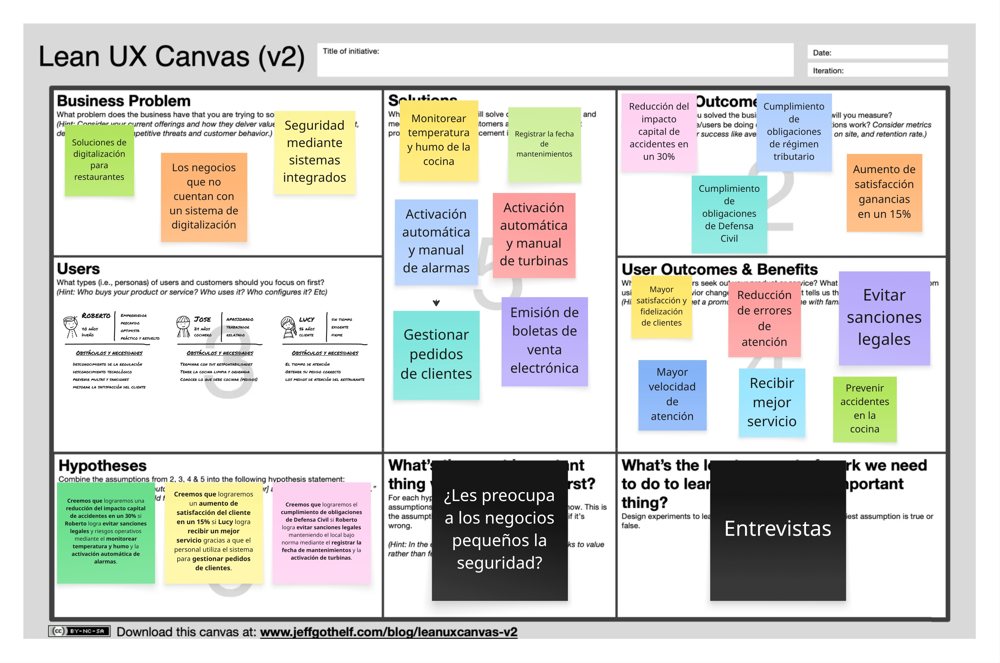

## 1.3. Segmentos Objetivo

**DUEÑOS DE RESTAURANTES**

- Edad: Según COPEME (2023), el 50.7% de emprendedores se encuentran entre 18 y 34 años de edad.
- Género: De acuerdo con el INEI (2025), el 72.7% de los trabajadores del sector restaurantes son mujeres.
- Emprendimiento: Según el INEI (2024), los negocios en general están principalmente constituidos como persona natural, representación que alcanza el 73.5% del total de las empresas.
- Segmento económico: De acuerdo con el INEI (2024), en el régimen de Sociedades Anónimas, el 96.5% de las empresas se clasifican como MyPE (84.7% microempresas y 11.8% pequeñas empresas), reflejando una estructura dominada por unidades con escalas de facturación y operación reducidas.

**COCINEROS**

- Edad: Según el INEI (2026), el mercado laboral se compone principalmente de trabajadores de 24 a 44 años (46.9%), seguido del grupo de 45 a más años de edad (38.5%).
- Género: De acuerdo con el INEI (2025), el 72.7% de los trabajadores del sector restaurantes son mujeres.

# Capítulo II: Requirements Elicitation & Analysis

## 2.1. Competidores

### 2.1.1. Análisis competitivo

<table>
    <thead>
        <tr>
            <th scope="col"><strong>Competitive Analysis Landscape<strong></th>
        </tr>
    </thead>
    <tbody>
        <!-- Introduction header -->
        <tr>
            <th scope="row" colspan="2">¿Por qué llevar a cabo este análisis?</th>
            <td colspan="4">Este análisis se realiza principalmente para identificar el estado del mercado y los segmentos objetivo que son atendidos actualmente, a fin de refinar la propuesta de valor central de la startup.</td>
        </tr>
        <!-- Companies header -->
        <tr>
            <th scope="row" colspan="2"></th>
            <td style="width: 25%; vertical-align: top;">Soulware 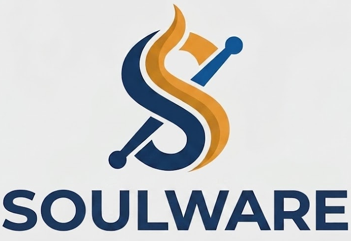</td>
            <td style="width: 25%; vertical-align: top;">Fitflow 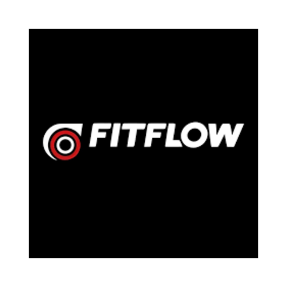</td>
            <td style="width: 25%; vertical-align: top;">Johnson Controls </td>
            <td style="width: 25%; vertical-align: top;">Grupo 3S </td>
        </tr>
        <!-- Profile -->
        <!-- Profile: Overview -->
        <tr>
            <th scope="row" rowspan="2">Perfil</th>
            <th scope="row">Overview</th>
            <td>Proveedor de seguridad tecnológica y automatización especializado en el soporte técnico y educativo para el ecosistema emprendedor y la pequeña empresa.</td>
            <td>Empresa regional líder en soluciones de protección contra incendios y bombeo de agua con presencia en 6 países.</td>
            <td>Líder global con más de 150 años de experiencia en soluciones inteligentes de detección y seguridad proteger personas y activos en diversos entornos.</td>
            <td>Empresa peruana con más de 20 años de trayectoria, especializada en soluciones integrales de diseño, suministro e instalación de sistemas de seguridad y protección contra incendios.</td>
        </tr>
        <!-- Profile: Ventaja competitiva -->
        <tr>
            <th scope="row">Ventaja competitiva ¿Qué valor ofrece a los clientes?</th>
            <td>Extrema facilidad de uso en sistemas automatizados y acompañamiento experto en la educación sobre procesos de control.</td>
            <td>Soporte de ingeniería y su propia escuela técnica (Fire School).</td>
            <td>Capacidad de autoevaluación revolucionaria (self-testing), supervisión electrónica 24/7 y la integración con la plataforma digital OpenBlue para mantenimiento conectado.</td>
            <td>Soporte de ingeniería, con asesoría legal y técnica para la implementación de protección contra incendios con múltiples estrategias y enfoques dada su alta gama y variedad de productos.</td>
        </tr>
        <!-- Perfil de Marketing -->
        <!-- Perfil de Marketing: Mercado Objetivo -->
        <tr>
            <th scope="row" rowspan="2">Perfil de Marketing</th>
            <th scope="row">Mercado objetivo</th>
            <td>Startups, nuevos emprendimientos, negocios locales y sectores comerciales con requerimientos de seguridad ágiles.</td>
            <td>Sectores industriales, mineros, energía, construcción y almacenes logísticos de gran envergadura.</td>
            <td>Centros de datos, hospitales, educación, gobierno federal, sector industrial, manufactura, transporte y grandes infraestructuras comerciales.</td>
            <td>Edificaciones residenciales (multifamiliares), sector comercial, industrial, almacenes y restaurantes/cocinas industriales.</td>
        </tr>
        <!-- Perfil de Marketing: Estrategias de marketing -->
        <tr>
            <th scope="row">Estrategias de marketing</th>
            <td>Posicionamiento como aliado educativo, marketing centrado en la usabilidad tecnológica y presencia en redes de emprendimiento.</td>
            <td>Enfoque en la educación técnica del sector, certificaciones de calidad (Trinorma ISO) y una red de distribución regional consolidada.</td>
            <td>Enfoque en "Smart Buildings", liderazgo en innovación digital (SaaS, AI), y posicionamiento como socio estratégico de ciclo de vida completo (desde el diseño hasta el mantenimiento).</td>
            <td>Liderazgo técnico a través de su "Biblioteca Técnica", posicionamiento basado en el cumplimiento estricto de normas locales de la regulación peruana y optimización económica de proyectos desde la fase inicial.</td>
        </tr>
        <!-- Perfil de Producto -->
        <!-- Perfil de Producto: Productos & Servicios -->
        <tr>
            <th scope="row" rowspan="3">Perfil de Producto</th>
            <th scope="row">Productos & Servicios</th>
            <td>
                * Paneles de control intuitivos 
                * Alarmas inteligentes 
                * Sensores plug-and-play 
                * Aplicaciones de gestión móvil 
                * Asesoría técnica normativa
            </td>
            <td>
                * Redes de agua 
                * Sistemas de espuma 
                * Bombas contra incendio 
                * Sistemas de detección y alarma varios 
                * Servicios de mantenimiento
            </td>
            <td>
                * Unidades de Control: Simplex, Autocall, FireClass 
                * Detección: Sensores de humo, CO, dispositivos de iniciación 
                * Notificación: Sirenas, luces estroboscópicas, altavoces direccionables 
                * Redes: Soluciones de red y estaciones de trabajo para grandes complejos
            </td>
            <td>
                * Sistemas de bombeo y redes de agua contra incendios 
                * Sistemas de rociadores automáticos y espumas 
                * Detección y alarma de incendios, y extracción de monóxido 
                * Sistemas de extinción por gases limpios (halocarbonados e inertes) 
                * Diseño, asesoría y simulaciones computacionales de incendio/evacuación
            </td>
        </tr>
        <!-- Perfil de Producto: Precios y Costos -->
        <tr>
            <th scope="row">Precios & Costos</th>
            <td>Estructura de costos escalable y accesible, orientada a minimizar la inversión inicial en infraestructura tecnológica pesada.</td>
            <td>Variable, según producto y cotización caso por caso</td>
            <td>Segmento corporativo y empresarial. Precios basados en el valor tecnológico, ROI (hasta 155% con OpenBlue) y ahorro a largo plazo por eficiencia operativa.</td>
            <td>Dependientes de la cotización, dado su esquema de consultoría + diseño e instalación, aunque altamente competitivos en el mercado local debido a la importación directa y la eliminación de subcontratistas en la etapa de instalación.</td>
        </tr>
        <!-- Perfil de Producto: Canales de distribución -->
        <tr>
            <th scope="row">Canales de distribución (Web y/o Móvil)</th>
            <td>Venta técnica directa, plataformas digitales y servicios de soporte especializado remoto o presencial.</td>
            <td>Venta directa técnica, sucursales regionales y canales digitales para soporte y repuestos.</td>
            <td>Fuerza de ventas corporativa directa, directiva global de expertos y red de socios/especialistas certificados.</td>
            <td>Venta directa mediante ingeniería de proyectos, servicios de consultoría técnica y contratos de instalación/mantenimiento.</td>
        </tr>
        <!-- Análisis SWOT -->
        <tr>
            <th scope="row" rowspan="4">Análisis SWOT</th>
            <th scope="row">Fortalezas</th>
            <td>
                * Curva de aprendizaje mínima para el usuario final 
                * Alta agilidad en la implementación 
                * Fuerte componente de valor agregado educativo
            </td>
            <td>
                * Capacidad logística regional 
                * Personal certificado 
                * Respaldo de fabricantes internacionales de primer nivel
            </td>
            <td>
                * Portafolio de clientes con marcas líderes 
                * I+D de vanguardia
            </td>
            <td>
                * Más de 20 años de experiencia en el mercado peruano 
                * Uso de herramientas avanzadas de cálculo y simulación (Cálculo hidráulico, FDS) 
                * Control total del ciclo de vida del proyecto (Diseño-Suministro-Instalación)
            </td>
        </tr>
        <tr>
            <th scope="row">Debilidades</th>
            <td>
                * Menor especialización en sistemas de protección contra incendios industriales de gran envergadura o complejidad pesada
            </td>
            <td>
                * Soluciones basadas en química y física pura, con poco espacio a digitalización 
                * Alta barrera de costos
            </td>
            <td>
                * Complejidad organizativa debido a su escala
            </td>
            <td>
                * Limitada presencia de marca fuera del territorio nacional frente a competidores regionales 
                * Dependencia directa de los ciclos de inversión del sector inmobiliario y construcción local
            </td>
        </tr>
        <tr>
            <th scope="row">Oportunidades</th>
            <td>
                * Creciente digitalización del sector minorista 
                * Aumento de la formalización de nuevos negocios que requieren cumplimiento normativo
            </td>
            <td>
                * Implementar tecnologías de monitoreo remoto 
                * Crecimiento por nuevas normativas de seguridad en la región
            </td>
            <td>
                * Tendencia a la digitalización 
                * Desarrollo de productos SaaS
            </td>
            <td>
                * Renovación de sistemas en edificaciones antiguas para cumplir con nuevas regulaciones 
                * Expansión en el nicho de edificios residenciales inteligentes y eficientes
            </td>
        </tr>
        <tr>
            <th scope="row">Amenazas</th>
            <td>
                * Competencia de soluciones de seguridad de consumo masivo (DIY) que carecen de soporte técnico y validación normativa comercial
            </td>
            <td>
                * Cambios constantes en la regulación internacional 
                * Alta competitividad en la cartera de clientes con negocios de alto nivel
            </td>
            <td>
                * Creciente demanda de edificios Net Zero 
                * Actualización de infraestructuras críticas post-pandemia
            </td>
            <td>
                * Ambigüedad en las normativas nacionales que permite la competencia de soluciones informales o de baja calidad 
                * Volatilidad en los precios de equipos importados por factores macroeconómicos
            </td>
        </tr>
    </tbody>
</table>

### 2.1.2. Estrategias y tácticas frente a competidores

**Estrategia 1: Concentración en negocios de pequeña escala**

- Táctica 1.1: Diseño de protocolos de seguridad simplificados que atiendan las preocupaciones específicas de locales comerciales pequeños y oficinas de dimensiones reducidas.
- Táctica 1.2: Implementación de auditorías de riesgo focalizadas en activos críticos para microempresas, optimizando el presupuesto de seguridad.

**Estrategia 2: Educación sobre procesos de control para nuevos emprendimientos**

- Táctica 2.1: Desarrollo de programas de capacitación en normativas locales y estándares de seguridad para dueños de negocios en fase de apertura.
- Táctica 2.2: Provisión de guías instructivas sobre gestión de riesgos y procesos de control interno para facilitar la autogestión del cliente.

**Estrategia 3: Automatización con herramientas intuitivas y accesibles**

- Táctica 3.1: Despliegue de paneles de control táctiles con interfaces gráficas simplificadas, eliminando la necesidad de personal técnico especializado para la operación diaria.
- Táctica 3.2: Integración de herramientas de monitoreo automatizado con acceso multiplataforma, diseñadas para una supervisión remota fácil y eficiente.
- Táctica 3.3: Inclusión de elementos de utilidad práctica que sirvan de hook principal en el posicionamiento del producto.

## 2.2. Entrevistas

### 2.2.1. Diseño de entrevistas

**DUEÑOS**

- Cuéntenos un poco acerca de usted y la historia de su negocio 
- ¿Ha implementado procesos de control internos para prevenirlos?
    1. ***(SI RESPONDE QUE NO)***
        - ¿Por qué no? ¿Se ha planteado en algún futuro implementar algún control interno?
        - ¿Cree que sería más fácil o más prioritario para su negocio adoptar estrategias de prevención de riesgos si los procesos de control fueran automáticos?
    2. **(SI RESPONDE QUE SÍ)**
        - ¿Cómo da seguimiento al cumplimiento de dichos controles por parte de sus empleados?
        1. **(SI MENCIONA AUTOMATIZACIÓN)**
            - ¿Qué considera que es lo más valioso de tener automatizados los procesos de control internos? 
        2. **(SI NO MENCIONA AUTOMATIZACIÓN)**
            - ¿Considera que la capacidad de automatizar ciertos procesos de control o digitalizar su seguimiento tendría beneficios para su negocio?

**COCINEROS**

- Cuéntenos sobre usted y su historia de cómo empezó a trabajar en el restaurante 
- En su trabajo como cocinero, ¿tiene otras responsabilidades además de cocinar? 
    1. **(SI RESPONDE QUE SÍ)**
        1. ¿Algunas de ellas están orientadas a la prevención de riesgos? (Saneamiento, detección de desperfectos en los equipos e instalaciones etc.)
    2. **(SI RESPONDE QUE NO)**
        1. ¿Hay otra persona encargada de labores orientadas a prevención de riesgos como las mencionadas?
- ¿Qué opinión te merece esa clase de procesos y tareas? ¿Crees que tienen un impacto positivo, que son muy cansados o tal vez innecesarios?
- ¿Cree que si estos procesos de control fueran automáticos y/o digitalizados tendría un impacto positivo en su trabajo o en el negocio?

### 2.2.2. Registro de entrevistas

**DUEÑOS DE RESTAURANTES**

<table>
    <thead>
        <tr>
            <th>Segmento</th>
            <th>Datos y resumen</th>
            <th>Evidence</th>
        </tr>
    </thead>
    <!--Segmento A -->
    <tbody>
        <tr>
            <th rowspan="8" scope="rowgroup">Dueños de restaurantes</th>
            <td rowspan="2">
                <strong>José Augusto Castillo Aguilar (52 años)</strong> 
                Distrito: Santiago de Surco 
                <strong>RESUMEN</strong> 
                El entrevistado comenta que lleva ocho años en su emprendimiento. 
                Señala que en su restaurante el mismo, personalmente, realiza los procesos de control en conjunto con un ayudante con el fin de realizar un control de calidad a los insumos. 
                Para ello, se sirven de un formato impreso que posteriormente destinan a un área de digitación. Comenta que este proceso conllevaba retrassos y errores. 
                Comenta que la digitalización directa de dichos registros podría evitar errores y acelerar los procesos.
            </td>
            <td>
                 
            </td>
        </tr>
        <tr>
            <td>
                <a href="https://upcedupe-my.sharepoint.com/personal/u202313655_upc_edu_pe/_layouts/15/stream.aspx?id=%2Fpersonal%2Fu202313655_upc_edu_pe%2FDocuments%2Fupc-pre-202610-1asi0572-6776-soulware-needfinding-sprint-1%2Emp4&nav=eyJyZWZlcnJhbEluZm8iOnsicmVmZXJyYWxBcHAiOiJPbmVEcml2ZUZvckJ1c2luZXNzIiwicmVmZXJyYWxBcHBQbGF0Zm9ybSI6IldlYiIsInJlZmVycmFsTW9kZSI6InZpZXciLCJyZWZlcnJhbFZpZXciOiJNeUZpbGVzTGlua0NvcHkifX0&ga=1&referrer=StreamWebApp%2EWeb&referrerScenario=AddressBarCopied%2Eview%2E60f4becb-1e8d-4d2a-a717-2d47baa1a405">Start: 00:00 | Duration: 6:40</a>
            </td>
        </tr>
        <tr>
            <td rowspan="2">
                <strong>Santiago Sebastián López Resentería (31 años)</strong> 
                Distrito: San Juan de Miraflores 
                <strong>RESUMEN</strong> 
                El entrevistado cuenta que su emprendimiento tiene aproximadamente 3 años. 
                Comenta que tiene alguno que otro proceso de control, principalmente orientado al mantenimiento de la cocina, a cargo de cada uno de los empleados. 
                Señala que tiene planeado en algun futuro adoptar formatos digitalizados, principalmente en documentos word. 
            </td>
            <td>
                 
            </td>
        </tr>
        <tr>
            <td>
                <a href="https://upcedupe-my.sharepoint.com/personal/u202313655_upc_edu_pe/_layouts/15/stream.aspx?id=%2Fpersonal%2Fu202313655_upc_edu_pe%2FDocuments%2Fupc-pre-202610-1asi0572-6776-soulware-needfinding-sprint-1%2Emp4&nav=eyJyZWZlcnJhbEluZm8iOnsicmVmZXJyYWxBcHAiOiJPbmVEcml2ZUZvckJ1c2luZXNzIiwicmVmZXJyYWxBcHBQbGF0Zm9ybSI6IldlYiIsInJlZmVycmFsTW9kZSI6InZpZXciLCJyZWZlcnJhbFZpZXciOiJNeUZpbGVzTGlua0NvcHkifX0&ga=1&referrer=StreamWebApp%2EWeb&referrerScenario=AddressBarCopied%2Eview%2E60f4becb-1e8d-4d2a-a717-2d47baa1a405">Start: 06:41 | Duration: 3:37</a>
            </td>
        </tr>
        <tr>
            <td rowspan="2">
                <strong>Enrique Shimabuko (57 años)</strong> 
                Distrito: Santiago de Surco 
                <strong>RESUMEN</strong> 
                El entrevistado cuenta que tiene aproximadamente 20 años de experiencia trabajando en el sector de restaurantes, teniendo su emprendimiento desde hace unos cuantos años. 
                Explica que actualmente en su negocio tiene implementadas algunas medidas de seguridad y supervisa ciertos procesos personalmente, pues como dueño también participa de la cocina, entre otras actividades como el control de calidad de los ingredientes. 
                Por último, expresa que no ve personalmente mucho potencial de usar sistemas automatizados en su negocio, pues cree que se da bastante a basto con la forma en que realiza las cosas y que su escala de inversión no amerita tanto gasto en prevención de riesgos.
            </td>
            <td>
                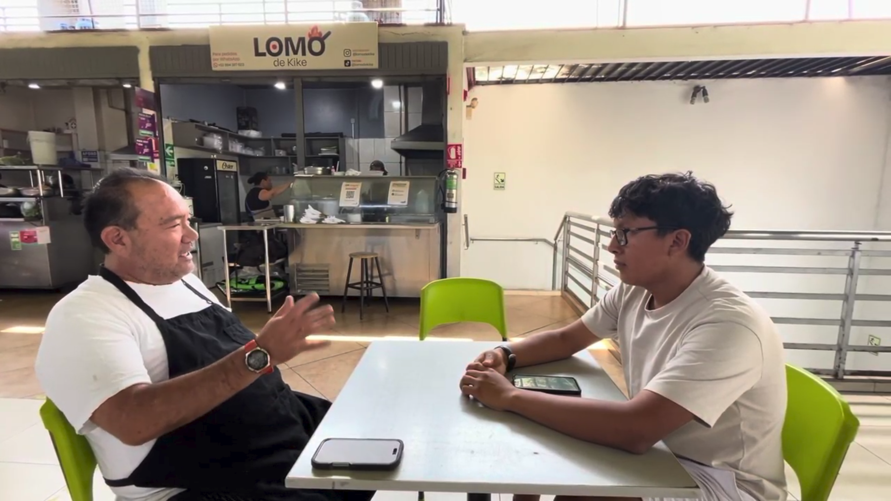 
            </td>
        </tr>
        <tr>
            <td>
                <a href="https://upcedupe-my.sharepoint.com/personal/u202313655_upc_edu_pe/_layouts/15/stream.aspx?id=%2Fpersonal%2Fu202313655_upc_edu_pe%2FDocuments%2Fupc-pre-202610-1asi0572-6776-soulware-needfinding-sprint-1%2Emp4&nav=eyJyZWZlcnJhbEluZm8iOnsicmVmZXJyYWxBcHAiOiJPbmVEcml2ZUZvckJ1c2luZXNzIiwicmVmZXJyYWxBcHBQbGF0Zm9ybSI6IldlYiIsInJlZmVycmFsTW9kZSI6InZpZXciLCJyZWZlcnJhbFZpZXciOiJNeUZpbGVzTGlua0NvcHkifX0&ga=1&referrer=StreamWebApp%2EWeb&referrerScenario=AddressBarCopied%2Eview%2E60f4becb-1e8d-4d2a-a717-2d47baa1a405">Start: 10:19 | Duration: 4:01</a>
            </td>
        </tr>
        <tr>
            <td rowspan="2">
                <strong>Luis Miguel Coello Medrano (60 años)</strong> 
                Distrito: San Juan de Miraflores 
                <strong>RESUMEN</strong> 
                El entrevistado explica que su negocio es una pizzería familiar, llevada en conjunto con esposa, hijas y su suegra. 
                Describe alegremente que implementa procesos de control de seguridad y control de calidad, cuya supervisión basados en la confianza, dada la cercanía y confianza con los miembros de su familia quienes trabajan en su negocio. Señala que estos procesos de control le han ayudado a prevenir un accidente con una fuga de gas. 
                Explica que considera que digitalizar el registro del cumplimiento de los procesos de control que implementa con su familia como una medida de seguridad y de transparencia adicional a su propia responsabilidad, cuidado y disciplina personal.
            </td>
            <td>
                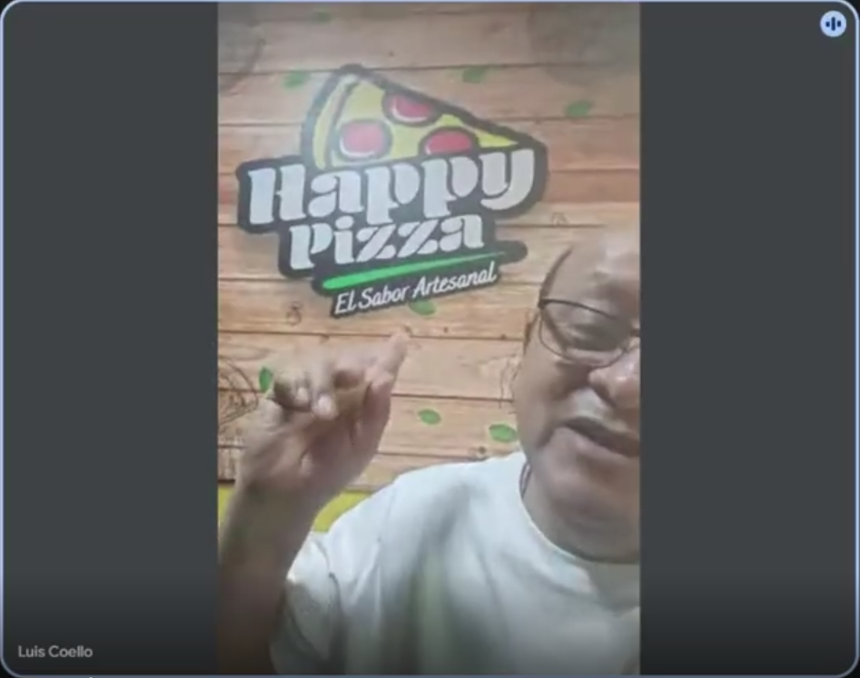 
            </td>
        </tr>
        <tr>
            <td>
                <a href="https://upcedupe-my.sharepoint.com/personal/u202313655_upc_edu_pe/_layouts/15/stream.aspx?id=%2Fpersonal%2Fu202313655_upc_edu_pe%2FDocuments%2Fupc-pre-202610-1asi0572-6776-soulware-needfinding-sprint-1%2Emp4&nav=eyJyZWZlcnJhbEluZm8iOnsicmVmZXJyYWxBcHAiOiJPbmVEcml2ZUZvckJ1c2luZXNzIiwicmVmZXJyYWxBcHBQbGF0Zm9ybSI6IldlYiIsInJlZmVycmFsTW9kZSI6InZpZXciLCJyZWZlcnJhbFZpZXciOiJNeUZpbGVzTGlua0NvcHkifX0&ga=1&referrer=StreamWebApp%2EWeb&referrerScenario=AddressBarCopied%2Eview%2E60f4becb-1e8d-4d2a-a717-2d47baa1a405">Start: 14:21 | Duration: 6:53</a>
            </td>
        </tr>
    </tbody>
    <!-- Segmento B -->
    <tbody>
        <tr>
            <th rowspan="6" scope="rowgroup">Cocineros</th>
            <td rowspan="2">
                <strong>José Ordóñez (22 años)</strong> 
                Distrito: San Juan de Miraflores 
                <strong>RESUMEN</strong> 
                El entrevistado comentó que empezó a trabajar a través de la confianza de un contacto que ya trabajaba para el negocio. 
                Señala que realiza múltiples labores según lo necesite el negocio, entre ellas, cocinero y repartidor, así como orientados a la señalética. Además, contó que ciertos procesos como la reposición de extinguidores en el local están a cargo de una empresa subcontratada. 
                Sus principales apreciaciones sobre la importancia de la prevención de riesgos y procesos de control interno son que son beneficiosos, pero que los negocios podrían prescindir de ellos. 
                Por último, mostró entusiasmo frente a la automatización, hablando un poco acerca de como sistemas inteligentes podrían aumentar el impacto de los mecanismos que ya poseen como los detectores de humo.
            </td>
            <td>
                 
            </td>
        </tr>
        <tr>
            <td>
                <a href="https://upcedupe-my.sharepoint.com/personal/u202313655_upc_edu_pe/_layouts/15/stream.aspx?id=%2Fpersonal%2Fu202313655_upc_edu_pe%2FDocuments%2Fupc-pre-202610-1asi0572-6776-soulware-needfinding-sprint-1%2Emp4&nav=eyJyZWZlcnJhbEluZm8iOnsicmVmZXJyYWxBcHAiOiJPbmVEcml2ZUZvckJ1c2luZXNzIiwicmVmZXJyYWxBcHBQbGF0Zm9ybSI6IldlYiIsInJlZmVycmFsTW9kZSI6InZpZXciLCJyZWZlcnJhbFZpZXciOiJNeUZpbGVzTGlua0NvcHkifX0&ga=1&referrer=StreamWebApp%2EWeb&referrerScenario=AddressBarCopied%2Eview%2E60f4becb-1e8d-4d2a-a717-2d47baa1a405">Start: 21:15 | Duration: 6:30</a>
            </td>
        </tr>
        <tr>
            <td rowspan="2">
                <strong>Jesús Guillermo Uribe Quispe (21 años)</strong> 
                Distrito: Santiago de Surco 
                <strong>RESUMEN</strong> 
                El entrevistado comentó haber trabajado antiguamente como lavaplatos y posteriormente cocinero en un sushi bar. 
                Explicó que en el sushi bar se llevan a cabo una serie de procesos de control internos, principalmente en cuanto a la gestión de alérgenos y la contaminación cruzada. 
                Comentó que estos procesos los supervisaba él mismo, ya que era el encargado. 
                Además, expresa que personalmente cree que estos procesos son muy positivos, comentando brevemente la experiencia donde estos controles ayudaron a prevenir entregar un plato que podía haber desatado una reacción alérgica en una cliente. 
                Por último, cree que la digitalización sería una buena forma de mantener presente de forma constante una serie de procesos de control, mejorando la transparencia sobre su cumplimiento.
            </td>
            <td>
                 
            </td>
        </tr>
        <tr>
            <td>
                <a href="https://upcedupe-my.sharepoint.com/personal/u202313655_upc_edu_pe/_layouts/15/stream.aspx?id=%2Fpersonal%2Fu202313655_upc_edu_pe%2FDocuments%2Fupc-pre-202610-1asi0572-6776-soulware-needfinding-sprint-1%2Emp4&nav=eyJyZWZlcnJhbEluZm8iOnsicmVmZXJyYWxBcHAiOiJPbmVEcml2ZUZvckJ1c2luZXNzIiwicmVmZXJyYWxBcHBQbGF0Zm9ybSI6IldlYiIsInJlZmVycmFsTW9kZSI6InZpZXciLCJyZWZlcnJhbFZpZXciOiJNeUZpbGVzTGlua0NvcHkifX0&ga=1&referrer=StreamWebApp%2EWeb&referrerScenario=AddressBarCopied%2Eview%2E60f4becb-1e8d-4d2a-a717-2d47baa1a405">Start: 27:46 | Duration: 5:38</a>
            </td>
        </tr>
        <tr>
            <td rowspan="2">
                <strong>MIlenio Huamán Hinostroza (24 años)</strong> 
                Distrito: La Molina 
                <strong>RESUMEN</strong> 
                Relata que comenzó a trabajar en una pizzería tras terminar el colegio, dada la facilidad de cumplir con las expectativas laborales. 
                Señala que considera que no tiene "otras responsabilidades" además de cocinar, sino que percibe que actividades de control de calidad y de seguridad como la limpieza son parte del trabajo de cocinero en sí mismo. Eso sí, destaca que había una supervisión constante por parte del dueño del local con actividades complementarias como simulacros o capacitaciones. 
                Razona que a pesar de que nunca ha experimentado algún siniestro en su tiempo laborando para la pizzería, sí considera que estos procesos de control son importantes, pues justamente son estos los que previenen que estos siniestros terminen ocurriendo. 
                Considera que la digitalización ayudaría a mantener la transparencia y serviría como una capa adicional de protección y cumplimiento adicionales a la responsabilidad suya y de otros trabajadores.
            </td>
            <td>
                 
            </td>
        </tr>
        <tr>
            <td>
                <a href="https://upcedupe-my.sharepoint.com/personal/u202313655_upc_edu_pe/_layouts/15/stream.aspx?id=%2Fpersonal%2Fu202313655_upc_edu_pe%2FDocuments%2Fupc-pre-202610-1asi0572-6776-soulware-needfinding-sprint-1%2Emp4&nav=eyJyZWZlcnJhbEluZm8iOnsicmVmZXJyYWxBcHAiOiJPbmVEcml2ZUZvckJ1c2luZXNzIiwicmVmZXJyYWxBcHBQbGF0Zm9ybSI6IldlYiIsInJlZmVycmFsTW9kZSI6InZpZXciLCJyZWZlcnJhbFZpZXciOiJNeUZpbGVzTGlua0NvcHkifX0&ga=1&referrer=StreamWebApp%2EWeb&referrerScenario=AddressBarCopied%2Eview%2E60f4becb-1e8d-4d2a-a717-2d47baa1a405">Start: 34:25 | Duration: 4:22</a>
            </td>
        </tr>
    </tbody>
</table>

### 2.2.3. Análisis de entrevistas

**DUEÑOS DE RESTAURANTES**

1. **Edad:** Se utiliza como valor representativo la media aritmética de los datos obtenidos.

| Entrevistado | Edad |
| :--- | :---: |
| José Augusto Castillo Aguilar | 52 |
| Santiago Sebastián López Resentería | 31 |
| Enrique Shimabuko | 57 |
| Luis Miguel Coello Medrano | 60 |
| **Media aritmética** | **50** |

2. **Género:** Se utiliza como dato representativo la moda.

| Entrevistado | Género |
| :--- | :--- |
| José Augusto Castillo Aguilar | Masculino |
| Santiago Sebastián López Resentería | Masculino |
| Enrique Shimabuko | Masculino |
| Luis Miguel Coello Medrano | Masculino |
| **Moda** | **Masculino** |

3. **Años como emprendedor:** Se utiliza como valor representativo la media aritmética.

| Entrevistado | Años como emprendedor |
| :--- | :---: |
| José Augusto Castillo Aguilar | 8 |
| Santiago Sebastián López Resentería | 3 |
| Enrique Shimabuko | 3 |
| Luis Miguel Coello Medrano | 6 |
| **Media aritmética** | **5 años** |

4. **Implementación de procesos de control:** Se utiliza como dato representativo la moda.

| Entrevistado | Implementación de procesos |
| :--- | :---: |
| José Augusto Castillo Aguilar | Sí |
| Santiago Sebastián López Resentería | Sí |
| Enrique Shimabuko | Sí |
| Luis Miguel Coello Medrano | Sí |
| **Moda** | **Sí** |

5. **Tipo de implementación:** Se utiliza como dato representativo la moda.

| Entrevistado | Tipo de implementación |
| :--- | :--- |
| José Augusto Castillo Aguilar | Manual (Formato impreso / Digitación posterior) |
| Santiago Sebastián López Resentería | Manual (A cargo de empleados) |
| Enrique Shimabuko | Manual (Supervisión personal) |
| Luis Miguel Coello Medrano | Manual (Basado en la confianza familiar) |
| **Moda** | **Manual** |

6. **Opinión frente a la digitalización:** Se utiliza como medida representativa un análisis cualitativo y literal de las opiniones expresadas por los entrevistados.

| Entrevistado | Opinión expresada |
| :--- | :--- |
| José Augusto Castillo Aguilar | Considera que podría evitar errores y acelerar los procesos. |
| Santiago Sebastián López Resentería | Tiene planeado adoptar formatos digitalizados (Word) en el futuro. |
| Enrique Shimabuko | No ve potencial; considera que su escala no amerita el gasto. |
| Luis Miguel Coello Medrano | La considera una medida de seguridad y transparencia adicional. |
| **Análisis cualitativo** | **Existe una inclinación mayoritaria hacia la digitalización como herramienta de optimización y seguridad, condicionada por la escala de inversión.** |

7. **Uso de dispositivos:** Se utiliza como dato representativo las opciones con mayor frecuencia.

| Entrevistado | Dispositivo |
| :--- | :--- |
| José Augusto Castillo Aguilar | Celular (iPhone) |
| Santiago Sebastián López Resentería | Celular |
| Enrique Shimabuko | Celular |
| Luis Miguel Coello Medrano | Celular |
| **Moda** | **Celular** |

8. **Navegadores:** Se utiliza como dato representativo la moda.

| Entrevistado | Navegador |
| :--- | :--- |
| José Augusto Castillo Aguilar | Safari |
| Santiago Sebastián López Resentería | Chrome |
| Enrique Shimabuko | Chrome |
| Luis Miguel Coello Medrano | Chrome |
| **Moda** | **Chrome** |

**COCINEROS**

1. **Edad:** Se utiliza como valor representativo la media aritmética de los datos obtenidos.

| Entrevistado | Edad |
| :--- | :---: |
| José Ordóñez | 22 |
| Jesús Guillermo Uribe Quispe | 21 |
| Milenio Huamán Hinostroza | 24 |
| **Media aritmética** | **22 años** |

2. **Género:** Se utiliza como dato representativo la moda.

| Entrevistado | Género |
| :--- | :--- |
| José Ordóñez | Masculino |
| Jesús Guillermo Uribe Quispe | Masculino |
| Milenio Huamán Hinostroza | Masculino |
| **Moda** | **Masculino** |

3. **Rol frente a procesos de control:** Se utiliza como dato representativo la moda.

| Entrevistado | Rol identificado |
| :--- | :--- |
| José Ordóñez | Ejecutor de labores preventivas (señalética) |
| Jesús Guillermo Uribe Quispe | Encargado de supervisión de procesos internos |
| Milenio Huamán Hinostroza | Ejecutor (integrado en labores de cocina) |
| **Moda** | **Ejecutor** |

4. **Actitud y opinión frente a procesos de control:** Se utiliza como medida representativa un análisis cualitativo y literal de las opiniones expresadas por los entrevistados.

| Entrevistado | Opinión expresada |
| :--- | :--- |
| José Ordóñez | Considera que son beneficiosos, aunque opina que los negocios podrían prescindir de ellos. |
| Jesús Guillermo Uribe Quispe | Perspectiva muy positiva; destaca su utilidad para prevenir incidentes críticos. |
| Milenio Huamán Hinostroza | Los considera fundamentales como barrera preventiva contra siniestros. |
| **Análisis cualitativo** | **Se observa una valoración positiva generalizada, fundamentada en la capacidad de los controles para mitigar riesgos operativos y sanitarios.** |

5. **Opinión frente a la digitalización:** Se utiliza como medida representativa un análisis cualitativo y literal de las opiniones expresadas por los entrevistados.

| Entrevistado | Opinión expresada |
| :--- | :--- |
| José Ordóñez | Entusiasta; resalta el potencial de los sistemas inteligentes para potenciar mecanismos de seguridad. |
| Jesús Guillermo Uribe Quispe | Considera que su principal beneficio es la transparencia. |
| Milenio Huamán Hinostroza | Considera que aporta transparencia y una capa adicional de protección al cumplimiento. |
| **Análisis cualitativo** | **Predomina una actitud de apertura y entusiasmo hacia la automatización como complemento de seguridad y transparencia institucional.** |

6. **Uso de dispositivos:** Se utiliza como dato representativo las opciones con mayor frecuencia.

| Entrevistado | Dispositivo |
| :--- | :--- |
| José Ordóñez | Celular |
| Jesús Guillermo Uribe Quispe | Laptop y Celular |
| Milenio Huamán Hinostroza | Celular |
| **Mayor frecuencia** | **Celular** |

7. **Navegadores:** Se utiliza como dato representativo la moda.

| Entrevistado | Navegador |
| :--- | :--- |
| José Ordóñez | Chrome |
| Jesús Guillermo Uribe Quispe | Safari |
| Milenio Huamán Hinostroza | Chrome |
| **Moda** | **Chrome** |

## 2.3. Needfinding

### 2.3.1. User Personas

A continuación, presentamos los arquetipos de usuario (perfiles ficticios) creados a partir de los segmentos que investigamos y entrevistamos. Cada perfil detalla aspectos clave como demografía, personalidad, motivaciones, metas, obstáculos y hábitos, así como su experiencia con productos afines. Toda esta información fue extraída de entrevistas reales y estructurada mediante la plataforma UXPressia.

**DUEÑO DE RESTAURANTE / ROBERTO CORNEJO**

**COCINERO / JOSÉ SANCHEZ**

### 2.3.2. User Task Matrix

La User Task Matrix es una herramienta clave para desglosar las acciones específicas que las personas realizan dentro de nuestra plataforma. Al evaluar la recurrencia y el impacto de cada tarea, obtenemos la claridad necesaria para enfocar de manera eficiente nuestros esfuerzos de diseño y desarrollo, garantizando así una mejora continua en la experiencia del usuario.

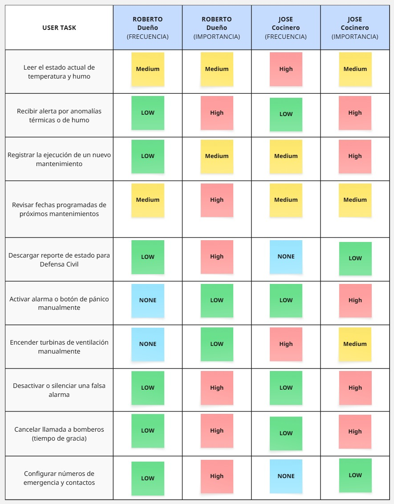

La User Task Matrix revela una clara división en los modelos de interacción de ambos arquetipos, lo que dictará la arquitectura de la información de la solución. Por un lado, Roberto (el Dueño) tiene un perfil de usuario supervisor; sus interacciones son de baja frecuencia pero de altísima importancia, centradas en la configuración, la mitigación de riesgos financieros (cancelar falsas alarmas, recibir alertas críticas) y el cumplimiento normativo (reportes para Defensa Civil). Por otro lado, José (el Cocinero) es un usuario operativo con tareas de alta frecuencia, interactuando constantemente con el sistema en el día a día para monitorear el entorno, encender turbinas y registrar mantenimientos.

### 2.3.3. User Journey Mapping

Se desarrolla el User Journey Mapping en base al As_is del flujo de trabajo de los User Persona anteriormente elaborados

**DUEÑO DE RESTAURANTE / ROBERTO CORNEJO**

Roberto enfrenta un ciclo reactivo cada vez que se aproxima una inspección de Defensa Civil. Sin registros organizados ni herramientas digitales, depende de su memoria, papeles dispersos y gestiones apresuradas para preparar su local. La falta de un sistema de acompañamiento continuo hace que repita el mismo proceso desorganizado en cada inspección.

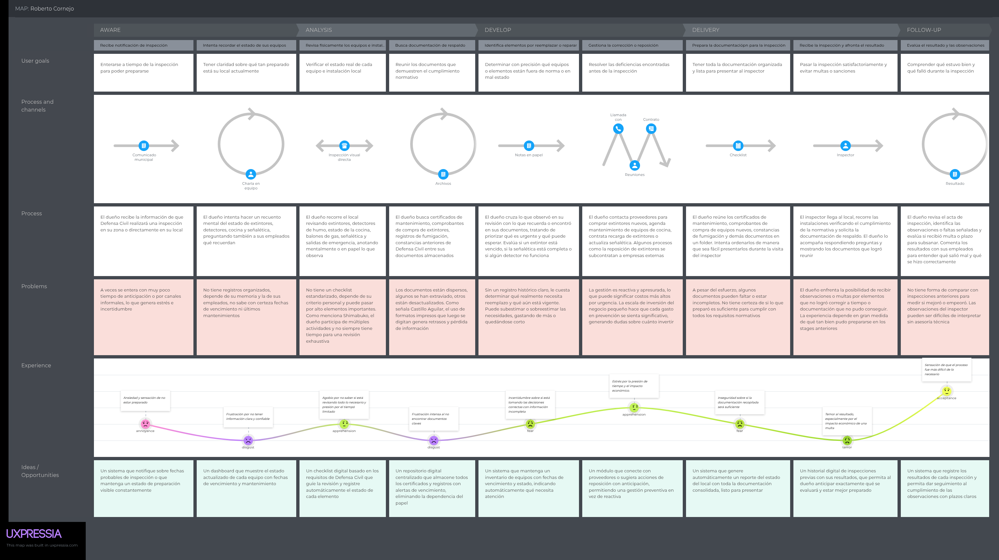

**COCINERO / JOSÉ SANCHEZ**

José depende completamente de sus sentidos y criterio personal para detectar, evaluar y responder ante riesgos en la cocina. Sin sensores, protocolos claros ni mecanismos de registro, enfrenta cada incidente de forma improvisada. Sus propuestas de mejora quedan en conversaciones informales sin garantía de implementación.

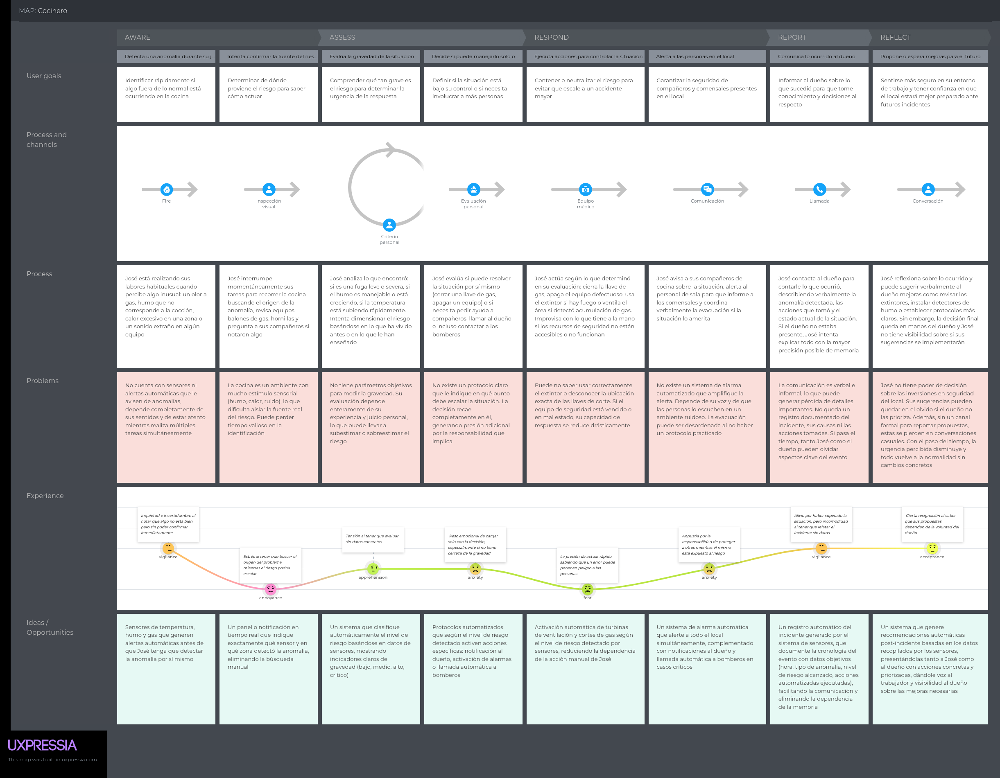

### 2.3.4. Empathy Mapping

**DUEÑO DE RESTAURANTE / ROBERTO CORNEJO**
Se representan las necesidades, frustraciones y oportunidades del dueño del restaurante, así como las percepciones de su entorno y sus propias observaciones. Su principal dolor es no tener visibilidad continua del estado de su local, y su mayor aspiración es contar con una herramienta accesible que le permita gestionar la prevención de forma constante sin comprometer su presupuesto limitado.

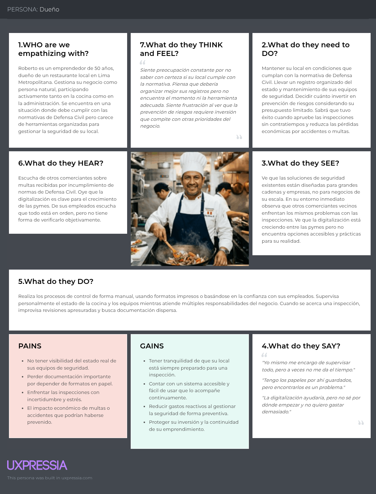

**COCINERO / JOSÉ SANCHEZ**
Se representan las necesidades, frustraciones y oportunidades del cocinero, así como las percepciones de su entorno y sus propias observaciones. José es un trabajador joven que enfrenta riesgos operativos diarios dependiendo únicamente de sus sentidos y criterio personal. Su principal dolor es cargar con la responsabilidad de detectar y responder ante emergencias sin herramientas ni protocolos claros, y su mayor aspiración es trabajar en un entorno donde la tecnología lo respalde y sus observaciones sobre seguridad sean consideradas.

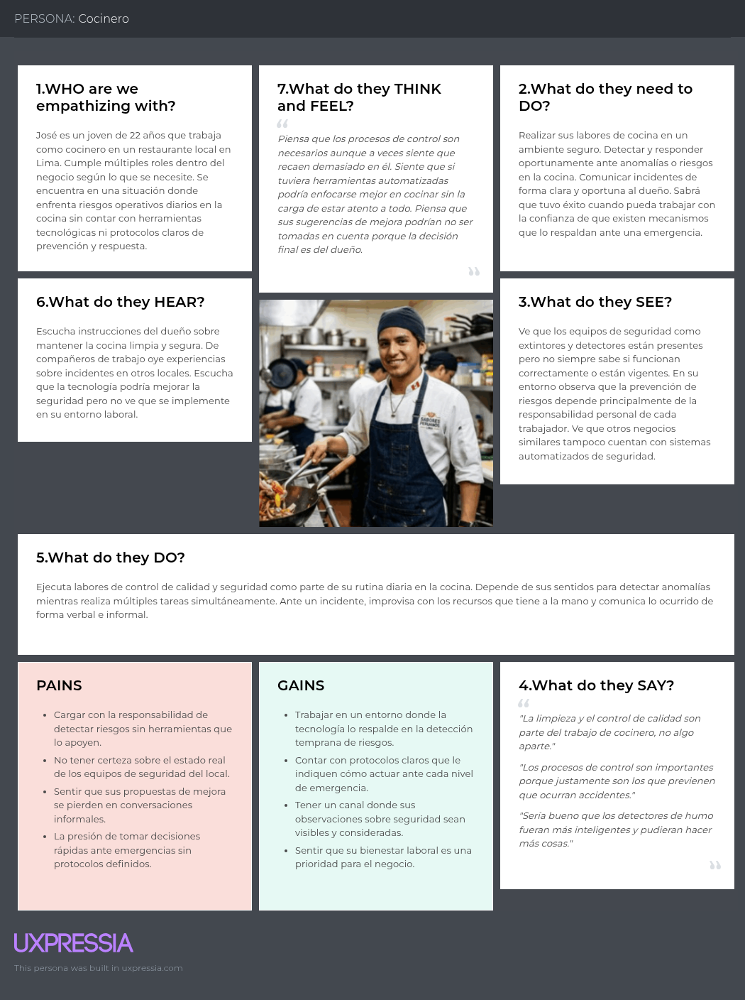

## 2.4. Big Picture EventStorming

**Paso 1: Identificar de eventos**
El proceso comenzó identificando todos los eventos significativos que ocurren en el ecosistema de la cocina. Nos enfocamos en verbos en pasado: Process added, Device added, Risk detected, User added. En esta etapa, el objetivo fue no dejar nada fuera.

**Paso 2: Ordenar eventos**
Ordenamos los eventos cronológicamente. Aquí fue donde notamos que el flujo de Cocina360 no es lineal, sino que tiene ramas paralelas.

**Paso 3: Identificar puntos pivote**
Identificamos los eventos que marcan un cambio de fase en el negocio. El más importante fue la división entre la gestión de dispositivos IoT y la identificación de riesgos. Estos puntos nos dieron las primeras pistas sobre dónde estarían las fronteras de nuestros contextos.

**Paso 4: Identificar comandos**
Para cada evento, definimos la acción humana o del sistema que lo dispara. Por ejemplo:

El comando Add registry dispara el evento Registry added.

El comando Manual activation dispara Actuator activated.

**Paso 5: Identificar políticas**
Establecimos las reglas de "Siempre que ocurra X, haz Y". Una política clave en Cocina360 es: Siempre que se detecte un riesgo (Risk detected), activar el protocolo de emergencia o actuar sobre el actuador (Actuator activated). Esto une el mundo de los sensores con la seguridad del local.

**Paso 6: Vistas y lecturas**
Diseñamos lo que los usuarios necesitan ver para tomar decisiones.

**Paso 7: Actores**
Asignamos responsabilidades. Identificamos claramente que el Dueño interactúa mayormente con la configuración, el Encargado con la ejecución de procesos, y el Sistema con la detección de riesgos de seguridad.

**Paso 8: Identificar de Agregados**
Este fue el punto de debate técnico más rico en dominio. Decidimos romper la idea de un "Agregado Restaurante" gigante para evitar cuellos de botella. Definimos tres raíces de agregados claras:

Process: El contenedor de la lógica de los formularios tipo Excel.

Device: El dueño de la telemetría y el estado de los sensores.

Restaurant (Organization): El gestor de la jerarquía de usuarios y permisos.

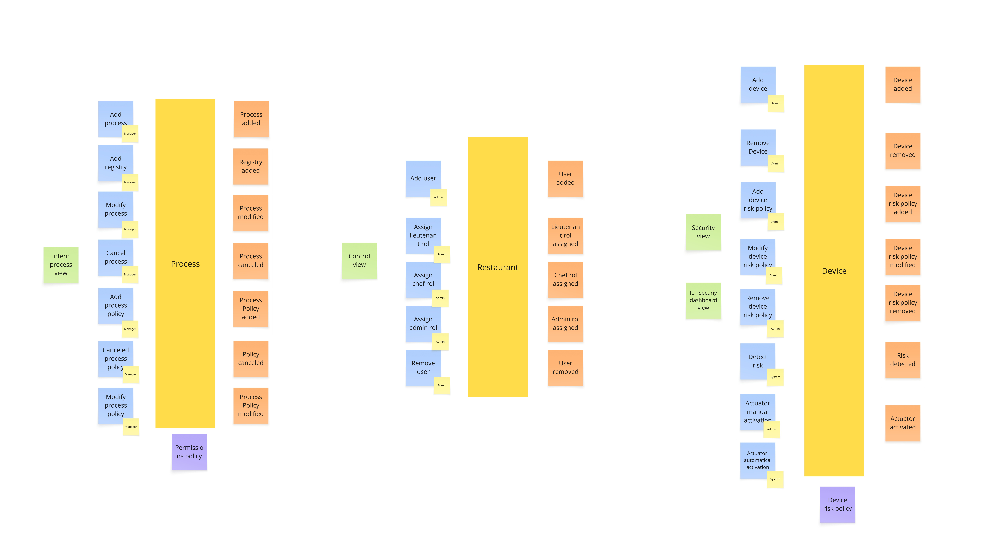

**Paso 9: Definir Contextos**
Finalmente, agrupamos los agregados y sus eventos relacionados en fronteras lingüísticas y funcionales claras:

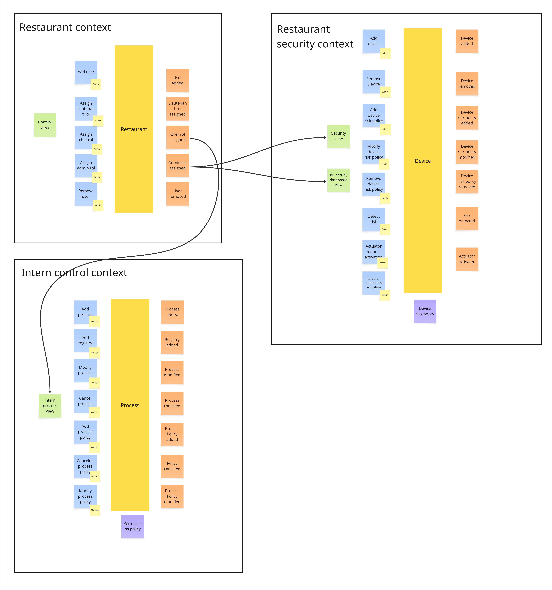

## 2.5. Ubiquitous Language

- **Restaurante (Restaurant):** Negocio gastronómico que opera una cocina y ocupa realizar procesos de control y gestión de riesgos

- **Organización (Organization):** Unidad administrativa digital que representa al restaurante dentro del sistema y agrupa usuarios, procesos, registros y dispositivos IoT.

- **Dueño (Owner):** Usuario principal con control total sobre la organizacion: configura permisos, crea procesos, registra dispositivos y define politicas de riesgo y accion.

- **Usuario (User):** Persona autenticada que accede al sistema web o movil para ejecutar acciones permitidas por su rol y permisos.

- **Administrador (Admin):** Usuario con privilegios de gestion autorizados por el dueño para administrar usuarios, permisos y configuraciones operativas del sistema.

- **Teniente (Lieutenant):** Usuario supervisor que puede tener permiso de administracion de usuarios o solo supervision de procesos, segun configuracion del dueño.

- **Encargado / Chef (Manager / Chef):** Usuario responsable de ejecutar y registrar procesos y sus politicas.

- **Rol (Role):** Categoria funcional asignada a un usuario que define los permisos que.

- **Permiso (Permission):** Regla especifica que habilita o restringe acciones concretas de un usuario sobre modulos, procesos, registros o dispositivos.

- **Politica de permisos (Permission policy):** Configuracion que determina como se delegan capacidades administrativas, de supervision y de registro entre usuarios de la organizacion.

- **Proceso de control (Control process):** Estrategias empresariales que involucran una secuencia de actividades con la finalidad de mitigar riesgos empresariales. Puede incluir uno o varios formatos de registro.

- **Formato de registro (Record template):** Formato estandarizado para registrar datos o hechos relativos a recursos o procesos empresariales

- **Dispositivo IoT (IoT device):** Equipo conectado al sistema que reporta eventos o estado de seguridad del restaurante (sensor, camara o actuador).

- **Sensor de humo (Smoke sensor):** Dispositivo IoT que detecta presencia de humo y genera alertas para activar protocolos de respuesta.

- **Sensor de calor (Heat sensor):** Dispositivo IoT que detecta incrementos anormales de temperatura y notifica posibles condiciones de incendio.

- **Camara de videovigilancia (Surveillance camera):** Dispositivo IoT que transmite video en tiempo real para observacion y validacion visual de incidentes.

- **Actuador IoT (IoT actuator):** Dispositivo controlable de forma remota por la plataforma (por ejemplo, alarma o aspersor).

- **Monitoreo en tiempo real (Real-time monitoring):** Visualizacion continua del estado, telemetria y alertas de dispositivos IoT en web y aplicacion movil.

- **Alerta de riesgo (Risk alert):** Notificacion generada por reglas o eventos de IoT cuando se detecta una condicion peligrosa o fuera de umbral.

- **Riesgo (Risk):** Condicion potencial de dano para personas, infraestructura u operacion (humo, fuego, sobrecalentamiento u otras amenazas).

- **Politica de riesgo (Risk policy):** Regla configurable que define umbrales, severidad, canales de notificacion y acciones automaticas/manuales ante incidentes.

- **Sistema de seguridad (Security system):** Modulo que integra monitoreo IoT, deteccion de eventos y capacidades de accion para prevencion y mitigacion de incidentes.

- **Llamada de emergencia (Emergency call):** Flujo guiado de la aplicacion movil que inicia contacto con emergencias mostrando datos de ubicacion para reducir errores humanos.

- **Incidente (Incident):** Evento confirmado o sospechoso de riesgo que requiere seguimiento operativo, posible activacion de actuadores y registro de evidencia.

# Capítulo III: Requirements Specification

## 3.1. User Stories

Se presenta a continuación el conjunto de User Stories planificadas para el alcance del proyecto.

<table>
    <thead>
        <tr>
            <th>Epic / Story ID</th>
            <th>Título</th>
            <th>Descripción</th>
            <th>Criterios de Aceptación</th>
            <th>Relacionado con (Epic ID)</th>
        </tr>
    </thead>
    <tbody>
        <tr>
            <td>US-5</td>
            <td>Crear procesos de control interno</td>
            <td>Como Dueño de restaurante, quiero registrar los procesos de control interno de mi restaurante para tener la tranquilidad de que mi negocio opera con la estructura y consistencia que necesito</td>
            <td>
                <ul>
                    <li>
                    <strong>Scenario:</strong> Intención de creación de proceso de control interno 
                    <strong>Given</strong> el dueño está administrando los procesos de control interno 
                    <strong>When</strong> elige crear un nuevo proceso de control interno 
                    <strong>Then</strong> se solicita al dueño ingresar el nombre de este nuevo proceso de control interno
                    </li>
                    <li>
                    <strong>Scenario:</strong> Crear proceso de control interno (éxito) 
                    <strong>Given</strong> el dueño ha elegido crear un nuevo proceso de control interno &nbsp;&nbsp;And el nombre ingresado es válido (sin caracteres especiales, no vacío) 
                    <strong>When</strong> confirma la creación del nuevo proceso de control interno 
                    <strong>Then</strong> el nuevo proceso de control interno debe ser agregado en su organización &nbsp;&nbsp;And se informa al usuario su creación mediante un mensaje
                    </li>
                    <li>
                    <strong>Scenario:</strong> Crear proceso de control interno (nombre inválido) 
                    <strong>Given</strong> el dueño ha elegido crear un nuevo proceso de control interno 
                    <strong>When</strong> ingrese un nombre inválido (con caracteres especiales o vacío) 
                    <strong>Then</strong> se desactiva la opción de crear el nuevo proceso de control interno &nbsp;&nbsp;And se explica la razón por la cual la opción ingresada no es válida con un mensaje
                    </li>
                    <li>
                    <strong>Scenario:</strong> Crear proceso de control interno (fallo) 
                    <strong>Given</strong> el dueño ha confirmado la creación de un nuevo proceso de control interno 
                    <strong>When</strong> la operación falle 
                    <strong>Then</strong> no se crea el nuevo proceso de control interno &nbsp;&nbsp;And se informa al usuario la razón del fallo mediante un mensaje
                    </li>
                </ul>
            </td>
            <td>EP-1</td>
        </tr>
        <tr>
            <td>US-6</td>
            <td>Crear nuevo formato de registro</td>
            <td>Como Dueño de restaurante, quiero crear formatos de registro para procesos de control internos para registrar los documentos que utilizo en mi negocio para dichos procesos</td>
            <td>
                <ul>
                    <li>
                    <strong>Scenario:</strong> Intención de creación de formato de registro para proceso de control interno 
                    <strong>Given</strong> el dueño cuenta con al menos un proceso de control interno &nbsp;&nbsp;And ha seleccionado uno de los procesos de control interno existentes 
                    <strong>When</strong> elige crear un formato de registro 
                    <strong>Then</strong> se solicita ingresar un nombre para el proceso de control interno
                    </li>
                    <li>
                    <strong>Scenario:</strong> Crear proceso de control interno (éxito) 
                    <strong>Given</strong> el dueño ha elegido crear un nuevo formato de registro para un proceso de control interno específico &nbsp;&nbsp;And ha ingresado un nombre válido (sin caracteres especiales, no vacío) 
                    <strong>When</strong> confirma la creación de el nuevo formato de registro 
                    <strong>Then</strong> se crea un formato de registro para el proceso de control interno seleccionado con el nombre ingresado, dos columnas por defecto a modo de ejemplo y el estado 'INACTIVO' &nbsp;&nbsp;And se confirma al usuario la creación con un mensaje
                    </li>
                    <li>
                    <strong>Scenario:</strong> Crear proceso de control interno (fallo) 
                    <strong>Given</strong> el dueño ha confirmado la creación de un formato de registro 
                    <strong>When</strong> la operación falle 
                    <strong>Then</strong> no se crea el formato de registro &nbsp;&nbsp;And se informa al usuario la razón por la que la operación falló
                    </li>
                    <li>
                    <strong>Scenario:</strong> Crear proceso de control interno (nombre inválido) 
                    <strong>Given</strong> el dueño ha elegido crear un nuevo formato de registro para un proceso de control interno específico 
                    <strong>When</strong> ingresa un nombre inválido (con caracteres especiales, vacío) 
                    <strong>Then</strong> la opción de confirmar la creación del nuevo formato de registro debe desactivarse
                    </li>
                </ul>
            </td>
            <td>EP-1</td>
        </tr>
        <tr>
            <td>US-7</td>
            <td>Configurar políticas de formato de registro</td>
            <td>Como Dueño de restaurante, quiero establecer reglas sobre la modificación o frecuencia de los registros asociados a mis procesos para garantizar la validez y la integridad de los datos, manteniendo la disciplina operativa y evitando inconsistencias</td>
            <td>
                <ul>
                    <li>
                    <strong>Scenario:</strong> Acceder a configuración de políticas de formato de registro 
                    <strong>Given</strong> el dueño del restaurante se encuentra visualizando un formato de registro 
                    <strong>When</strong> selecciona editar las políticas del formato de registro 
                    <strong>Then</strong> se debe visualizar las configuraciones de las políticas asociadas al formato de registro como un formulario editable
                    </li>
                    <li>
                    <strong>Scenario:</strong> Intención de modificar políticas de formato de registro 
                    <strong>Given</strong> el dueño se encuentra visualizando las políticas asociadas a un formato de registro 
                    <strong>When</strong> cambia las configuraciones de las políticas asociadas 
                    <strong>Then</strong> se debe activar la opción de confirmar cambios a las políticas del formato de registros
                    </li>
                    <li>
                    <strong>Scenario:</strong> Modificar políticas de formato de registro (éxito) 
                    <strong>Given</strong> el dueño se encuentra visualizando las políticas asociadas a un formato de registro &nbsp;&nbsp;And ha cambiado las configuraciones de las políticas asociadas 
                    <strong>When</strong> confirma los cambios 
                    <strong>Then</strong> se deben cambiar las políticas asociadas a las nuevas configuraciones ingresadas &nbsp;&nbsp;And se debe confirmar al usuario los cambios con un mensaje
                    </li>
                    <li>
                    <strong>Scenario:</strong> Modificar políticas de formato de registro (fallo) 
                    <strong>Given</strong> el dueño ha confirmado los cambios a las políticas de un formato de registros 
                    <strong>When</strong> la operación falle 
                    <strong>Then</strong> no se modifican las políticas asociadas al formato de registro &nbsp;&nbsp;And se informa al usuario la razón del fallo con un mensaje
                    </li>
                    <li>Las opciones de políticas deberían incluir la frecuencia de creación de nuevos registros: diario, semanal, mensual. Estos se corresponden con el bloque según semanas (se valida de lunes a lunes y de 1ro de un mes al último día de dicho mes).</li>
                    <li>Las opciones de políticas deberían incluir la cantidad máxima de registros que se pueden añadir en un periodo de tiempo (número personalizable)</li>
                </ul>
            </td>
            <td>EP-1</td>
        </tr>
        <tr>
            <td>US-8</td>
            <td>Realizar registros para un formato de registros</td>
            <td>Como Cocinero asignado como 'RESPONSABLE' a un formato de registros, quiero llenar los formatos de registro de los procesos de control interno de forma sencilla y eficiente para documentar el cumplimiento de los procesos de control, eliminando la incertidumbre de la 'confianza verbal'</td>
            <td>
                <ul>
                    <li>
                    <strong>Scenario:</strong> Intención de creación de nuevo registro 
                    <strong>Given</strong> el cocinero tiene el rol de 'RESPONSABLE' para al menos un formato de registros &nbsp;&nbsp;And selecciona uno de los formatos de registros de los cuales es responsable &nbsp;&nbsp;And el formato de registros seleccionado tiene el estado 'ACTIVO' 
                    <strong>When</strong> elige añadir un nuevo registro 
                    <strong>Then</strong> se debe visualizar un formulario con campos correspondientes al formato de registros
                    </li>
                    <li>
                    <strong>Scenario:</strong> Adición de nuevo registro (éxito) 
                    <strong>Given</strong> el cocinero se encuentra llenando un formulario correspondiente a un formato de registros &nbsp;&nbsp;And ha llenado correctamente todos los campos del formato de registros 
                    <strong>When</strong> confirme la adición del nuevo registro 
                    <strong>Then</strong> se debe almacenar el nuevo registro &nbsp;&nbsp;And se confirma al usuario su adición mediante un mensaje
                    </li>
                    <li>
                    <strong>Scenario:</strong> Adición de nuevo registro (fallo) 
                    <strong>Given</strong> el cocinero ha confirmado la adición del nuevo registro 
                    <strong>When</strong> la operación falle 
                    <strong>Then</strong> no se añade el registro &nbsp;&nbsp;And se informa al usuario la razón del fallo
                    </li>
                    <li>
                    <strong>Scenario:</strong> Adición de nuevo registro (campos inválidos) 
                    <strong>Given</strong> l cocinero se encuentra llenando un formulario correspondiente a un formato de registros 
                    <strong>When</strong> llene algún campo de forma inválida (vacío si es requerido, o valores no admitidos por el campo) 
                    <strong>Then</strong> se desactiva la opción de confirmar la adición del nuevo registro &nbsp;&nbsp;And se señala al usuario el campo que hace que el campo sea válido &nbsp;&nbsp;And se proporciona la razón de que la opción ingresada sea inválida
                    </li>
                </ul>
            </td>
            <td>EP-1</td>
        </tr>
        <tr>
            <td>US-9</td>
            <td>Crear organización</td>
            <td>Como Dueño de restaurante, quiero crear la organización correspondiente a mi restaurante dentro del sistema para tener una visión clara y estructurada de mi negocio para una gestión más eficaz y un mayor control</td>
            <td>
                <ul>
                    <li>
                    <strong>Scenario:</strong> Solicitar creación de organización al ingresar por primera vez 
                    <strong>Given</strong> Given el dueño no tiene configurada una organización creada 
                    <strong>When</strong> ingrese a la aplicación por primera vez 
                    <strong>Then</strong> se solicitan datos crear una organización, los cuales incluyen nombre (requerido) y foto, dirección y ubicación GPS (opcionales)
                    </li>
                    <li>
                    <strong>Scenario:</strong> Creación de organización (éxito) 
                    <strong>Given</strong> el dueño se encuentra creando su organización &nbsp;&nbsp;And ha llenado al menos el único campo obligatorio (nombre) de forma válida (caracteres especiales permitidos, no vacío) 
                    <strong>When</strong> confirme la creación de la organización 
                    <strong>Then</strong> se debe registrar la organización con los datos registrados &nbsp;&nbsp;And se informa al usuario sobre su creación mediante un mensaje &nbsp;&nbsp;And se lo conduce a la interfaz principal
                    </li>
                    <li>
                    <strong>Scenario:</strong> Creación de organización (fallo) 
                    <strong>Given</strong> el dueño ha confirmado la creación de su organización 
                    <strong>When</strong> la operación falle 
                    <strong>Then</strong> no se crea la organización &nbsp;&nbsp;And se informa al usuario la razón del fallo con un mensaje
                    </li>
                    <li>
                    <strong>Scenario:</strong> Intención de añadir foto de restaurante 
                    <strong>Given</strong> el dueño se encuentra creando su organización 
                    <strong>When</strong> elija añadir una foto de organización 
                    <strong>Then</strong> se debe permitir utilizar el sistema de archivos del dispositivo para elegir una foto
                    </li>
                    <li>
                    <strong>Scenario:</strong> Añadir foto de restaurante (éxito) 
                    <strong>Given</strong> el dueño ha seleccionado una foto de su sistema de archivos 
                    <strong>When</strong> confirme la selección de la foto como foto de la organización 
                    <strong>Then</strong> la foto debe quedar almacenada en el sistema inmediatamente &nbsp;&nbsp;And se confirma su almacenamiento al usuario mediante un mensaje
                    </li>
                    <li>
                    <strong>Scenario:</strong> Añadir foto de restaurante (fallo) 
                    <strong>Given</strong> ha confirmado la selección de una foto como foto de la organización 
                    <strong>When</strong> la operación falle 
                    <strong>Then</strong> la foto no se registra en el sistema &nbsp;&nbsp;And se informa al usuario la razón del fallo
                    </li>
                    <li>
                    <strong>Scenario:</strong> Intención de añadir ubicación GPS del restaurante 
                    <strong>Given</strong> el dueño se encuentra creando su organización 
                    <strong>When</strong> elija añadir la ubicación del restaurante 
                    <strong>Then</strong> se debe permitir abrir un mapa interactivo tomando como ubicación inicial, de ser posible, la ubicación actual del usuario mediante GPS
                    </li>
                    <li>
                    <strong>Scenario:</strong> Añadir ubicación GPS del restaurante (éxito) 
                    <strong>Given</strong> el dueño ha seleccionado un punto en el mapa o ingresado coordenadas válidas (en Lima Perú) 
                    <strong>When</strong> confirme la selección de la ubicación como posición de la organización 
                    <strong>Then</strong> la ubicación debe quedar almacenada en el sistema inmediatamente &nbsp;&nbsp;And se confirma su almacenamiento al usuario mediante un mensaje
                    </li>
                    <li>
                    <strong>Scenario:</strong> Añadir ubicación GPS del restaurante (fallo) 
                    <strong>Given</strong> ha confirmado la selección de una ubicación como posición de la organización 
                    <strong>When</strong> la operación falle por falta de permisos de GPS o error de red 
                    <strong>Then</strong> la ubicación no se registra en el sistema &nbsp;&nbsp;And se informa al usuario la razón del fallo
                    </li>
                    <li>
                    <strong>Scenario:</strong> Creación de organización (nombre inválido) 
                    <strong>Given</strong> el dueño se encuentra creando su organización 
                    <strong>When</strong> ingrese un nombre de organización inválido (vacío) 
                    <strong>Then</strong> se debe bloquear la opción de confirmar la creación de la organización con las opciones ingresadas &nbsp;&nbsp;And se debe informar al usuario la razón por la que la opción ingresada es inválida
                    </li>
                </ul>
            </td>
            <td>EP-1</td>
        </tr>
        <tr>
            <td>US-20</td>
            <td>Suspensión de procesos de control interno</td>
            <td>Como Dueño de restaurante, quiero suspender procesos de control interno para impedir el ingreso de nuevos registros cuando por razones de negocio se va a cesar su aplicación temporal o permanentemente</td>
            <td>
                <ul>
                    <li>
                    <strong>Scenario:</strong> Intención de suspender proceso de control interno 
                    <strong>Given</strong> el dueño tiene al menos un proceso de control interno &nbsp;&nbsp;And selecciona uno de ellos 
                    <strong>When</strong> intente suspender el proceso de control interno 
                    <strong>Then</strong> se solicita al usuario una confirmación 
                    </li>
                    <li>
                    <strong>Scenario:</strong> Suspensión de proceso de control interno (éxito) 
                    <strong>Given</strong> el dueño ha intentado suspender un proceso de control interno 
                    <strong>When</strong> confirme la acción 
                    <strong>Then</strong> se debe cambiar el estado del proceso seleccionado a 'SUSPENDIDO' &nbsp;&nbsp;And se notifica al usuario su suspensión con un mensaje
                    </li>
                    <li>
                    <strong>Scenario:</strong> Suspensión de proceso de control interno (fallo) 
                    <strong>Given</strong> el dueño ha confirmado la suspensión de un proceso de control interno 
                    <strong>When</strong> la operación falle 
                    <strong>Then</strong> el estado del proceso de control interno no cambia &nbsp;&nbsp;And se notifica al usuario la razón del fallo con un mensaje
                    </li>
                </ul>
            </td>
            <td>EP-1</td>
        </tr>
        <tr>
            <td>US-21</td>
            <td>Actualizar formato de registros </td>
            <td>Como Dueño de restaurante, quiero actualizar el formato de los registros para procesos de control interno para mantener el formato actualizado según evoluciona y madura la aplicación de los procesos de control interno del negocio</td>
            <td>
                <ul>
                    <li>
                    <strong>Scenario:</strong> Adición de nueva columna al formato de registro (éxito) 
                    <strong>Given</strong> el dueño se encuentra modificando un formato de registro 
                    <strong>When</strong> seleccione añadir una nueva columna 
                    <strong>Then</strong> se debe crear una nueva columna con un nombre por defecto y un tipo de dato por defecto &nbsp;&nbsp;And se confirma al usuario que la nueva columna fue añadida con un mensaje
                    </li>
                    <li>
                    <strong>Scenario:</strong> Adición de nueva columna al formato de registro (fallo) 
                    <strong>Given</strong> el dueño ha seleccionado añadir una nueva columna 
                    <strong>When</strong> la operación falle 
                    <strong>Then</strong> no se añade ninguna nueva columna &nbsp;&nbsp;And se notifica al usuario la razón del fallo
                    </li>
                    <li>
                    <strong>Scenario:</strong> Intención de remoción de columna existente de un formato de registro 
                    <strong>Given</strong> el dueño se encuentra modificando un formato de registro &nbsp;&nbsp;And el formato de registro cuenta con al menos una columna 
                    <strong>When</strong> seleccione remover una de las columnas existentes 
                    <strong>Then</strong> se debe solicitar al usuario una confirmación de la operación seleccionada
                    </li>
                    <li>
                    <strong>Scenario:</strong> Remoción de columna existente de un formato de registro (éxito) 
                    <strong>Given</strong> el dueño ha seleccionado remover una columna existente de un formato de registros 
                    <strong>When</strong> confirme la eliminación de la columna 
                    <strong>Then</strong> se debe eliminar la columna específicada por el usuario &nbsp;&nbsp;And se confirma al usuario su eliminación con un mensaje
                    </li>
                    <li>
                    <strong>Scenario:</strong> Remoción de columna existente de un formato de registro (fallo) 
                    <strong>Given</strong> el dueño ha confirmado la eliminación de una columna existente de un formato de registros 
                    <strong>When</strong> la operación falle 
                    <strong>Then</strong> no se elimina ninguna columna del formato de registro &nbsp;&nbsp;And se notifica al usuario la razón del fallo con un mensaje
                    </li>
                </ul>
            </td>
            <td>EP-1</td>
        </tr>
        <tr>
            <td>US-22</td>
            <td>Renombrar procesos de control interno</td>
            <td>Como Dueño de restaurante, quiero quiero ajustar el nombre asignado a procesos de control interno para mantener el nombre de los procesos actualizado a como madura el lenguaje de mi negocio</td>
            <td>
                <ul>
                    <li>
                    <strong>Scenario:</strong> Iniciar cambio de nombre de proceso de control interno 
                    <strong>Given</strong> el dueño de restaurante cuenta con al menos un proceso de control interno 
                    <strong>When</strong> elige cambiar el nombre del proceso de control interno 
                    <strong>Then</strong> debe mostrarse un modal o formulario para ingresar el nuevo nombre &nbsp;&nbsp;And este debe contener como valor inicial el nombre actual del proceso de control interno
                    </li>
                    <li>
                    <strong>Scenario:</strong> Cambiar nombre de proceso de control interno (éxito) 
                    <strong>Given</strong> el dueño de restaurante ha elegido modificar el nombre de un proceso de control interno &nbsp;&nbsp;And ha ingresado un nuevo nombre válido (no vacío, sin caracteres especiales) 
                    <strong>When</strong> decide confirmar el cambio de nombre 
                    <strong>Then</strong>  el nombre del proceso de control interno cambia al ingresado por el usuario &nbsp;&nbsp;And se confirma el cambio al usuario con un mensaje
                    </li>
                    <li>
                    <strong>Scenario:</strong> Cambiar nombre de proceso de control interno (fallo) 
                    <strong>Given</strong> el dueño de restaurante ha confirmado el cambio del nombre de un proceso de control interno 
                    <strong>When</strong> el proceso falla por algún motivo 
                    <strong>Then</strong> el nombre del proceso se mantiene sin cambios &nbsp;&nbsp;And se informa al usuario la razón por la que la operación ha fallado con un mensaje
                    </li>
                    <li>
                    <strong>Scenario:</strong> Cambiar nombre de proceso de control interno (nombre inválido) 
                    <strong>Given</strong> el dueño de restaurante ha elegido modificar el nombre de un proceso de control interno &nbsp;&nbsp;And  
                    <strong>When</strong> ingrese un nombre no válido (vacío, con caracteres especiales o idéntico al nombre actual) 
                    <strong>Then</strong> la opción de confirmar el cambio de nombre del proceso debe deshabilitarse &nbsp;&nbsp;And señalar la razón por la cual la opción ingresada no es válida mediante un mensaje
                    </li>
                    <li>La edición debería contar con un modal u otra forma de confirmación para evitar una modificación accidental.</li>
                </ul>
            </td>
            <td>EP-1</td>
        </tr>
        <tr>
            <td>US-23</td>
            <td>Suspender formato de registro de procesos de control interno</td>
            <td>Como Dueño de restaurante, quiero suspender un formato de registro de procesos de control interno para evitar el ingreso de nuevos registros en dicho formato específico, sin afectar a otros formatos correspondientes al mismo proceso</td>
            <td>
                <ul>
                    <li>
                    <strong>Scenario:</strong> Suspender un proceso de control interno (éxito) 
                    <strong>Given</strong> el dueño ha elegido suspender un proceso de control interno 
                    <strong>When</strong> confirme su suspensión 
                    <strong>Then</strong> el proceso de control interno debe pasar a tener el estado 'SUSPENDIDO' &nbsp;&nbsp;And se confirma la suspensión al usuario con un mensaje
                    </li>
                    <li>
                    <strong>Scenario:</strong> Intención de suspender un proceso de control interno 
                    <strong>Given</strong> el dueño tiene al menos un proceso de control interno 
                    <strong>When</strong> elige suspender el proceso de control interno 
                    <strong>Then</strong> se debe solicitar una confirmación que explique cuales son las consecuencias de suspender un proceso de control interno
                    </li>
                    <li>
                    <strong>Scenario:</strong> Suspender un proceso de control interno (fallo) 
                    <strong>Given</strong> el dueño ha confirmado la suspensión de un proceso de control interno 
                    <strong>When</strong> el proceso falle 
                    <strong>Then</strong> se informa al usuario al razón del fallo mediante un mensaje
                    </li>
                </ul>
            </td>
            <td>EP-1</td>
        </tr>
        <tr>
            <td>US-29</td>
            <td>Cambiar estado de formato de registro</td>
            <td>Como Dueño de restaurante, quiero cambiar el estado de un formato de registro para controlar qué formatos de registros son visibles o utilizables para y por mis empleados</td>
            <td>
                <ul>
                    <li>
                    <strong>Scenario:</strong> Intención de actualización de formato de registros 
                    <strong>Given</strong> el dueño se encuentra editando un formato de registros 
                    <strong>When</strong> selecciona cambiar el estado del formato de registros 
                    <strong>Then</strong> se deben visualizar los posibles estados ('ACTIVO' e 'INACTIVO')
                    </li>
                    <li>
                    <strong>Scenario:</strong> Actualizar estado de formato de registro a (éxito) 
                    <strong>Given</strong> el dueño esta visualizando los estados posibles de un formato de registros 
                    <strong>When</strong> selecciona un estado de formato de registros diferente al valor actual 
                    <strong>Then</strong> se actualiza el estado del formato de registros actual al nuevo valor elegido por el usuario &nbsp;&nbsp;And se informa al usuario del cambio de estado con un mensaje
                    </li>
                    <li>
                    <strong>Scenario:</strong> Actualizar estado de formato de registro a (fallo) 
                    <strong>Given</strong> el dueño ha seleccionado un formato de registros diferente al valor actual 
                    <strong>When</strong> la operación falle 
                    <strong>Then</strong> no se cambia el estado del formato de registros &nbsp;&nbsp;And se informa al usuario la razón del fallo con un mensaje
                    </li>
                </ul>
            </td>
            <td>EP-1</td>
        </tr>
        <tr>
            <td>US-30</td>
            <td>Listar procesos de control interno</td>
            <td>Como Dueño de restaurante, quiero visualizar el listado de todos los procesos de control interno para saber qué áreas de mi negocio se están modelando dentro del sistema</td>
            <td>
                <ul>
                    <li>
                    <strong>Scenario:</strong> Listar procesos de control interno 
                    <strong>Given</strong> el dueño posee al menos un proceso de control interno en su organización 
                    <strong>When</strong> ingrese al panel de procesos de control interno 
                    <strong>Then</strong> se muestran todos los procesos de control interno creados en la organización
                    </li>
                </ul>
            </td>
            <td>EP-1</td>
        </tr>
        <tr>
            <td>US-31</td>
            <td>Listar formatos de registro</td>
            <td>Como Usuario del sistema con permisos de escritura para procesos de control, quiero ver los formatos de registro existentes asociados a un proceso de control interno para saber qué documentos o estructuras de control ya se encuentran presentes dentro del sistema</td>
            <td>
                <ul>
                    <li>
                    <strong>Scenario:</strong> Listar formatos de registro de un proceso de control interno 
                    <strong>Given</strong> el usuario se encuentra en el panel de procesos de control interno &nbsp;&nbsp;And la organización posee al menos un proceso de control interno &nbsp;&nbsp;And este proceso de control interno posee al menos un formato de registro 
                    <strong>When</strong> decida ver el desglose del proceso de control interno 
                    <strong>Then</strong> se muestran la lista de formatos de registro asociados a ese proceso de control interno
                    </li>
                </ul>
            </td>
            <td>EP-1</td>
        </tr>
        <tr>
            <td>US-14</td>
            <td>Vincular dispositivos IoT</td>
            <td>Como Usuario del sistema con permisos de modificación para dispositivos IoT, quiero registrar mis dispositivos IoT de seguridad para mi restaurante para asegurar que mi negocio esté protegido por el sistema integrado en caso de emergencias</td>
            <td>
                <ul>
                    <li>
                    <strong>Scenario:</strong> Intención de añadir dispositivo 
                    <strong>Given</strong> el usuario cuenta con permisos de escritura para dispositivos IoT 
                    <strong>When</strong> elija la opción de añadir un nuevo dispositivo 
                    <strong>Then</strong> el sistema debe solicitar los datos de identificación del dispositivo (ej. ID, clave de activación)
                    </li>
                    <li>
                    <strong>Scenario:</strong> Añadir dispositivo IoT (éxito) 
                    <strong>Given</strong> el usuario ha ingresado datos de identificación válidos para un dispositivo IoT 
                    <strong>When</strong> confirme la acción de añadir 
                    <strong>Then</strong> el dispositivo se vincula a la organización y al sistema &nbsp;&nbsp;And se confirma al usuario el éxito de la operación mediante un mensaje
                    </li>
                    <li>
                    <strong>Scenario:</strong> Añadir dispositivo IoT (fallo) 
                    <strong>Given</strong> el usuario ha solicitado la vinculación de un dispositivo IoT 
                    <strong>When</strong> la operación falle 
                    <strong>Then</strong> el dispositivo no se vincula a la organización &nbsp;&nbsp;And se informa al usuario la razón específica del fallo mediante un mensaje de error
                    </li>
                    <li>El dato solicitado para vincular el dispositivo IoT debería ser fácil de ubicar para el usuario</li>
                </ul>
            </td>
            <td>EP-2</td>
        </tr>
        <tr>
            <td>US-15</td>
            <td>Monitorear datos de seguridad en tiempo real</td>
            <td>Como Dueño de restaurante con permisos de lectura para dispositivos IoT, quiero ver en tiempo real la información de mis dispositivos IoT desde cualquier lugar para tener visibilidad constante sobre el estado de seguridad de mi negocio sin tener que estar físicamente presente</td>
            <td>
                <ul>
                    <li>
                    <strong>Scenario:</strong> Error de transferencia de datos (consulta directa) 
                    <strong>Given</strong> que el usuario cuenta con permisos de lectura para dispositivos IoT &nbsp;&nbsp;And la organización cuenta con al menos un dispositivo IoT conectado &nbsp;&nbsp;And alguno de los dispositivos presenta problemas de conexión 
                    <strong>When</strong> ingrese a una vista que requiera los datos de dicho dispositivo 
                    <strong>Then</strong> se debe alertar al usuario de que el(los) dispositivo(s) IoT requerido(s) presentan problemas de conexión con un mensaje que lo inste a revisar las instalaciones de los dispositivos
                    </li>
                    <li>La funcionalidad debe contar con una vista agregada de múltiples dispositivos IoT de forma simultánea.</li>
                    <li>La funcionalidad debe contar con una vista individual de un único dispositivo IoT.</li>
                </ul>
            </td>
            <td>EP-2</td>
        </tr>
        <tr>
            <td>US-17</td>
            <td>Desvincular dispositivo IoT</td>
            <td>Como Usuario del sistema con permisos de escritura para dispositivos IoT, quiero desvincular dispositivos IoT del sistema integrado para dejar de visualizar en el sistema aquellos que ya dejaron de funcionar o van a ser reemplazados</td>
            <td>
                <ul>
                    <li>
                    <strong>Scenario:</strong> Intención de desvincular dispositivo 
                    <strong>Given</strong> el usuario cuenta con permisos de escritura para dispositivos IoT &nbsp;&nbsp;And la organización a la que pertenece cuenta con al menos un dispositivo IoT vinculado 
                    <strong>When</strong> elija desvincular el dispositivo 
                    <strong>Then</strong> se debe solicitar una confirmación de la acción al usuario
                    </li>
                    <li>
                    <strong>Scenario:</strong> Desvincular dispositivo IoT (éxito) 
                    <strong>Given</strong> el usuario quiere desvincular un dispositivo IoT vinculado 
                    <strong>When</strong> confirme la desvinculación 
                    <strong>Then</strong> se desvincula de la organización y el sistema el dispositivo IoT seleccionado &nbsp;&nbsp;And se confirma al usuario la desinvulación con un mensaje
                    </li>
                    <li>
                    <strong>Scenario:</strong> Desvincular dispositivo IoT (fallo) 
                    <strong>Given</strong> el usuario ha confirmado la desvinculación de un dispositivo IoT vinculado 
                    <strong>When</strong> la operación falle 
                    <strong>Then</strong> no se desvincula el dispositivo de la organización ni el sistema &nbsp;&nbsp;And se informa la usuario la razón del fallo mediante un mensaje
                    </li>
                </ul>
            </td>
            <td>EP-2</td>
        </tr>
        <tr>
            <td>US-18</td>
            <td>Listar dispositivos IoT</td>
            <td>Como Usuario del sistema, quiero visualizar la lista de dispositivos IoT que he registrado en el sistema para asegurarme de que vinculé todos los dispositivos que he adquirido y que se encuentran en buen estado</td>
            <td>
                <ul>
                    <li>
                    <strong>Scenario:</strong> Listar dispositivos IoT conectados 
                    <strong>Given</strong> el usuario posee permisos de lectura para dispositivos IoT &nbsp;&nbsp;And la organización a la que pertenece posee al menos un dispositivo IoT vinculado 
                    <strong>When</strong> el usuario ingrese al panel IoT 
                    <strong>Then</strong> se deben visualizar todos los dispositivos IoT vinculados a la organización
                    </li>
                </ul>
            </td>
            <td>EP-2</td>
        </tr>
        <tr>
            <td>US-19</td>
            <td>Cambiar identificador alias de dispositivo IoT</td>
            <td>Como Usuario del sistema con permisos de escritura para dispositivos IoT, quiero cambiar el identificador alias de mis dispositivos IoT para mantenerlo actualizado y relevante como por ejemplo, al cambiarlo de ubicación</td>
            <td>
                <ul>
                    <li>
                    <strong>Scenario:</strong> Intención de cambio de nombre para dispositivos IoT 
                    <strong>Given</strong> el usuario tiene permisos de escritura para dispositivos IoT &nbsp;&nbsp;And la organización tiene al menos un dispositivo IoT conectado al sistema 
                    <strong>When</strong> seleccione cambiar el nombre de un dispositivo IoT 
                    <strong>Then</strong> se debe solicitar el nuevo nombre para el dispositivo, usando como valor inicial el nombre alias actual
                    </li>
                    <li>
                    <strong>Scenario:</strong> Cambiar nombre alias a dispositivo IoT (éxito) 
                    <strong>Given</strong> el usuario ha ingresado el nuevo nombre alias para un dispositivo IoT 
                    <strong>When</strong> confirme el cambio del alias 
                    <strong>Then</strong> se debe actualizar el alias del dispositivo al nuevo &nbsp;&nbsp;And se debe confirmar el cambio al usuario con un mensaje
                    </li>
                    <li>
                    <strong>Scenario:</strong> Cambiar nombre alias a dispositivo IoT (fallo) 
                    <strong>Given</strong> el usuario ha confirmado el cambio de alias de un dispositivo IoT 
                    <strong>When</strong> la operación falle 
                    <strong>Then</strong> no se debe actualizar el alias del dispositivo &nbsp;&nbsp;And se explica al usuario la razón del fallo con un mensaje
                    </li>
                </ul>
            </td>
            <td>EP-2</td>
        </tr>
        <tr>
            <td>US-24</td>
            <td>Configurar ubicación (dirección física y referencia)</td>
            <td>Como Dueño de restaurante, quiero configurar la información de ubicación de mi restaurante incluyendo dirección física y referencia para los servicios de emergencia tengan los datos básicos precisos en caso de emergencia</td>
            <td>
                <ul>
                    <li>
                    <strong>Scenario:</strong> Valores por defecto del formulario (datos no configurados previamente) 
                    <strong>Given</strong> el dueño no ha configurado previamente la ubicación de su restaurante 
                    <strong>When</strong> ingresa a la configuración de ubicación de su restaurante 
                    <strong>Then</strong> los campos de ubicación física y referencia deben estar vacíos
                    </li>
                    <li>
                    <strong>Scenario:</strong> Persistencia de datos en el formulario (datos configurados previamente) 
                    <strong>Given</strong> el dueño ha configurado previamente la ubicación de su restaurante 
                    <strong>When</strong> ingresa a la configuración de ubicación de su restaurante 
                    <strong>Then</strong> los campos de ubicación física, coordenadas, referencias y archivos multimedia deben mostrar la información registrada en la última sesión de guardado.
                    </li>
                    <li>Dada la naturaleza de la información, la interfaz para esta funcionalidad debería usar un formulario reactivo que permite guardar los cambios al modificar la información.</li>
                </ul>
            </td>
            <td>EP-3</td>
        </tr>
        <tr>
            <td>US-25</td>
            <td>Realizar llamada de emergencia</td>
            <td>Como Usuario del sistema, quiero iniciar una llamada telefónica a servicios de emergencia y tener la información de mi ubicación visible al mismo tiempo para pueda comunicarme de forma efectiva y asegurar una respuesta rápida y precisa en situaciones críticas, minimizando el error humano.</td>
            <td>
                <ul>
                    <li>
                    <strong>Scenario:</strong> Superposición de datos del restaurante durante llamada 
                    <strong>Given</strong> el restaurante tiene configurado los datos de su ubicación física y referencia 
                    <strong>When</strong> se realice una llamada de emergencia 
                    <strong>Then</strong> estos datos deben ser visibles para el usuario durante la llamada
                    </li>
                    <li>La opción de realizar la llamada a emergencias debería ser fácil de encontrar, pero difícil de accionar por accidente, dado que realizar llamadas innecesarias a las líneas de emergencias es delito.</li>
                </ul>
            </td>
            <td>EP-3</td>
        </tr>
        <tr>
            <td>US-27</td>
            <td>Activación automática de dispositivos IoT contra-incendios</td>
            <td>Como Dueño de restaurante, quiero que los dispositivos contra-incendios (como alarmas, aspersores, extractores de humo, etc.) se activen de forma automática ante la detección de fuego para tener la seguridad de que existe una primera línea de defensa que proteja mi negocio y mitigue incluso si mis trabajadores no pueden hacerlo</td>
            <td>
                <ul>
                    <li>
                    <strong>Scenario:</strong> Activación automática de los dispositivos IoT 
                    <strong>Given</strong> al menos un dispositivo IoT se encuentra vinculado al nodo EDGE 
                    <strong>When</strong> se detecten valores que atentan contra los establecidos en la política 
                    <strong>Then</strong> se deben activar los dispositivos de acción correspondientes para responder a la emergencia
                    </li>
                    <li>Esta funcionalidad no debería fallar bajo ninguna circunstancia.</li>
                </ul>
            </td>
            <td>EP-3</td>
        </tr>
        <tr>
            <td>US-28</td>
            <td>Activación manual de dispositivos IoT contra-incendios</td>
            <td>Como Usuario del sistema en presencia cercana al dispositivo IoT, quiero activar de forma manual dispositivos contra-incendios (como alarmas, aspersores, turbinas extractoras, etc.)  para mitigar un riesgo potencial o no detectado por el sistema y alertar al equipo y clientes en el local</td>
            <td>
                <ul>
                    <li>
                    <strong>Scenario:</strong> Accionamiento remoto de dispositivos 
                    <strong>Given</strong> que el usuario cuenta con permisos de lectura para dispositivos IoT 
                    <strong>When</strong> cuando seleccione accionar un dispositivo IoT 
                    <strong>Then</strong> el dispositivo IoT debe activar la función correspondiente
                    </li>
                    <li>La opción u opciones disponibles deben variar según el tipo de dispositivo conectado.</li>
                    <li>Esta funcionalidad no debería fallar bajo ninguna circunstancia.</li>
                </ul>
            </td>
            <td>EP-3</td>
        </tr>
        <tr>
            <td>US-33</td>
            <td>Configurar ubicación GPS (coordenadas exactas)</td>
            <td>Como Dueño de restaurante, quiero configurar las coordenadas GPS de mi establecimiento mediante un mapa interactivo para los servicios de emergencia tengan la ubicación exacta y puedan llegar sin confusiones o demoras al buscar la calle por su nombre.</td>
            <td>
                <ul>
                    <li>
                    <strong>Scenario:</strong> Permiso de geolocalización denegado 
                    <strong>Given</strong> el sistema ha solicitado el permiso de ubicación 
                    <strong>When</strong> el usuario rechaza la solicitud del sistema 
                    <strong>Then</strong> el mapa debe mostrar una vista predeterminada &nbsp;&nbsp;And debe mostrarse un mensaje informativo indicando que la geolocalización automática no está disponible y se requiere ajuste manual
                    </li>
                    <li>
                    <strong>Scenario:</strong> Agregar dirección GPS (éxito) 
                    <strong>Given</strong> el usuario se encuentra seleccionando la ubicación GPS en el mapa &nbsp;&nbsp;And un marcador está posicionado en el mapa 
                    <strong>When</strong> el usuario confirma la dirección en el mapa 
                    <strong>Then</strong> el sistema guarda la ubicación correspondiente en coordenadas &nbsp;&nbsp;And se informa al usuario que los datos se guardaron exitosamente con un mensaje
                    </li>
                    <li>
                    <strong>Scenario:</strong> Solicitar permiso de geolocalización 
                    <strong>Given</strong> el usuario accede a la sección de configuración de ubicación GPS &nbsp;&nbsp;And el sistema no tiene permisos GPS aún 
                    <strong>When</strong> decide agregar la ubicación GPS  
                    <strong>Then</strong> el sistema debe disparar la solicitud nativa del navegador o dispositivo para acceder a la ubicación del usuario
                    </li>
                    <li>
                    <strong>Scenario:</strong> Permiso de geolocalización aceptado 
                    <strong>Given</strong> el sistema ha solicitado el permiso de ubicación 
                    <strong>When</strong> el usuario acepta la solicitud del sistema 
                    <strong>Then</strong> el mapa debe centrarse en las coordenadas detectadas por el dispositivo &nbsp;&nbsp;And el marcador debe posicionarse automáticamente en ese punto
                    </li>
                    <li>
                    <strong>Scenario:</strong> Agregar dirección GPS (fallo) 
                    <strong>Given</strong> el usuario ha confirmado al dirección en el mapa 
                    <strong>When</strong> la operación falle 
                    <strong>Then</strong> no se guarda la dirección ingresada &nbsp;&nbsp;And el sistema no abandona la interfaz del mapa &nbsp;&nbsp;And se debe informar al usuario que la información no fue guardada con un mensaje
                    </li>
                    <li>Dada la naturaleza de la información, esta debería guardarse inmediatamente tras haberlo ingresado.</li>
                </ul>
            </td>
            <td>EP-3</td>
        </tr>
        <tr>
            <td>US-10</td>
            <td>Invitar empleados</td>
            <td>Como Dueño de restaurante, quiero añadir a mis empleados al sistema y asignarles roles como 'Teniente' o 'Encargado' para delegar responsabilidades de forma clara y asegurar que mis trabajadores contribuyan al control interno según su asignación</td>
            <td>
                <ul>
                    <li>
                    <strong>Scenario:</strong> Intención de añadir nuevo empleado 
                    <strong>Given</strong> el dueño se encuentra en el panel de Recursos Humanos 
                    <strong>When</strong> decida agregar un nuevo empleado 
                    <strong>Then</strong> se deben solicitar los datos obligatorios del empleado (nombre, apellido, correo electrónico y rol) &nbsp;&nbsp;And el campo obligatorio de rol debe tener como valor por defecto el rol 'ENCARGADO' &nbsp;&nbsp;And se incluye una explicación del significado del rol
                    </li>
                    <li>
                    <strong>Scenario:</strong> Cambio de rol al añadir nuevo empleado 
                    <strong>Given</strong> el dueño se encuentra añadiendo un nuevo empleado 
                    <strong>When</strong> cambie el valor del rol del nuevo empleado 
                    <strong>Then</strong> se debe actualizar la descripción que explica el significado de los roles a una correspondiente al nuevo rol seleccionado
                    </li>
                    <li>
                    <strong>Scenario:</strong> Añadir nuevo empleado (éxito) 
                    <strong>Given</strong> el dueño ha llenado todos los campos de nuevo empleado  &nbsp;&nbsp;And los nombres y apellidos son válidos (no vacíos y sin caracteres especiales) &nbsp;&nbsp;And el correo es válido (no vacío, cumple REGEX de correo electrónico) &nbsp;&nbsp;And el correo no pertenece a ningún empleado ya presente en la organización 
                    <strong>When</strong> cuando confirme la adición del nuevo empleado 
                    <strong>Then</strong> se debe registrar una invitación en el sistema con los datos del empleado proporcionados &nbsp;&nbsp;And se confirma al usuario que la invitación a la organización
                    </li>
                    <li>
                    <strong>Scenario:</strong> Añadir nuevo empleado (fallo) 
                    <strong>Given</strong> el dueño ha confirmado la adición de un nuevo empleado 
                    <strong>When</strong> la operación falle 
                    <strong>Then</strong> no se genera ninguna invitación &nbsp;&nbsp;And se informa al usuario la razón del fallo con un mensaje
                    </li>
                </ul>
            </td>
            <td>EP-4</td>
        </tr>
        <tr>
            <td>US-11</td>
            <td>Modificar permisos de los usuarios</td>
            <td>Como Dueño de restaurante, quiero ajustar qué acciones puede realizar cada usuario del sistema en función de las áreas IoT, RRHH y Procesos de control para mantener un control preciso sobre la seguridad y las responsabilidades, protegiendo mi inversión y garantizando la integridad de las operaciones</td>
            <td>
                <ul>
                    <li>
                    <strong>Scenario:</strong> Intención de modificar los permisos de un empleado 
                    <strong>Given</strong> que el dueño tiene registrado al menos un empleado 
                    <strong>When</strong> seleccione modificar los permisos asignados a uno de los empleados 
                    <strong>Then</strong> se debe mostrar el checklist de permisos asociados con el rol correspondiente al empleado &nbsp;&nbsp;And se debe evidenciar los permisos relativos del empleado relativos a su rol
                    </li>
                    <li>
                    <strong>Scenario:</strong> Cambiar los permisos de empleado (éxito) 
                    <strong>Given</strong> el dueño se encuentra cambiando los permisos de un empleado &nbsp;&nbsp;And ha realizado cambios mediante los check a los permisos del empleado 
                    <strong>When</strong> confirme los cambios 
                    <strong>Then</strong> se deben modificar los permisos del usuario en el sistema a los nuevos específicados por el usuario &nbsp;&nbsp;And se informa al usuario el éxito de la operación con un mensaje
                    </li>
                    <li>
                    <strong>Scenario:</strong> Cambiar los permisos de empleado (fallo) 
                    <strong>Given</strong> el dueño ha confirmado los cambios de permisos de un empleado 
                    <strong>When</strong> la operación falle 
                    <strong>Then</strong> no se cambian los permisos del empleado &nbsp;&nbsp;And se informa al usuario la razón del fallo con un mensaje
                    </li>
                </ul>
            </td>
            <td>EP-4</td>
        </tr>
        <tr>
            <td>US-35</td>
            <td>Primer ingreso al sistema por correo electrónico</td>
            <td>Como Dueño de restaurante, quiero que al añadir empleados a mi organización puedan recibir la invitación formal a su correo para tener una forma segura y rápida de verificar que el proceso ha funcionado correctamente</td>
            <td>
                <ul>
                    <li>
                    <strong>Scenario:</strong> Aceptar invitación  
                    <strong>Given</strong> el usuario invitado ha recibido una invitación a un restaurante 
                    <strong>When</strong> acepte la invitación en el correo electrónico 
                    <strong>Then</strong> se lo debe redirigir a la página de la aplicación web o aplicación móvil a visualizar las invitaciones
                    </li>
                    <li>El proceso para enviar el correo de invitación debe contar con un hipervinculo que redirija al usuario a la página web o aplicación al mismo tiempo que acepta la invitación.</li>
                    <li>La operación de envío del correos debería ser asíncrona, usando reintentos y consistencia eventual para garantizar la entrega.</li>
                </ul>
            </td>
            <td>EP-4</td>
        </tr>
        <tr>
            <td>US-36</td>
            <td>Visualizar invitaciones</td>
            <td>Como Cocinero, quiero poder ver las invitaciones que he recibido a distintos restaurantes para poder unirme al sistema del restaurante en el que trabajo</td>
            <td>
                <ul>
                    <li>
                    <strong>Scenario:</strong> Visualizar invitaciones 
                    <strong>Given</strong> el cocinero tiene invitaciones pendientes 
                    <strong>When</strong> el panel de invitaciones cargue 
                    <strong>Then</strong> el sistema debe mostrar una lista con todas las invitaciones pendientes &nbsp;&nbsp;And cada elemento de la lista debe incluir el nombre de la organización, la fecha de la invitación y el estado 'PENDIENTE'
                    </li>
                </ul>
            </td>
            <td>EP-4</td>
        </tr>
        <tr>
            <td>US-37</td>
            <td>Registrarme con mi cuenta de Google</td>
            <td>Como Dueño de restaurante, quiero crear mi cuenta de usuario utilizando mi identidad de Google para simplifique el proceso de acceso y pueda concentrarme en proteger mi inversión sin demoras</td>
            <td>
                <ul>
                    <li>
                    <strong>Scenario:</strong> Registrarse con cuenta de Google (éxito) 
                    <strong>Given</strong> el usuario se encuentra en la interfaz de registro &nbsp;&nbsp;And y la cuenta de Google del registro no se encuentra registrada aún 
                    <strong>When</strong> se registre usando dicha cuenta de Google 
                    <strong>Then</strong> se debe utilizar todos los datos proporcionados por OAuth para generarle un usuario en el sistema
                    </li>
                    <li>
                    <strong>Scenario:</strong> Registrarse con cuenta de Google (fallo) 
                    <strong>Given</strong> el usuario se ha registrado con su cuenta Google 
                    <strong>When</strong> la operación falle 
                    <strong>Then</strong> se informa al usuario la razón del fallo con un mensaje
                    </li>
                    <li>
                    <strong>Scenario:</strong> Registrarse con cuenta de Google (cuenta ya registrada) 
                    <strong>Given</strong> el usuario se encuentra en la interfaz de registro &nbsp;&nbsp;And y la cuenta de Google ya se encuentra registrada 
                    <strong>When</strong> se registre usando dicha cuenta de Google 
                    <strong>Then</strong> no se registra al usuario nuevamente &nbsp;&nbsp;And se informa al usuario que dicha cuenta se encuentra registrada, por lo que debe hacer login
                    </li>
                </ul>
            </td>
            <td>EP-5</td>
        </tr>
        <tr>
            <td>US-38</td>
            <td>Iniciar sesión con mi cuenta de Google</td>
            <td>Como Usuario del sistema, quiero acceder al sistema utilizando mi identidad de Google para evite recordar credenciales adicionales y tenga una experiencia de inicio de sesión rápida y segura</td>
            <td>
                <ul>
                    <li>
                    <strong>Scenario:</strong> Iniciar sesión con Google (éxito) 
                    <strong>Given</strong> el usuario se encuentra en la interfaz de login del sistema &nbsp;&nbsp;And se ha registrado previamente con OAuth Google 
                    <strong>When</strong> inicie sesión usando su cuenta de Google 
                    <strong>Then</strong> el sistema debe utilizar los datos proporcionados por OAuth para identificar al usuario
                    </li>
                    <li>
                    <strong>Scenario:</strong> Iniciar sesión con Google (fallo) 
                    <strong>Given</strong> el usuario ha iniciado sesión con OAuth Google 
                    <strong>When</strong> la operación falle 
                    <strong>Then</strong> se informa al usuario la razón del fallo con un mensaje
                    </li>
                    <li>
                    <strong>Scenario:</strong> Iniciar sesión con Google (no registrado aún) 
                    <strong>Given</strong> el usuario se encuentra en la interfaz de login del sistema &nbsp;&nbsp;And no se ha registrado aún con OAuth Google 
                    <strong>When</strong> inicie sesión usando su cuenta de Google 
                    <strong>Then</strong> se informa al usuario que debe registrarse antes de iniciar sesión
                    </li>
                </ul>
            </td>
            <td>EP-5</td>
        </tr>
        <tr>
            <td>US-39</td>
            <td>Hero section</td>
            <td>Como Visitante de Landing Page, quiero ver una Hero Section de alto impacto que resuma de qué se trata el producto para tener una razón principal para interesarme a seguir revisando la landing page</td>
            <td>
                <ul>
                    <li>La sección debería ocupar toda la pantalla tanto en mobile como en desktop.</li>
                </ul>
            </td>
            <td>EP-6</td>
        </tr>
        <tr>
            <td>US-40</td>
            <td>Features</td>
            <td>Como Visitante de Landing Page, quiero quiero ver un listado de las funcionalidades del producto para tener razones concretas para querer adquirir el producto o servicio</td>
            <td>
                <ul>
                    <li>En la versión desktop debería ocupar toda la pantalla.</li>
                    <li>La versión mobile debería colocar un feature por vertical height del dispositivo.</li>
                </ul>
            </td>
            <td>EP-6</td>
        </tr>
        <tr>
            <td>US-41</td>
            <td>About the Product</td>
            <td>Como Visitante de Landing Page, quiero quiero una sección con un demo en vídeo del producto para ver el funcionamiento del producto</td>
            <td>
                <ul>
                    <li>Este video debe encontrarse incustrado en el sitio usando YouTube como fuente.</li>
                </ul>
            </td>
            <td>EP-6</td>
        </tr>
        <tr>
            <td>US-42</td>
            <td>About the Team</td>
            <td>Como Visitante de Landing Page, quiero tener una sección con una presentación del equipo de desarrollo para conocer las personas a cargo del producto y sentir confianza a través de su presencia</td>
            <td>
                <ul>
                    <li>El vídeo debe contener a todos los integrantes del equipo.</li>
                    <li>El vídeo debe contener secciones del equipo trabajando juntos.</li>
                </ul>
            </td>
            <td>EP-6</td>
        </tr>
        <tr>
            <td>US-43</td>
            <td>Suscripciones</td>
            <td>Como Visitante de Landing Page, quiero ver las opciones para adquirir el producto para evaluar si deseo adquirirlo en función del precio</td>
            <td>
                <ul>
                    <li>
                    <strong>Scenario:</strong> Intención de compra 
                    <strong>Given</strong> el visitante del landing page se encuentra en la sección suscripciones de la landing page 
                    <strong>When</strong> elija adquirir alguna de las suscripciones 
                    <strong>Then</strong> se insta al usuario a registrarse o iniciar sesión en la aplicación web
                    </li>
                    <li>La sección debería ocupar toda la pantalla en la versión desktop.</li>
                </ul>
            </td>
            <td>EP-6</td>
        </tr>
        <tr>
            <td>US-45</td>
            <td>Visualizar suscripciones</td>
            <td>Como Dueño de restaurante, quiero ver las suscripciones disponibles  para seleccionar cual deseo adquirir para mi organización</td>
            <td>
                <ul>
                    <li>Las suscripciones disponibles deben contar con todas sus características disponibles</li>
                </ul>
            </td>
            <td>EP-8</td>
        </tr>
        <tr>
            <td>US-46</td>
            <td>Suscribirse</td>
            <td>Como Dueño de restaurante, quiero seleccionar una suscripción específica y adquirirla para obtener los beneficios que ofrece</td>
            <td>
                <ul>
                    <li>
                    <strong>Scenario:</strong> Intención de adquirir suscripción 
                    <strong>Given</strong> el dueño está visualizando las suscripciones 
                    <strong>When</strong> seleccione adquirir una de ellas 
                    <strong>Then</strong> se debe solicitar un medio de pago a modo de confirmación
                    </li>
                    <li>
                    <strong>Scenario:</strong> Adquirir suscripción (éxito) 
                    <strong>Given</strong> el dueño ha seleccionado una suscripción &nbsp;&nbsp;And y ha introducido un método de pago 
                    <strong>When</strong> confirme la compra 
                    <strong>Then</strong> se debe ejecutar una transacción que realiza el cobro correspondiente según la membresía seleccionada &nbsp;&nbsp;And se activa la suscripción seleccionada para el usuario &nbsp;&nbsp;And se confirma el éxito de la transacción al usuario con un mensaje
                    </li>
                    <li>
                    <strong>Scenario:</strong> Adquirir suscripción (fallo) 
                    <strong>Given</strong> el dueño ha confirmado la compra de una suscripción 
                    <strong>When</strong> la transacción falle 
                    <strong>Then</strong> no se realiza ningún cobro &nbsp;&nbsp;And no se activa ninguna suscripción &nbsp;&nbsp;And se informa al usuario la razón del fallo con un mensaje
                    </li>
                    <li>
                    <strong>Scenario:</strong> Adquirir suscripción (ya suscrito) 
                    <strong>Given</strong> el dueño ha seleccionado una suscripción &nbsp;&nbsp;And ha introducido un método de pago &nbsp;&nbsp;And el dueño ya cuenta con una suscripción en su cuenta 
                    <strong>When</strong> confirme la compra 
                    <strong>Then</strong> no se realiza ningún cobro &nbsp;&nbsp;And no se activa ni se renueva ninguna suscripción &nbsp;&nbsp;And se informa al usuario que ya se encuentra suscrito
                    </li>
                    <li>Se debe usar una pasarela de pagos.</li>
                </ul>
            </td>
            <td>EP-8</td>
        </tr>
    </tbody>
</table>

## 3.2. Impact Mapping

Se presenta a continuación el Impact Mapping del producto que relaciona los objetivos de negocio con el valor de los usuarios, traducidos a Epics y User Stories del Product Backlog.

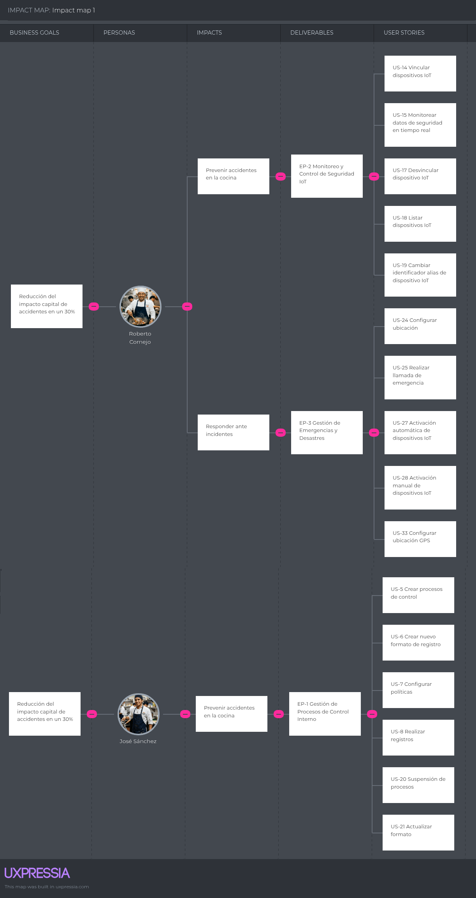

## 3.3. Product Backlog

Se presenta el Product Backlog, priorizando las historias de usuario en función al valor que aportan al negocio.

Se presenta a continuación una captura del Product Backlog en YouTrack, al cual se puede acceder mediante el siguiente enlace: [https://soulware.youtrack.cloud/projects/C360](https://soulware.youtrack.cloud/projects/C360)

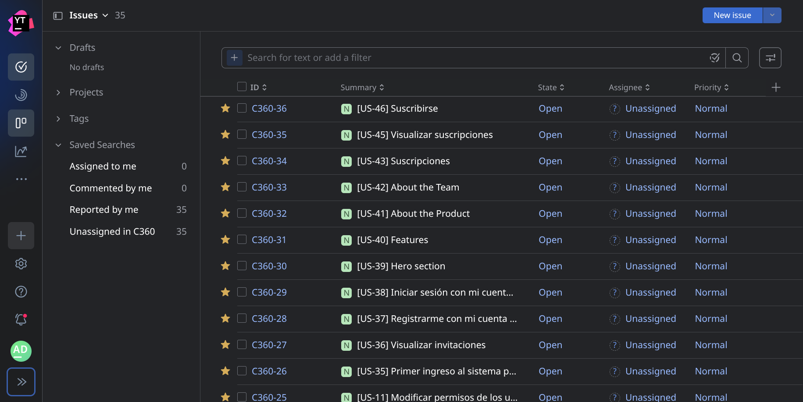

<table>
    <thead>
        <tr>
            <th scope="col"># Orden</th>
            <th scope="col">User Story ID</th>
            <th scope="col">Título</th>
            <th scope="col">Descripción</th>
            <th scope="col">Story Points</th>
        </tr>
    </thead>
    <tbody>
        <tr>
            <td>1</td>
            <td>US-39</td>
            <td>Hero section</td>
            <td>
                
<strong>Como</strong> Visitante de Landing Page, <strong>quiero</strong> ver una Hero Section de alto impacto que resuma de qué se trata el producto <strong>para</strong> interesarme a seguir revisando la landing page

            </td>
            <td>1</td>
        </tr>
        <tr>
            <td>2</td>
            <td>US-40</td>
            <td>Features</td>
            <td>
                
<strong>Como</strong> Visitante de Landing Page, <strong>quiero</strong> quiero ver un listado de las funcionalidades del producto <strong>para</strong> tener razones concretas para querer adquirir el producto o servicio

            </td>
            <td>1</td>
        </tr>
        <tr>
            <td>3</td>
            <td>US-41</td>
            <td>About the Product</td>
            <td>
                
<strong>Como</strong> Visitante de Landing Page, <strong>quiero</strong> quiero una sección con un demo en vídeo del producto <strong>para</strong> ver el funcionamiento del producto

            </td>
            <td>1</td>
        </tr>
        <tr>
            <td>4</td>
            <td>US-42</td>
            <td>About the Team</td>
            <td>
                
<strong>Como</strong> Visitante de Landing Page, <strong>quiero</strong> tener una sección con una presentación del equipo de desarrollo <strong>para</strong> conocer las personas a cargo del producto y sentir confianza a través de su presencia

            </td>
            <td>1</td>
        </tr>
        <tr>
            <td>5</td>
            <td>US-43</td>
            <td>Suscripciones</td>
            <td>
                
<strong>Como</strong> Visitante de Landing Page, <strong>quiero</strong> ver las opciones para adquirir el producto <strong>para</strong> evaluar si deseo adquirirlo en función del precio

            </td>
            <td>5</td>
        </tr>
        <tr>
            <td>6</td>
            <td>US-45</td>
            <td>Visualizar suscripciones</td>
            <td>
                
<strong>Como</strong> Dueño de restaurante, <strong>quiero</strong> ver las suscripciones disponibles  <strong>para</strong> seleccionar cual deseo adquirir para mi organización

            </td>
            <td>2</td>
        </tr>
        <tr>
            <td>7</td>
            <td>US-46</td>
            <td>Suscribirse</td>
            <td>
                
<strong>Como</strong> Dueño de restaurante, <strong>quiero</strong> seleccionar una suscripción específica y adquirirla <strong>para</strong> obtener los beneficios que ofrece

            </td>
            <td>8</td>
        </tr>
        <tr>
            <td>8</td>
            <td>US-5</td>
            <td>Crear procesos de control interno</td>
            <td>
                
<strong>Como</strong> Dueño de restaurante, <strong>quiero</strong> registrar los procesos de control interno de mi restaurante <strong>para</strong> tener la tranquilidad de que mi negocio opera con la estructura y consistencia que necesito

            </td>
            <td>3</td>
        </tr>
        <tr>
            <td>9</td>
            <td>US-30</td>
            <td>Listar procesos de control interno</td>
            <td>
                
<strong>Como</strong> Dueño de restaurante, <strong>quiero</strong> visualizar el listado de todos los procesos de control interno <strong>para</strong> saber qué áreas de mi negocio se están modelando dentro del sistema

            </td>
            <td>1</td>
        </tr>
        <tr>
            <td>10</td>
            <td>US-22</td>
            <td>Renombrar procesos de control interno</td>
            <td>
                
<strong>Como</strong> Dueño de restaurante, <strong>quiero</strong> quiero ajustar el nombre asignado a procesos de control interno <strong>para</strong> mantener el nombre de los procesos actualizado a como madura el lenguaje de mi negocio

            </td>
            <td>1</td>
        </tr>
        <tr>
            <td>11</td>
            <td>US-20</td>
            <td>Suspensión de procesos de control interno</td>
            <td>
                
<strong>Como</strong> Dueño de restaurante, <strong>quiero</strong> suspender procesos de control interno <strong>para</strong> impedir el ingreso de nuevos registros cuando por razones de negocio se va a cesar su aplicación temporal o permanentemente

            </td>
            <td>2</td>
        </tr>
        <tr>
            <td>12</td>
            <td>US-6</td>
            <td>Crear nuevo formato de registro</td>
            <td>
                
<strong>Como</strong> Dueño de restaurante, <strong>quiero</strong> crear formatos de registro para procesos de control internos <strong>para</strong> registrar los documentos que utilizo en mi negocio de dichos procesos

            </td>
            <td>5</td>
        </tr>
        <tr>
            <td>13</td>
            <td>US-31</td>
            <td>Listar formatos de registro</td>
            <td>
                
<strong>Como</strong> Usuario del sistema con permisos de escritura para procesos de control, <strong>quiero</strong> ver los formatos de registro existentes asociados a un proceso de control interno <strong>para</strong> saber qué documentos o estructuras de control ya se encuentran presentes dentro del sistema

            </td>
            <td>1</td>
        </tr>
        <tr>
            <td>14</td>
            <td>US-21</td>
            <td>Actualizar formato de registros </td>
            <td>
                
<strong>Como</strong> Dueño de restaurante, <strong>quiero</strong> actualizar el formato de los registros para procesos de control interno <strong>para</strong> mantener el formato actualizado según evoluciona y madura la aplicación de los procesos de control interno del negocio

            </td>
            <td>8</td>
        </tr>
        <tr>
            <td>15</td>
            <td>US-7</td>
            <td>Configurar políticas de formato de registro</td>
            <td>
                
<strong>Como</strong> Dueño de restaurante, <strong>quiero</strong> establecer reglas sobre la modificación o frecuencia de los registros asociados a mis procesos <strong>para</strong> garantizar la validez y la integridad de los datos, manteniendo la disciplina operativa y evitando inconsistencias

            </td>
            <td>5</td>
        </tr>
        <tr>
            <td>16</td>
            <td>US-29</td>
            <td>Cambiar estado de formato de registro</td>
            <td>
                
<strong>Como</strong> Dueño de restaurante, <strong>quiero</strong> cambiar el estado de un formato de registro <strong>para</strong> controlar qué formatos de registros son visibles o utilizables para y por mis empleados

            </td>
            <td>2</td>
        </tr>
        <tr>
            <td>17</td>
            <td>US-23</td>
            <td>Suspender formato de registro de procesos de control interno</td>
            <td>
                
<strong>Como</strong> Dueño de restaurante, <strong>quiero</strong> suspender un formato de registro de procesos de control interno <strong>para</strong> evitar el ingreso de nuevos registros en dicho formato específico, sin afectar a otros formatos correspondientes al mismo proceso

            </td>
            <td>3</td>
        </tr>
        <tr>
            <td>18</td>
            <td>US-8</td>
            <td>Realizar registros <strong>para</strong> un formato de registros</td>
            <td>
                
<strong>Como</strong> Cocinero asignado como 'RESPONSABLE' a un formato de registros, <strong>quiero</strong> llenar los formatos de registro de los procesos de control interno de forma sencilla y eficiente <strong>para</strong> documentar el cumplimiento de los procesos de control, eliminando la incertidumbre de la 'confianza verbal'

            </td>
            <td>5</td>
        </tr>
        <tr>
            <td>19</td>
            <td>US-9</td>
            <td>Crear organización</td>
            <td>
                
<strong>Como</strong> Dueño de restaurante, <strong>quiero</strong> crear la organización correspondiente a mi restaurante dentro del sistema <strong>para</strong> tener una visión clara y estructurada de mi negocio y tener una gestión más eficaz y un mayor control

            </td>
            <td>8</td>
        </tr>
        <tr>
            <td>20</td>
            <td>US-24</td>
            <td>Configurar ubicación (dirección física y referencia)</td>
            <td>
                
<strong>Como</strong> Dueño de restaurante, <strong>quiero</strong> configurar la información de ubicación de mi restaurante incluyendo dirección física y referencia <strong>para</strong> los servicios de emergencia tengan los datos básicos precisos en caso de emergencia

            </td>
            <td>1</td>
        </tr>
        <tr>
            <td>21</td>
            <td>US-33</td>
            <td>Configurar ubicación GPS (coordenadas exactas)</td>
            <td>
                
<strong>Como</strong> Dueño de restaurante, <strong>quiero</strong> configurar las coordenadas GPS de mi establecimiento mediante un mapa interactivo <strong>para</strong> los servicios de emergencia tengan la ubicación exacta y puedan llegar sin confusiones o demoras al buscar la calle por su nombre.

            </td>
            <td>5</td>
        </tr>
        <tr>
            <td>22</td>
            <td>US-14</td>
            <td>Vincular dispositivos IoT</td>
            <td>
                
<strong>Como</strong> Usuario del sistema con permisos de modificación para dispositivos IoT, <strong>quiero</strong> registrar mis dispositivos IoT de seguridad de mi restaurante <strong>para</strong> asegurar que mi negocio esté protegido por el sistema integrado en caso de emergencias

            </td>
            <td>5</td>
        </tr>
        <tr>
            <td>23</td>
            <td>US-18</td>
            <td>Listar dispositivos IoT</td>
            <td>
                
<strong>Como</strong> Usuario del sistema, <strong>quiero</strong> visualizar la lista de dispositivos IoT que he registrado en el sistema <strong>para</strong> asegurarme de que vinculé todos los dispositivos que he adquirido y que se encuentran en buen estado

            </td>
            <td>3</td>
        </tr>
        <tr>
            <td>24</td>
            <td>US-19</td>
            <td>Cambiar identificador alias de dispositivo IoT</td>
            <td>
                
<strong>Como</strong> Usuario del sistema con permisos de escritura para dispositivos IoT, <strong>quiero</strong> cambiar el identificador alias de mis dispositivos IoT <strong>para</strong> mantenerlo actualizado y relevante como por ejemplo, al cambiarlo de ubicación

            </td>
            <td>1</td>
        </tr>
        <tr>
            <td>25</td>
            <td>US-17</td>
            <td>Desvincular dispositivo IoT</td>
            <td>
                
<strong>Como</strong> Usuario del sistema con permisos de escritura para dispositivos IoT, <strong>quiero</strong> desvincular dispositivos IoT del sistema integrado <strong>para</strong> dejar de visualizar en el sistema aquellos que ya dejaron de funcionar o van a ser reemplazados

            </td>
            <td>5</td>
        </tr>
        <tr>
            <td>26</td>
            <td>US-15</td>
            <td>Monitorear datos de seguridad en tiempo real</td>
            <td>
                
<strong>Como</strong> Dueño de restaurante con permisos de lectura para dispositivos IoT, <strong>quiero</strong> ver en tiempo real la información de mis dispositivos IoT desde cualquier lugar <strong>para</strong> tener visibilidad constante sobre el estado de seguridad de mi negocio sin tener que estar físicamente presente

            </td>
            <td>8</td>
        </tr>
        <tr>
            <td>27</td>
            <td>US-27</td>
            <td>Activación automática de dispositivos IoT contra-incendios</td>
            <td>
                
<strong>Como</strong> Dueño de restaurante, <strong>quiero</strong> que los dispositivos contra-incendios (como alarmas, aspersores, extractores de humo, etc.) se activen de forma automática ante la detección de fuego <strong>para</strong> tener la seguridad de que existe una primera línea de defensa que proteja mi negocio y mitigue incluso si mis trabajadores no pueden hacerlo

            </td>
            <td>13</td>
        </tr>
        <tr>
            <td>28</td>
            <td>US-28</td>
            <td>Activación manual de dispositivos IoT contra-incendios</td>
            <td>
                
<strong>Como</strong> Usuario del sistema en presencia cercana al dispositivo IoT, <strong>quiero</strong> activar de forma manual dispositivos contra-incendios (como alarmas, aspersores, turbinas extractoras, etc.)  <strong>para</strong> mitigar un riesgo potencial o no detectado por el sistema y alertar al equipo y clientes en el local

            </td>
            <td>13</td>
        </tr>
        <tr>
            <td>29</td>
            <td>US-25</td>
            <td>Realizar llamada de emergencia</td>
            <td>
                
<strong>Como</strong> Usuario del sistema, <strong>quiero</strong> iniciar una llamada telefónica a servicios de emergencia y tener la información de mi ubicación visible al mismo tiempo <strong>para</strong> pueda comunicarme de forma efectiva y asegurar una respuesta rápida y precisa en situaciones críticas, minimizando el error humano.

            </td>
            <td>5</td>
        </tr>
        <tr>
            <td>30</td>
            <td>US-37</td>
            <td>Registrarme con mi cuenta de Google</td>
            <td>
                
<strong>Como</strong> Dueño de restaurante, <strong>quiero</strong> crear mi cuenta de usuario utilizando mi identidad de Google <strong>para</strong> simplifique el proceso de acceso y pueda concentrarme en proteger mi inversión sin demoras

            </td>
            <td>5</td>
        </tr>
        <tr>
            <td>31</td>
            <td>US-38</td>
            <td>Iniciar sesión con mi cuenta de Google</td>
            <td>
                
<strong>Como</strong> Usuario del sistema, <strong>quiero</strong> acceder al sistema utilizando mi identidad de Google <strong>para</strong> evite recordar credenciales adicionales y tenga una experiencia de inicio de sesión rápida y segura

            </td>
            <td>5</td>
        </tr>
        <tr>
            <td>32</td>
            <td>US-10</td>
            <td>Invitar empleados</td>
            <td>
                
<strong>Como</strong> Dueño de restaurante, <strong>quiero</strong> añadir a mis empleados al sistema y asignarles roles como 'Teniente' o 'Encargado' <strong>para</strong> delegar responsabilidades de forma clara y asegurar que mis trabajadores contribuyan al control interno según su asignación

            </td>
            <td>5</td>
        </tr>
        <tr>
            <td>33</td>
            <td>US-35</td>
            <td>Primer ingreso al sistema por correo electrónico</td>
            <td>
                
<strong>Como</strong> Dueño de restaurante, <strong>quiero</strong> que al añadir empleados a mi organización puedan recibir la invitación formal a su correo <strong>para</strong> tener una forma segura y rápida de verificar que el proceso ha funcionado correctamente

            </td>
            <td>8</td>
        </tr>
        <tr>
            <td>34</td>
            <td>US-36</td>
            <td>Visualizar invitaciones</td>
            <td>
                
<strong>Como</strong> Cocinero, <strong>quiero</strong> poder ver las invitaciones que he recibido a distintos restaurantes <strong>para</strong> poder unirme al sistema del restaurante en el que trabajo

            </td>
            <td>1</td>
        </tr>
        <tr>
            <td>35</td>
            <td>US-11</td>
            <td>Modificar permisos de los usuarios</td>
            <td>
                
<strong>Como</strong> Dueño de restaurante, <strong>quiero</strong> ajustar qué acciones puede realizar cada usuario del sistema en función de las áreas IoT, RRHH y Procesos de control <strong>para</strong> mantener un control preciso sobre la seguridad y las responsabilidades, protegiendo mi inversión y garantizando la integridad de las operaciones

            </td>
            <td>5</td>
        </tr>
    </tbody>
</table>

# Capítulo IV: Solution Software Design

## 4.1. Strategic-Level Domain-Driven Design

### 4.1.1. Design-Level EventStorming

#### 4.1.1.1 Candidate Context Discovery

En base al conocimiento actual del equipo sobre el dominio se ha realizado la técnica Eventstorming. A través de la cual se ha podido identificar los contextos del dominio:

Para mayor documentación observar la sección 2.4. Big Picture EventStorming.

#### 4.1.1.2 Domain Message Flows Modeling

Para detallar el funcionamiento y conexión de los bounded context se ha determinado 2 escenarios que permitan comprender los procesos del negocio.

Se ha reflejado el escenario de un encargado de cocina completando un registro de un proceso propio. 
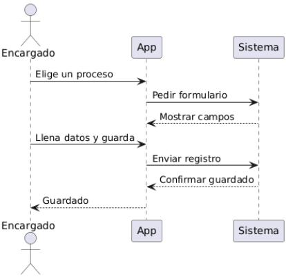

Además, se ha representado el escenario de un administrador observando los indicadores recopilados por los sensores IoT en su cocina.

#### 4.1.1.3 Bounded Context Canvases

El Intern Control Context constituye el núcleo operativo de l sistema, diseñado para cerrar la brecha entre la gestión informal y la auditoría profesional en los emprendimientos gastronómicos. Su propósito fundamental es la digitalización de la "confianza verbal", transformándola en un flujo de datos auditable que protege la inversión del dueño mediante la estandarización de procesos.

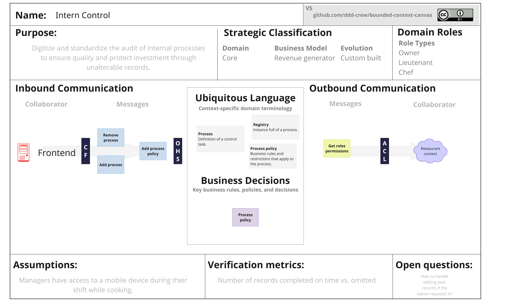

El Security Context representa la capa de defensa proactiva del sistema, integrando hardware IoT y computación en el borde para mitigar riesgos críticos. Se delega la vigilancia constante de integridad física (humo y calor) a un sistema autónomo capaz de reaccionar ante desastres inminentes.

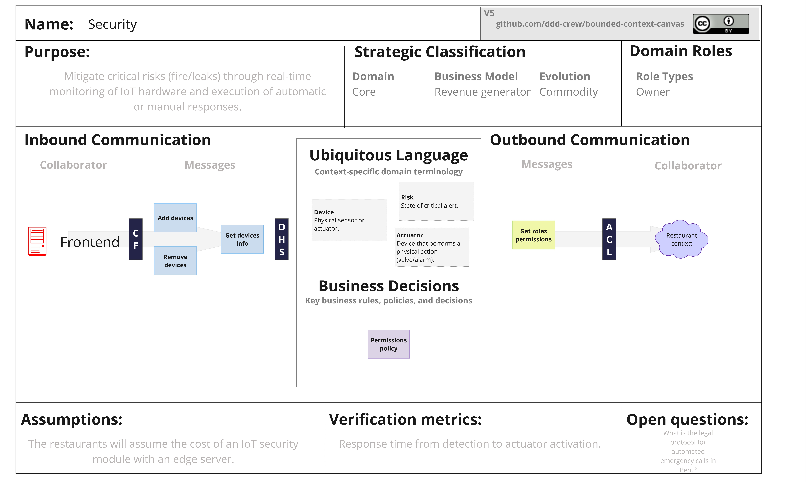

El Restaurant Context actúa como el sistema de soporte administrativo y de identidad de la plataforma. Su función primordial es establecer las fronteras organizacionales, gestionando la jerarquía de usuarios y la estructura de permisos necesaria para que los demás contextos operen de manera segura y ordenada dentro de una entidad legal específica.

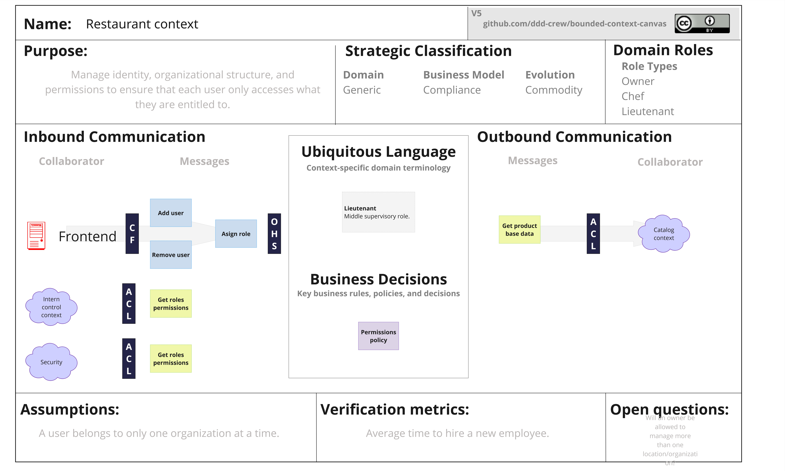

### 4.1.2. Context Mapping

Para formalizar la interacción entre los contextos identificados, se ha diseñado un Context Mapping que define los límites de consistencia y los contratos de comunicación del sistema. La arquitectura adopta un patrón de Upstream/Downstream, donde el Restaurant Context se comunica con los otros contextos a través de un ACL, que centraliza la autoridad sobre la identidad y la estructura organizacional.

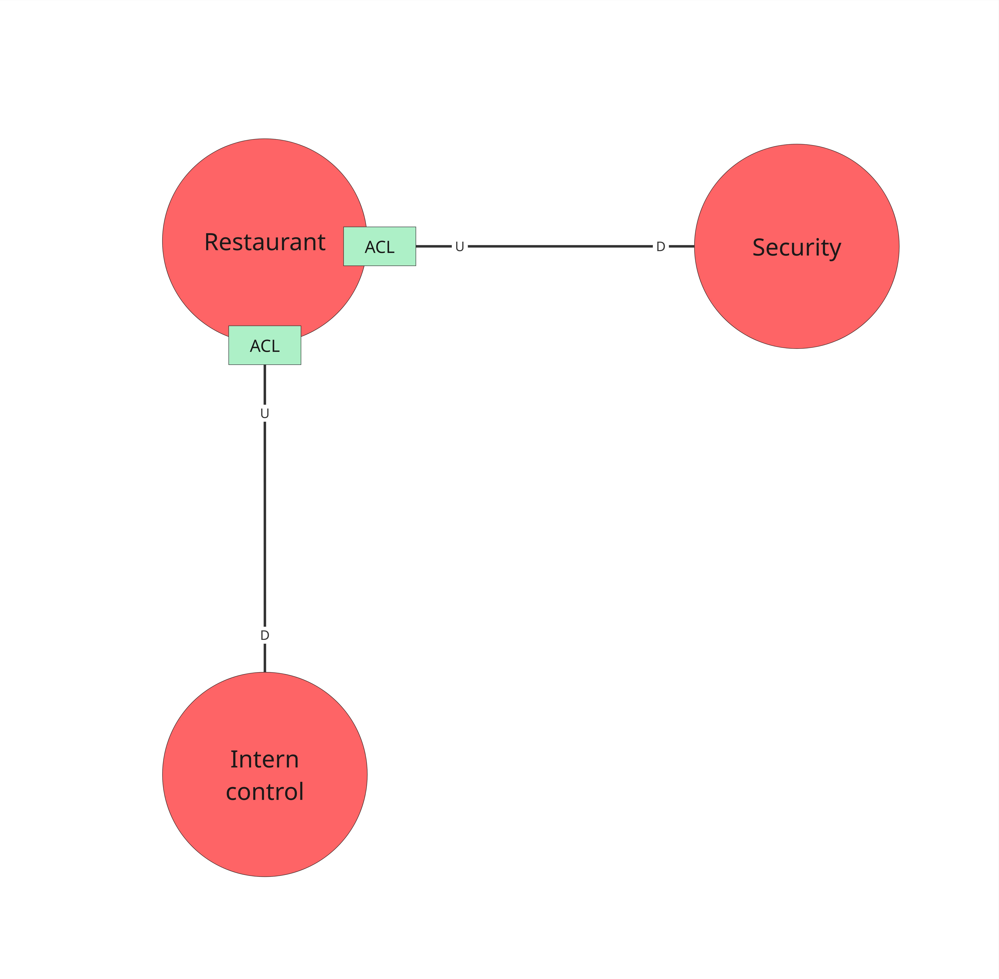

Bajo este esquema, tanto el Intern Control como el Security Context se sitúan en una posición de Downstream, lo que garantiza una alta cohesión al consumir una fuente de verdad unificada para la gestión de permisos. Esto asegura que el sistema sea resiliente ante cambios internos y altamente escalable, permitiendo que la lógica de procesos y la seguridad evolucionen de forma independiente sin comprometer la integridad global del ecosistema.

### 4.1.3. Software Architecture

#### 4.1.3.1. Software Architecture System Landscape Diagram

Representa el panorama global de la solución. En esta vista se identifican todas las personas y sistemas que existen en el ecosistema, independientemente de si forman parte o no del sistema principal.

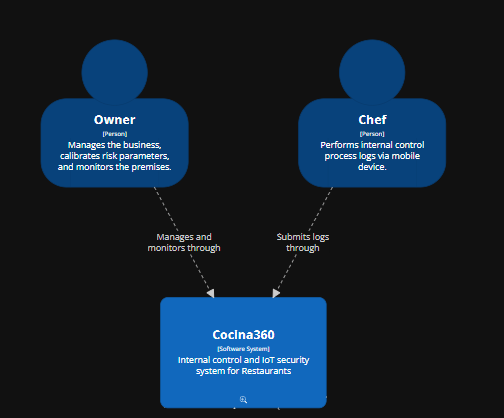

#### 4.1.3.2. Software Architecture Context Level Diagrams

Este nivel se centra exclusivamente en Cocina360 y su interacción con el exterior. Aquí se muestran las personas que utilizan el sistema, los sistemas externos con los que se integra y las relaciones entre ellos. No se entra en detalles internos del sistema; sólo se muestra cómo se vincula con su entorno. Esta vista define claramente los límites de la solución y establece el alcance general del modelo.

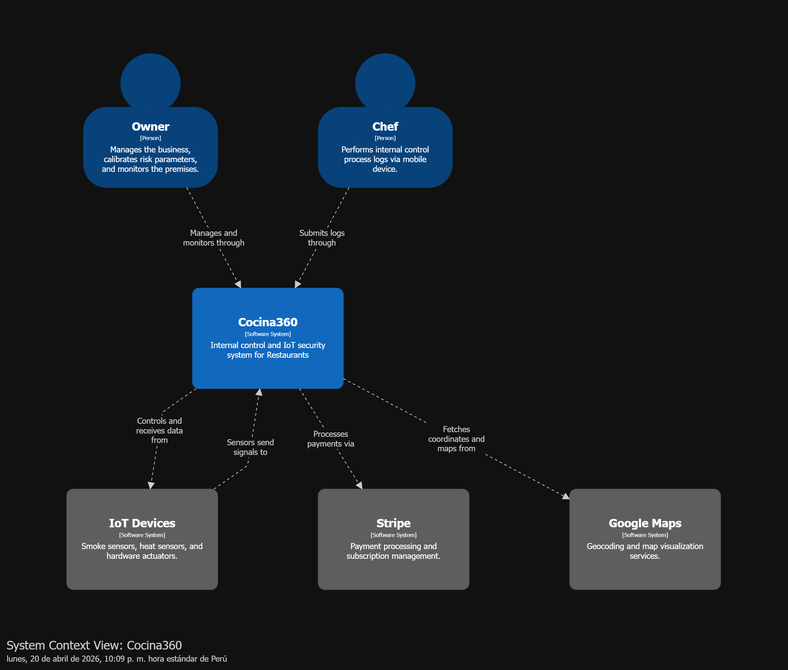

#### 4.1.3.2. Software Architecture Container Level Diagrams

Este nivel descompone Cocina360 en sus principales contenedores, es decir, en los bloques tecnológicos que lo conforman: aplicaciones, servicios, bases de datos y ejecutables.

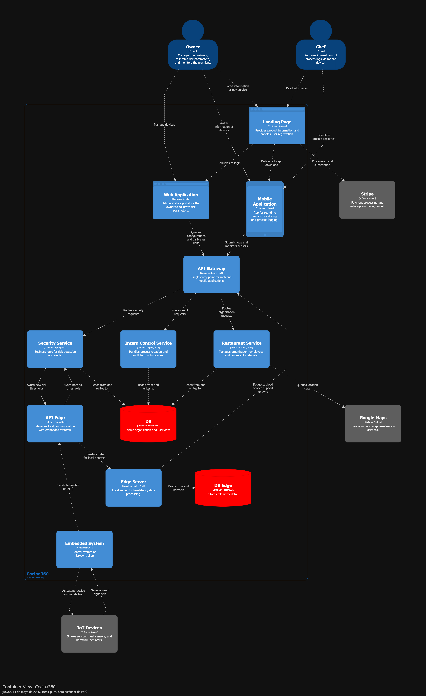

#### 4.1.3.3. Software Architecture Deployment Diagrams

Se representa el diagrama de despliegue relacionado con los servicios en la nube correspondientes.

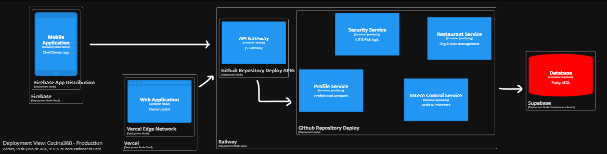

## 4.2. Tactical-Level Domain-Driven Design

### 4.2.1. Bounded Context: Restaurant

#### 4.2.1.1. Domain Layer

En esta seccion se presenta la imagen de domain layer del contexto restaurant.
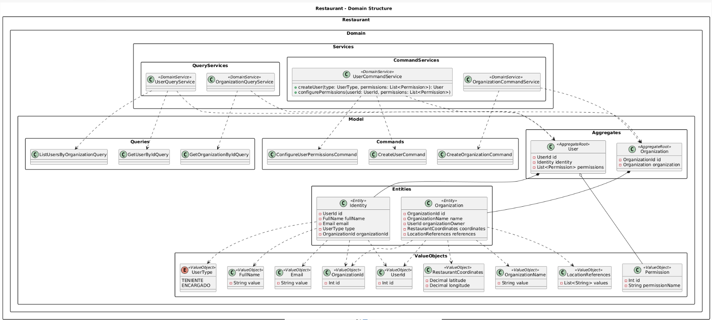

#### 4.2.1.2. Interface Layer

En esta seccion se presenta la imagen de interface layer del contexto restaurant.
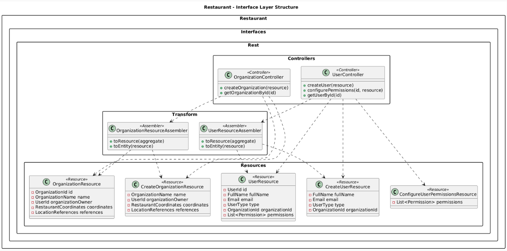

#### 4.2.1.3. Application Layer

En esta seccion se presenta la imagen de application layer del contexto restaurant.
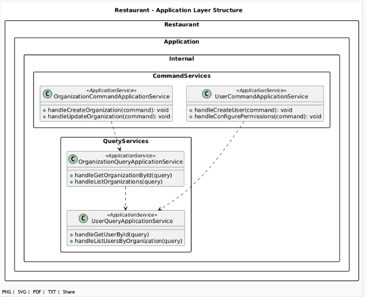

#### 4.2.1.4. Infrastructure Layer

En esta seccion se presenta la imagen de infrastructure layer del contexto restaurant.
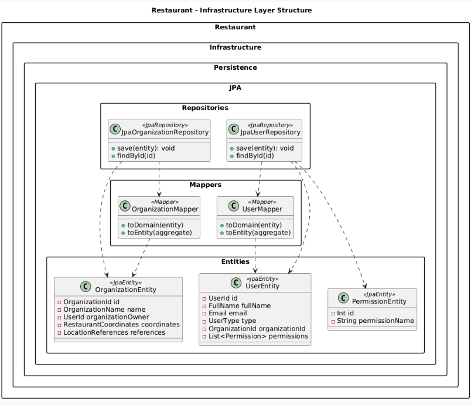

#### 4.2.1.5. Bounded Context Software Architecture Component Level Diagrams

En esta seccion se presenta la imagen de component diagrams del contexto restaurant.
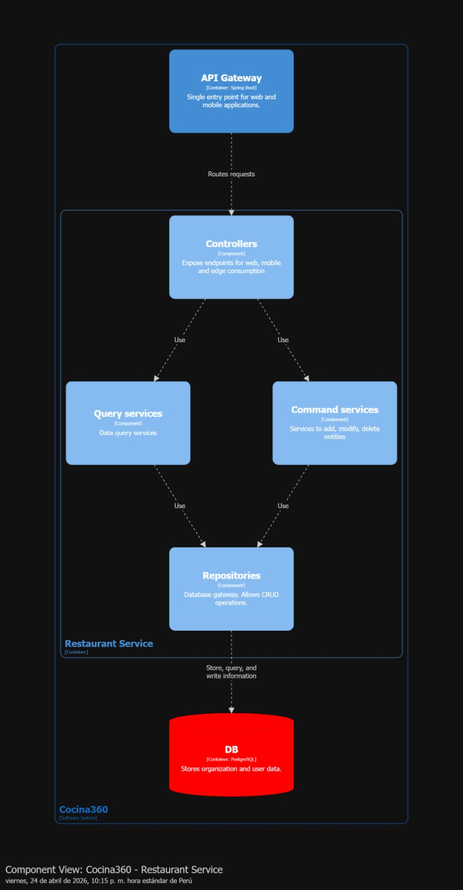

#### 4.2.1.6. Bounded Context Software Architecture Code Level Diagrams

##### 4.2.1.6.1. Bounded Context Domain Layer Class Diagrams

En esta seccion se presenta la imagen de domain layer del contexto restaurant.

##### 4.2.1.6.2. Bounded Context Database Design Diagram

En esta seccion se presenta la imagen de database diagram del contexto restaurant.
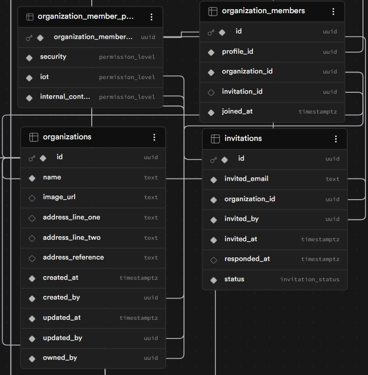

### 4.2.2. Bounded Context: Security

#### 4.2.2.1. Domain Layer

En esta seccion se presenta la imagen de domain layer del contexto security.
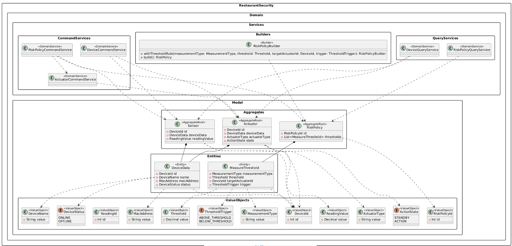

#### 4.2.2.2. Interface Layer

En esta seccion se presenta la imagen de interface layer del contexto security.
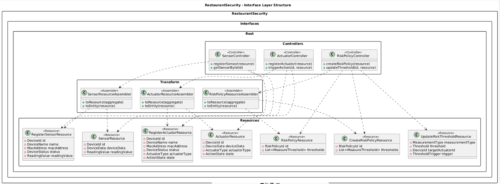

#### 4.2.2.3. Application Layer

En esta seccion se presenta la imagen de application layer del contexto security.
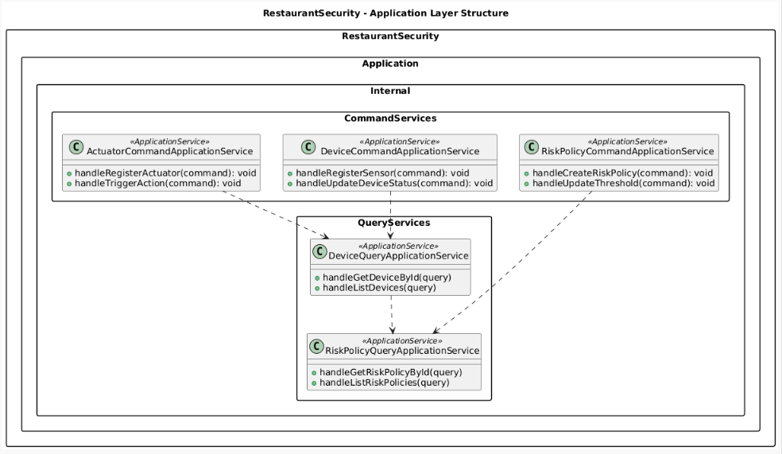

#### 4.2.2.4. Infrastructure Layer

En esta seccion se presenta la imagen de infrastructure layer del contexto security.
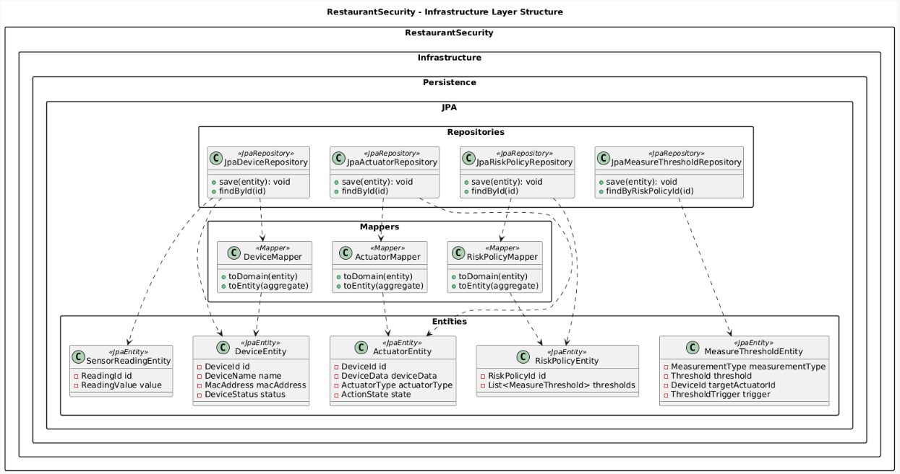

#### 4.2.2.5. Bounded Context Software Architecture Component Level Diagrams

En esta seccion se presenta la imagen de component diagrams del contexto security.
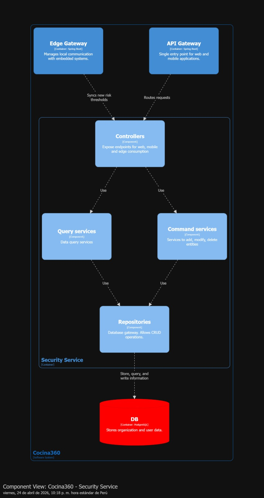

#### 4.2.2.6. Bounded Context Software Architecture Code Level Diagrams

##### 4.2.2.6.1. Bounded Context Domain Layer Class Diagrams

En esta seccion se presenta la imagen de domain class diagrams del contexto security.

##### 4.2.2.6.2. Bounded Context Database Design Diagram

En esta seccion se presenta la imagen de database diagram del contexto security.
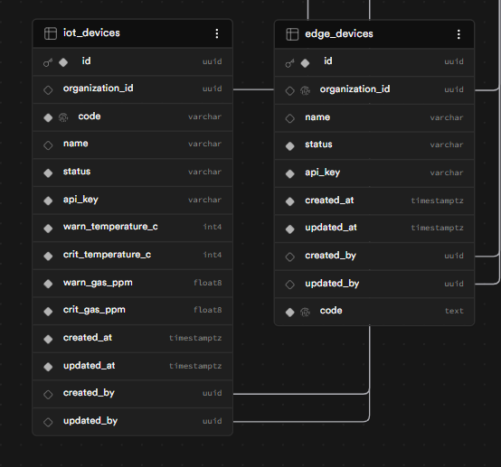

### 4.2.3. Bounded Context: Intern Control

#### 4.2.3.1. Domain Layer

En esta seccion se presenta la imagen de domain layer del contexto intern_control.
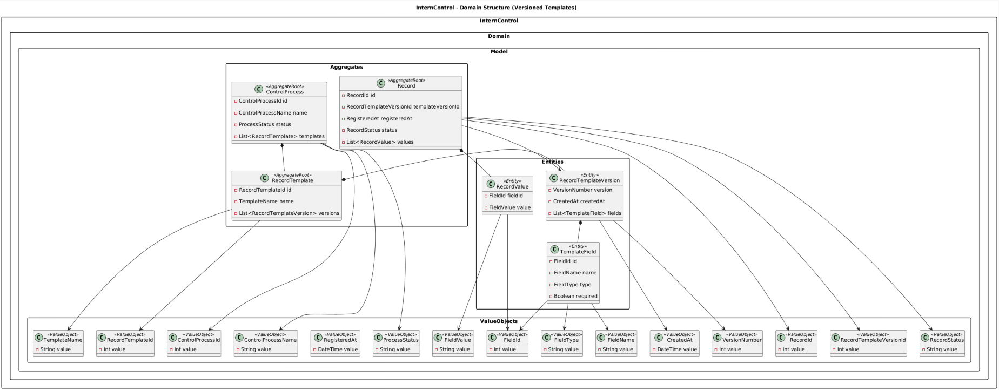

#### 4.2.3.2. Interface Layer

En esta seccion se presenta la imagen de interface layer del contexto intern_control.
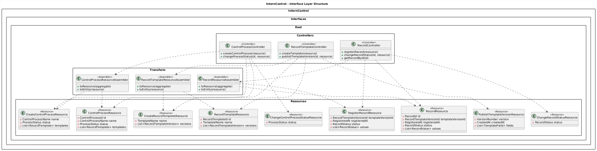

#### 4.2.3.3. Application Layer

En esta seccion se presenta la imagen de application layer del contexto intern_control.

#### 4.2.3.4. Infrastructure Layer

En esta seccion se presenta la imagen de infrastructure layer del contexto intern_control.
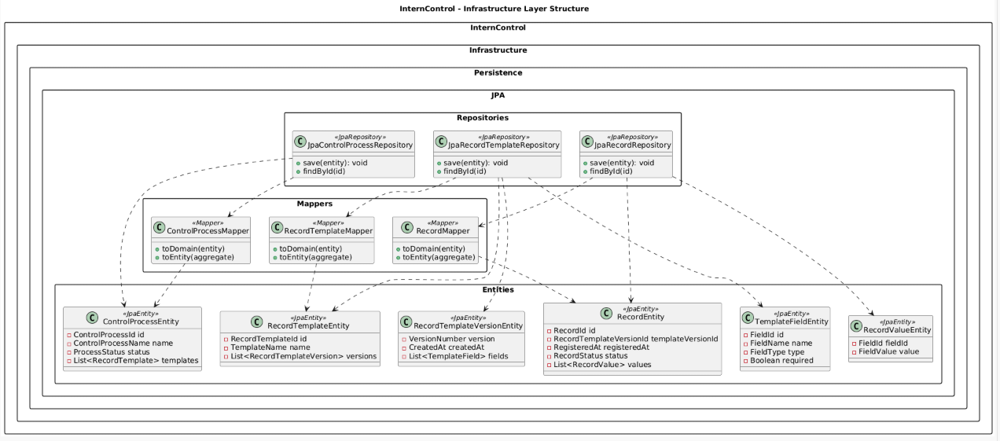

#### 4.2.3.5. Bounded Context Software Architecture Component Level Diagrams

En esta seccion se presenta la imagen de component diagrams del contexto intern_control.
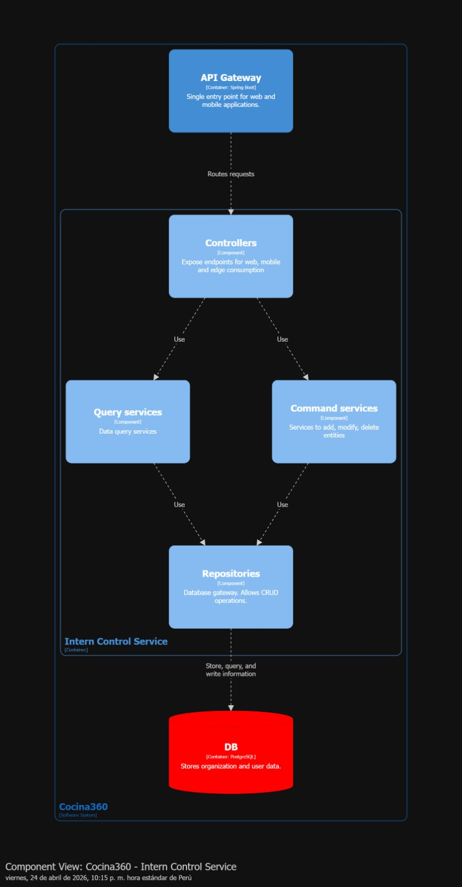

#### 4.2.3.6. Bounded Context Software Architecture Code Level Diagrams

##### 4.2.3.6.1. Bounded Context Domain Layer Class Diagrams

En esta seccion se presenta la imagen de domain layer del contexto intern_control.

##### 4.2.3.6.2. Bounded Context Database Design Diagram

En esta seccion se presenta la imagen de database diagram del contexto restaurant.
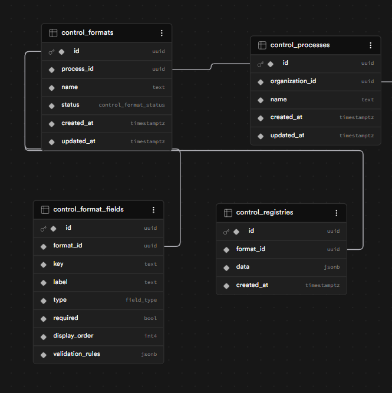

# Referencias Bibliográficas

- COPEME. (2023). ¿Cuál es el perfil actual del emprendedor peruano joven? [Entrada de blog]. https://copeme.org.pe/Blog/cual-es-el-perfil-actual-del-emprendedor-peruano-joven/
- Fitflow. (s. f.). Nosotros. Recuperado el 16 de abril de 2026, de https://fitflow.com/nosotros/
- Gibson, K. (2023, 24 de octubre). What is risk management & why is it important? Harvard Business School Online. https://online.hbs.edu/blog/post/risk-management
- Gothelf, J., & Seiden, J. (2021). Lean UX: Designing Great Products with Agile Teams (3rd ed.). O'Reilly Media.
- Grupo 3S. (s. f.). GRUPO 3S PERU - Asesoría y Servicios Protección contra Incendios. Recuperado el 16 de abril de 2026, de https://grupo3s.pe/
- Instituto Nacional de Estadística e Informática. (2024). Perú: Estructura Empresarial, 2024. https://www.inei.gob.pe/media/MenuRecursivo/publicaciones_digitales/Est/Lib2045/libro.pdf
- Johnson Controls. (s. f.). Fire detection. Recuperado el 16 de abril de 2026, de https://www.johnsoncontrols.com/fire-detection
- Ministerio de la Producción. (2025). Análisis sectorial: Desempeño e importancia del sector restaurantes y afines en la economía nacional 2019 - 2024. Producempresarial. https://www.producempresarial.pe/wp-content/uploads/2025/02/234-Sector-restaurantes-y-afines-2024.pdf
- Instituto Nacional de Estadística e Informática. (2026). Perú: Comportamiento de los indicadores del mercado laboral a nivel nacional y en 27 ciudades: Enero-Diciembre 2025 | Cuarto trimestre 2025 (Informe Técnico). https://cdn.www.gob.pe/uploads/document/file/9450232/7739601-peru-comportamiento-de-los-indicadores-del-mercado-laboral-a-nivel-nacional-y-27-ciudades-cuarto-trimestre-2025.pdf
- Ministerio de la Producción. (2025). Análisis sectorial: Desempeño e importancia del sector restaurantes y afines en la economía nacional (2019-2024). Oficina General de Evaluación de Impacto y Estudios Económicos.
- Movistar Empresas. (2025). 65% de pymes planea integrar Inteligencia Artificial para fortalecer sus operaciones. https://www.movistar.com.pe/65-de-pymes-planea-integrar-inteligencia-artificial-para-fortalecer-sus-operaciones
- Programa de las Naciones Unidas para el Desarrollo. (2025). Perú: Datos sobre desarrollo humano. Human Development Report Data Center. https://hdr.undp.org/data-center/specific-country-data#/countries/PER
- World Bank. (2025). World Development Indicators: Interactive data portal. World Bank Open Data. https://datos.bancomundial.org/

