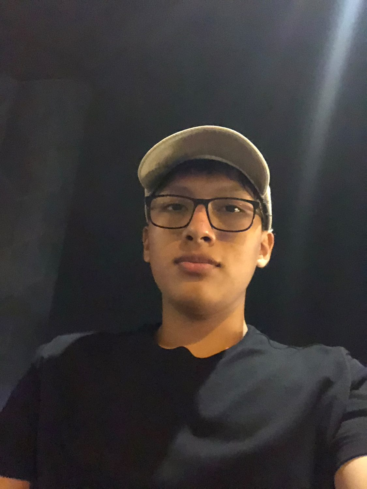
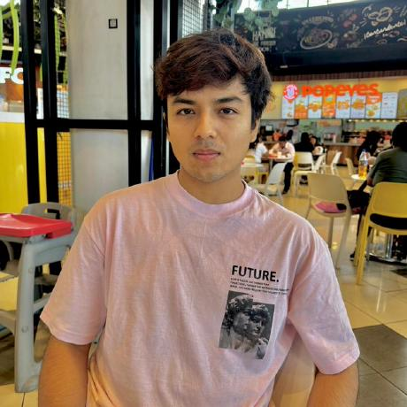

Se presenta en formato de tabla una breve descripción de cada uno de los integrantes del equipo.

<table>
    <thead>
        <tr>
            <th scope="col">Fotografía</th>
            <th scope="col">Nombres y Apellidos</th>
            <th scope="col">Código de estudiante</th>
            <th scope="col">Carrera</th>
            <th scope="col">Principales habilidades técnicas</th>
        </tr>
    </thead>
    <tbody>
        <!--Integrante 1-->
        <tr>
            <td></td>
            <td>Kevin Jorge Chi Cruzatt</td>
            <td>202313665</td>
            <td>Ingeniería de Software</td>
            <td>
                Diseño de arquitectura de software 
                Programación en Java 
                Programación en PHP 
            </td>
        </tr>
        <!--Integrante 2-->
        <tr>
            <td></td>
            <td>Nelson Fabrizio Guerrero Tomas</td>
            <td>202222745</td>
            <td>Ingeniería de Software</td>
            <td>
                Arquitectura de software 
                Desarrollo en flutter 
                Patrones de software 
            </td>
        </tr>
        <!--Integrante 3-->
        <tr>
            <td></td>
            <td>Fabrizio Amir León Vivas</td>
            <td>20211b994</td>
            <td>Ingeniería de Software</td>
            <td>
                Programación low code 
                Uso de sistemas de gestión 
                Dominio en framework Scrum 
            </td>
        </tr>
        <!--Integrante 4-->
        <tr>
            <td></td>
            <td>Álvaro Joaquín Orozco Torres</td>
            <td>202220783</td>
            <td>Ingeniería de Software</td>
            <td>
                Dominio en framework Scrum 
                DevOps 
                Gestión de bases de datos 
            </td>
        </tr>
        <!--Integrante 5-->
        <tr>
            <td></td>
            <td>Henry Paolo Reaño Delgadillo</td>
            <td>20221e247</td>
            <td>Ingeniería de Software</td>
            <td>
                Programación Java SpringBoot 
                Programación C# 
                Diseño de arquitectura de software 
            </td>
        </tr>
    </tbody>
</table>