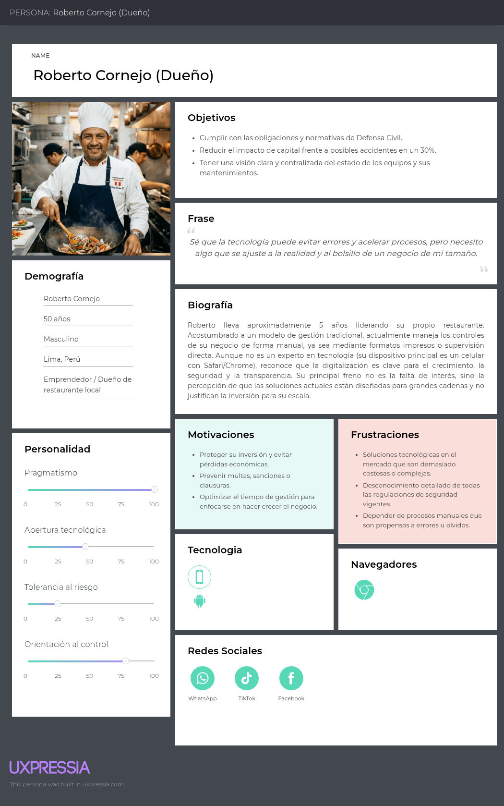
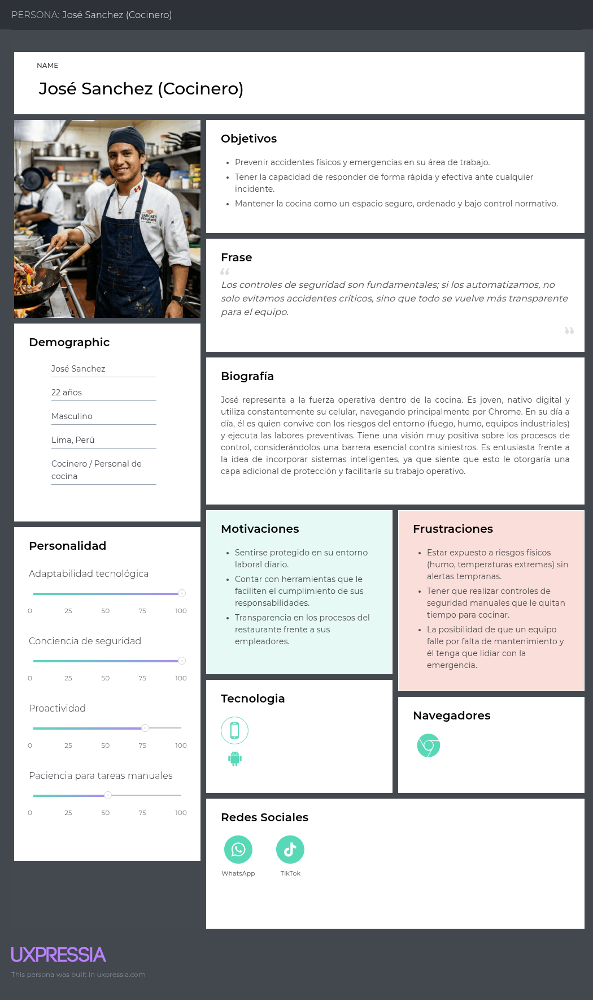

A continuación, presentamos los arquetipos de usuario (perfiles ficticios) creados a partir de los segmentos que investigamos y entrevistamos. Cada perfil detalla aspectos clave como demografía, personalidad, motivaciones, metas, obstáculos y hábitos, así como su experiencia con productos afines. Toda esta información fue extraída de entrevistas reales y estructurada mediante la plataforma UXPressia.

**DUEÑO DE RESTAURANTE / ROBERTO CORNEJO**

**COCINERO / JOSÉ SANCHEZ**

