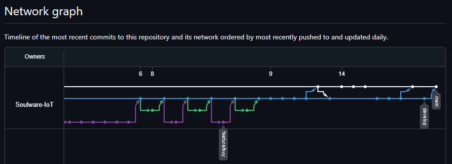
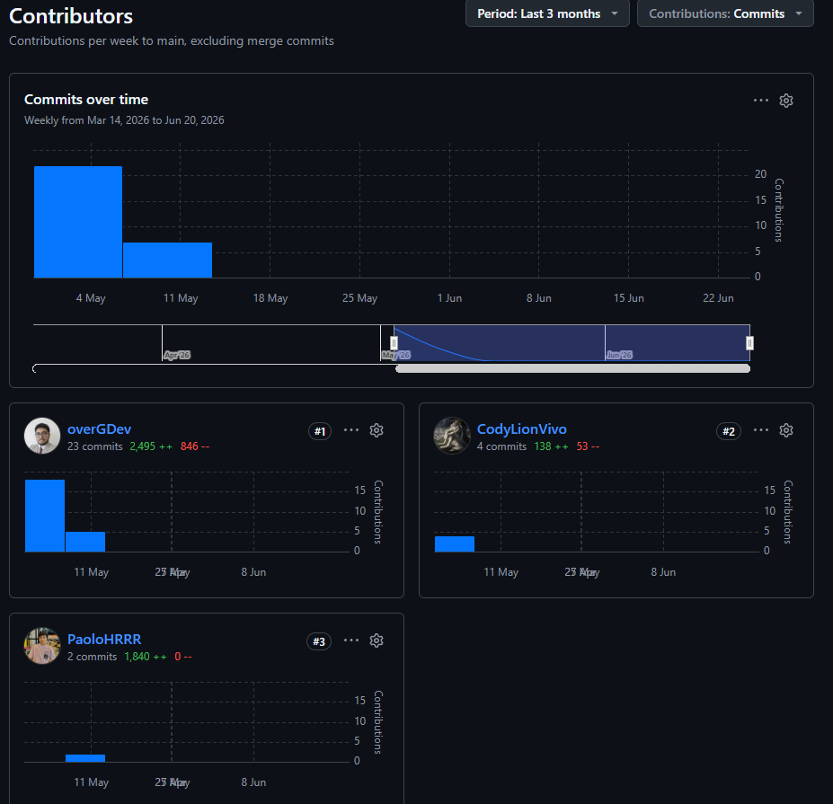

En el Sprint 1, se dividieron las tareas según las funcionalidades del sistema y se asignaron a los integrantes del equipo considerando sus competencias y experiencia. Esta estrategia facilitó una distribución más eficiente del trabajo y contribuyó a un progreso más ágil en el desarrollo.

**Landing Page**

