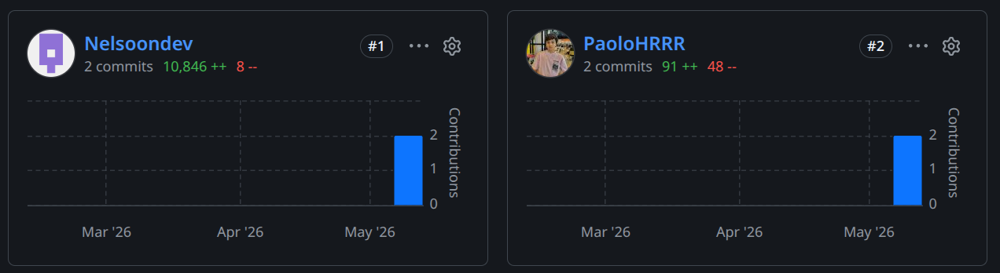
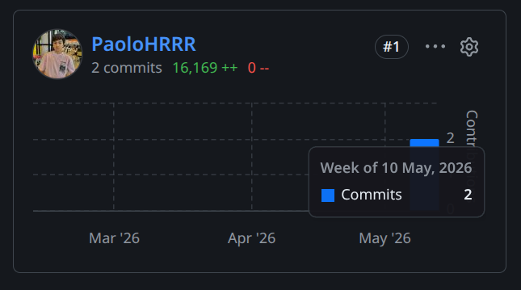
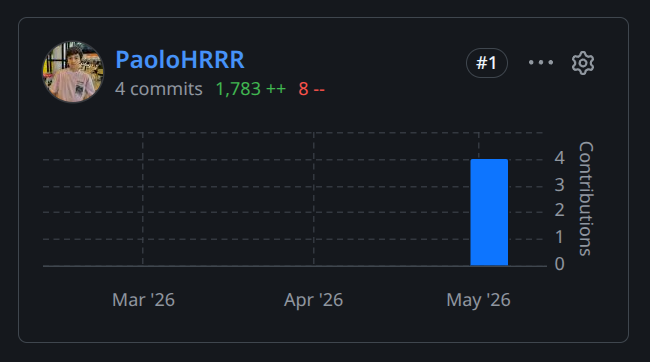
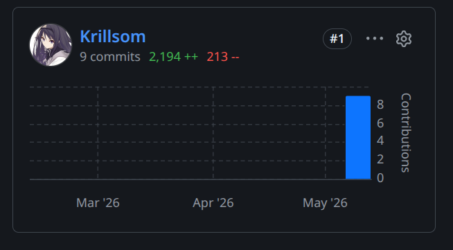

En esta sección se presentan los insights de colaboración y trabajo del equipo durante el Sprint 1, extraídos de las métricas de contribución en los diferentes repositorios de la organización Soulware-IoT.

**API Gateway**

**Front-end (SPA)**

**Internal Control**

**Landing Page**

**Restaurant**

