En el Sprint 2, se dividieron las tareas según las funcionalidades del sistema y se asignaron a los integrantes del equipo considerando sus competencias y experiencia. Esta estrategia facilitó una distribución más eficiente del trabajo y contribuyó a un progreso más ágil en el desarrollo.

**API Gateway**

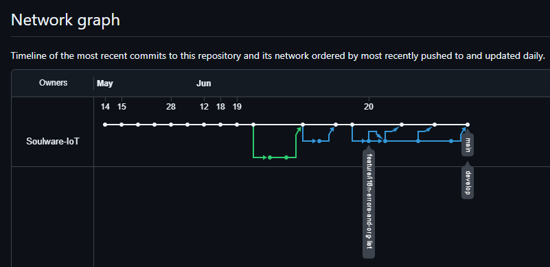

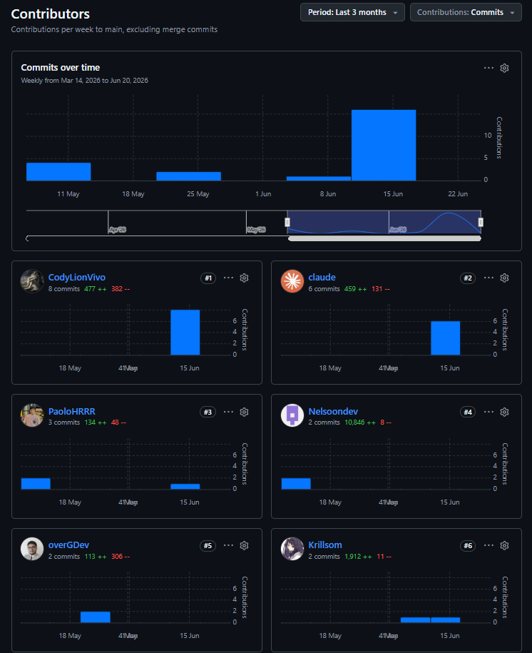

**Backend**

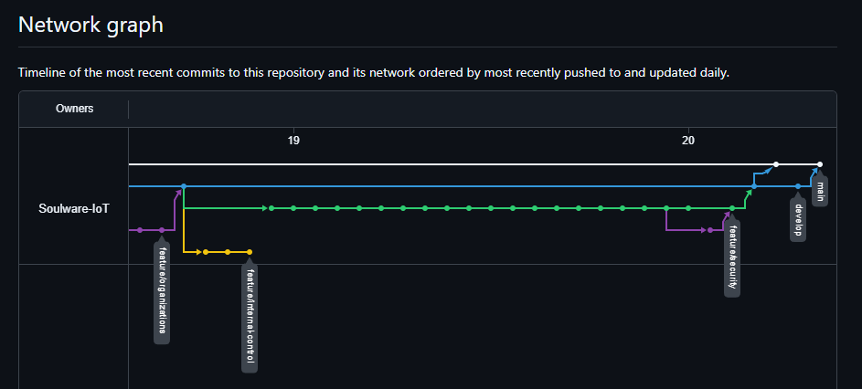

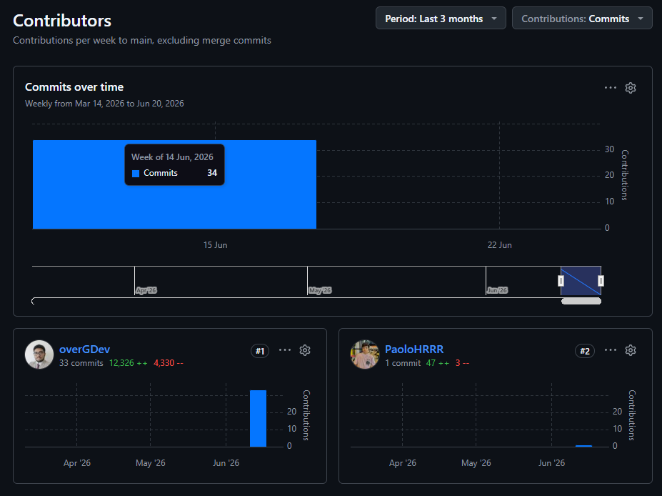

**Aplicación Mobile**

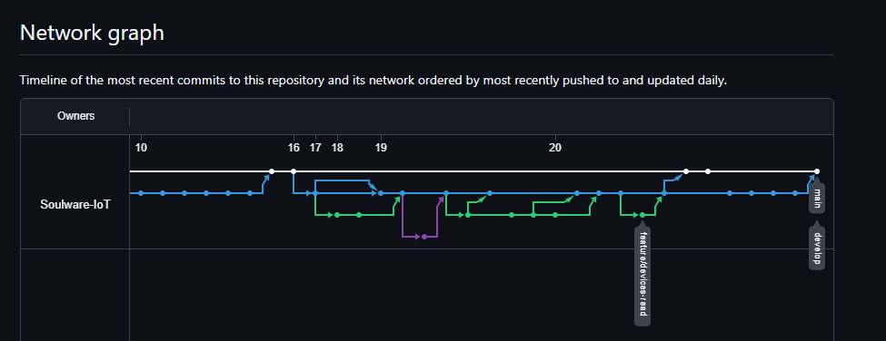

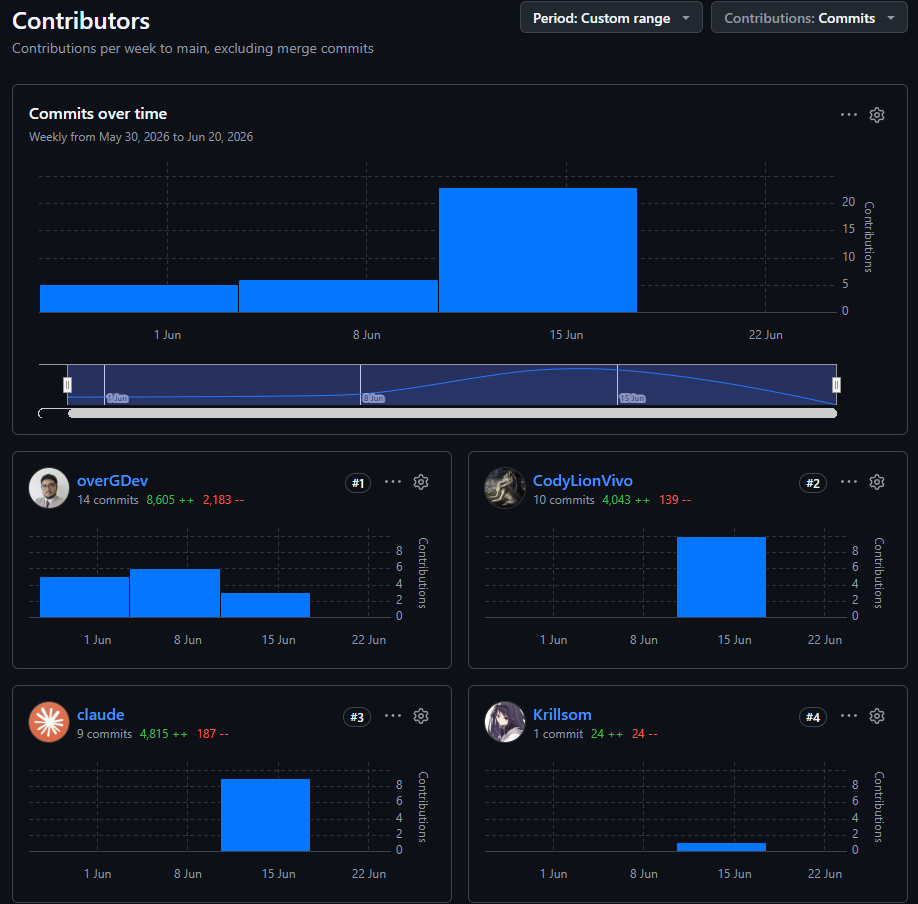

**Aplicación Edge y Edge Gateway**

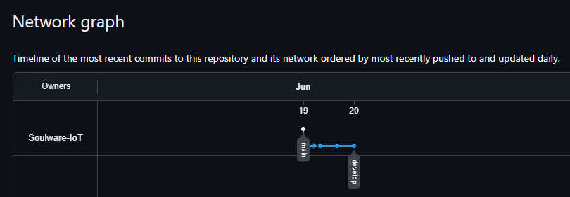

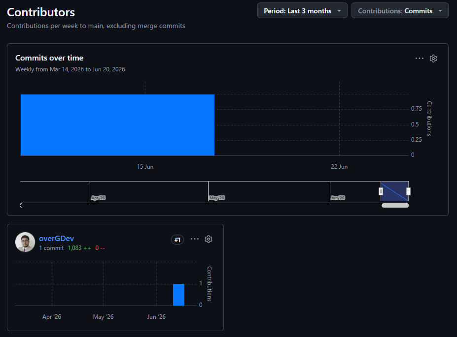

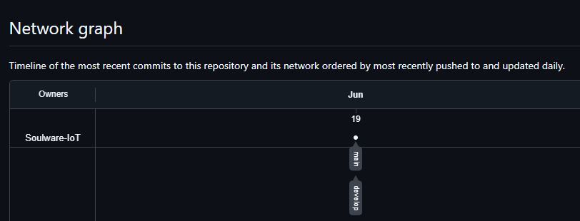

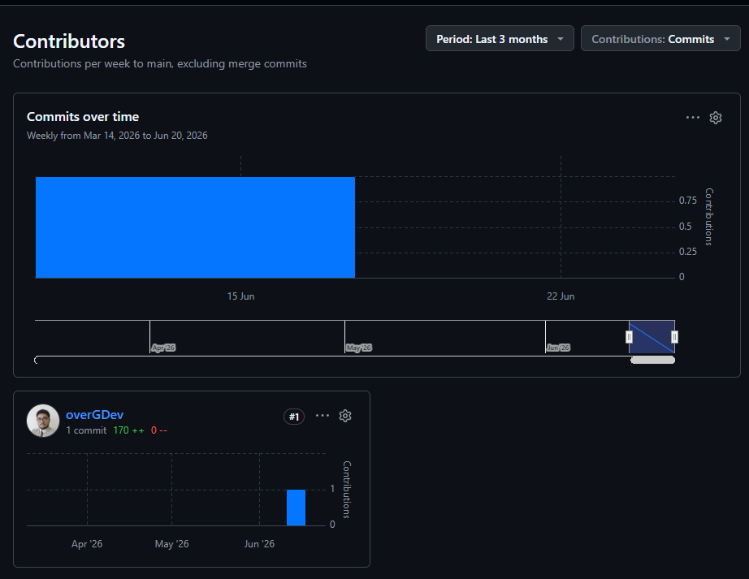

**Sistema Embebido (IoT Device)**

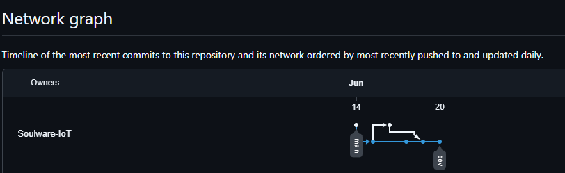

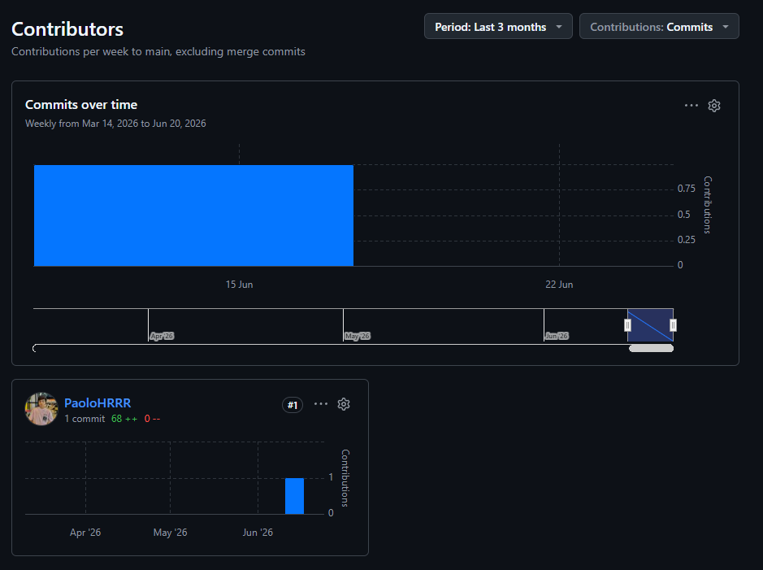
