En esta sección se presenta la evidencia del despliegue de los servicios desarrollados durante el Sprint 2.

**API Gateway**

El API Gateway fue desplegado como servicio en Railway, actuando como punto de entrada unificado para todos los bounded contexts del backend.

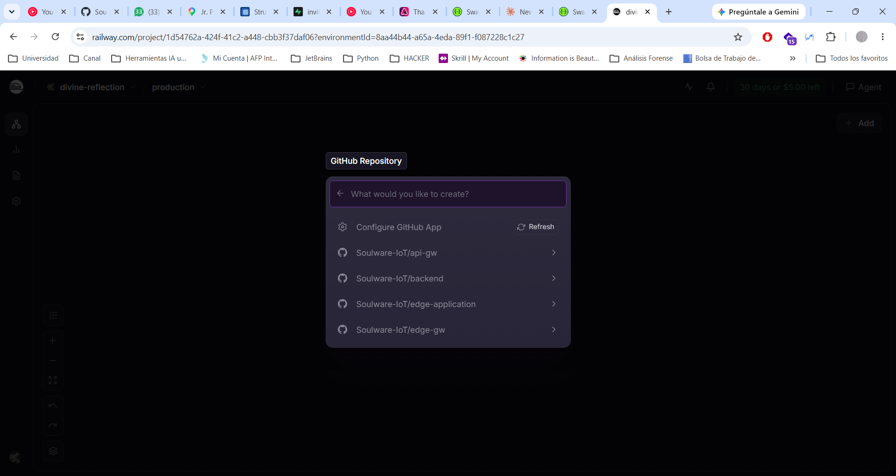
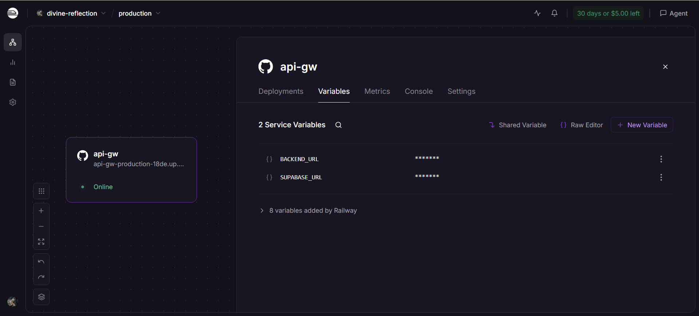

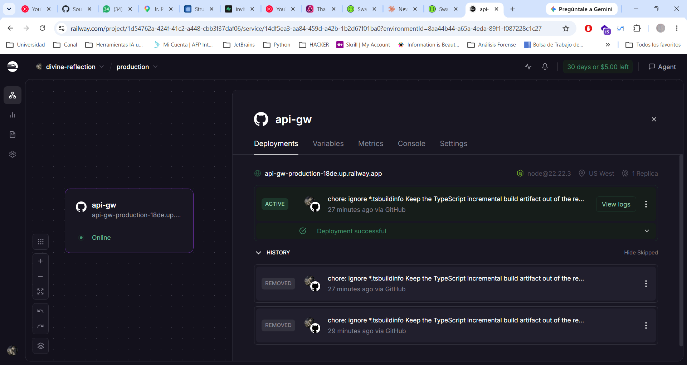

**Backend**

El backend fue desplegado en Railway, exponiendo los servicios RESTful de los bounded contexts desarrollados en el sprint.

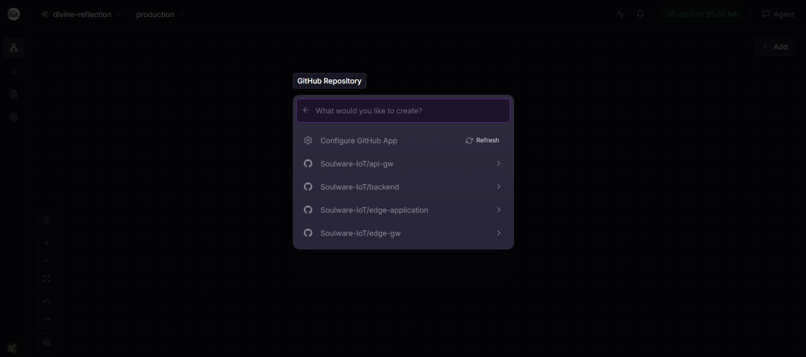
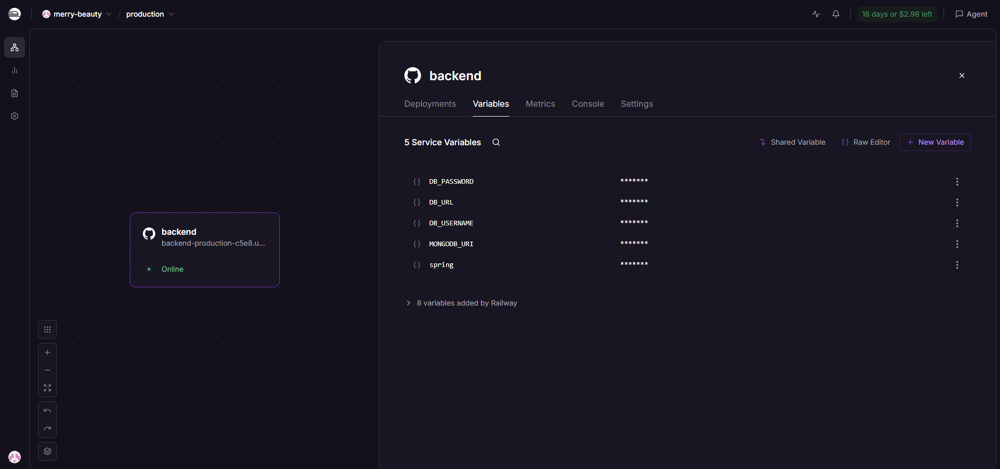
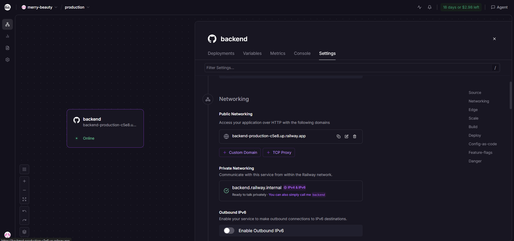
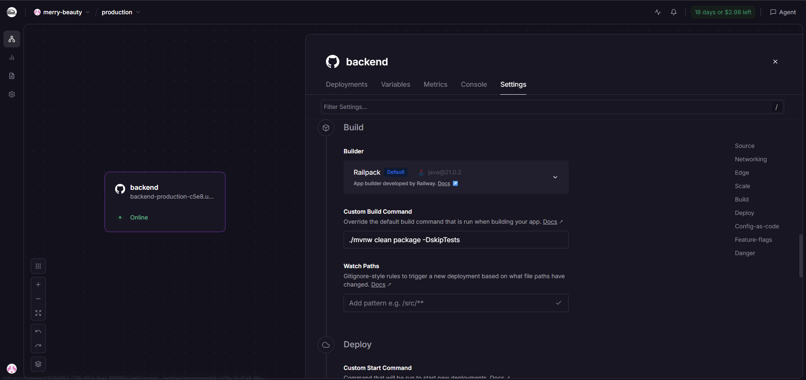
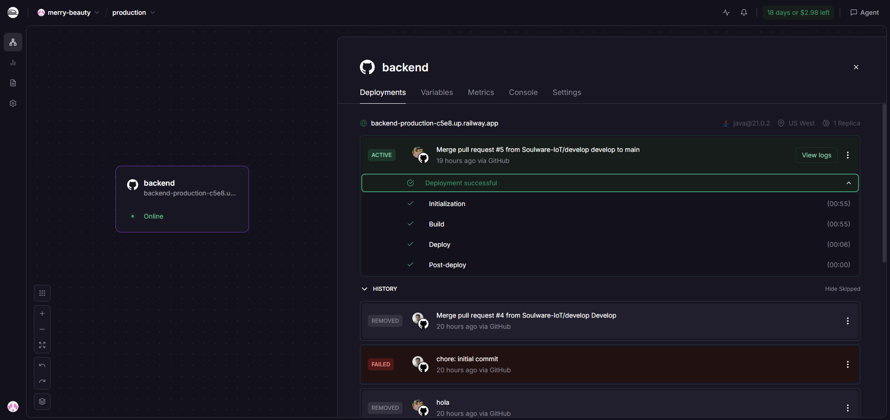

**Web Application**

La aplicación web fue desplegada y validada en su entorno de producción durante este sprint.

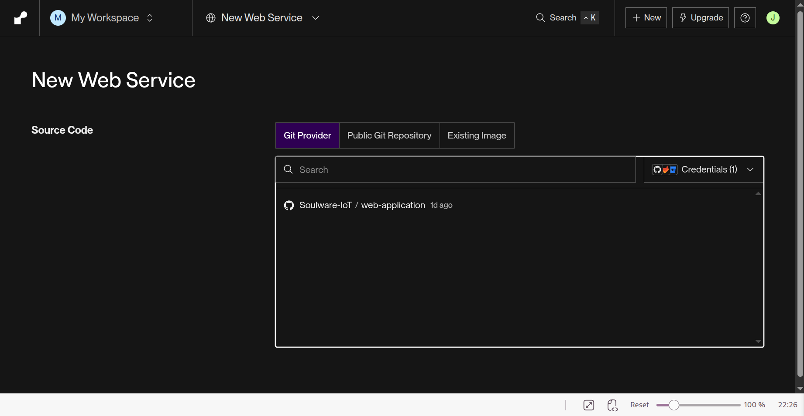
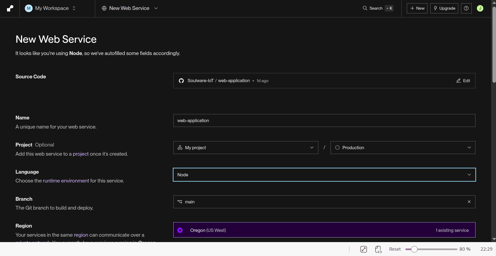
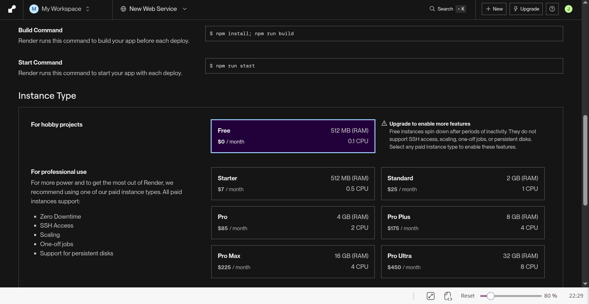
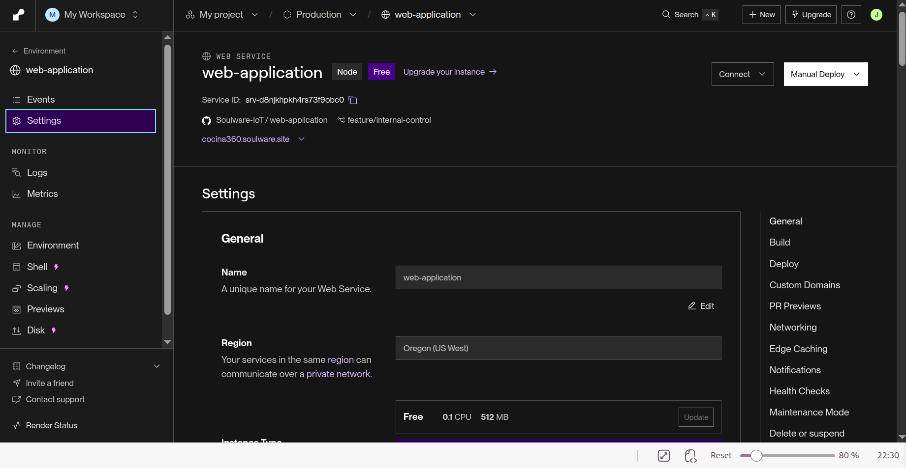
