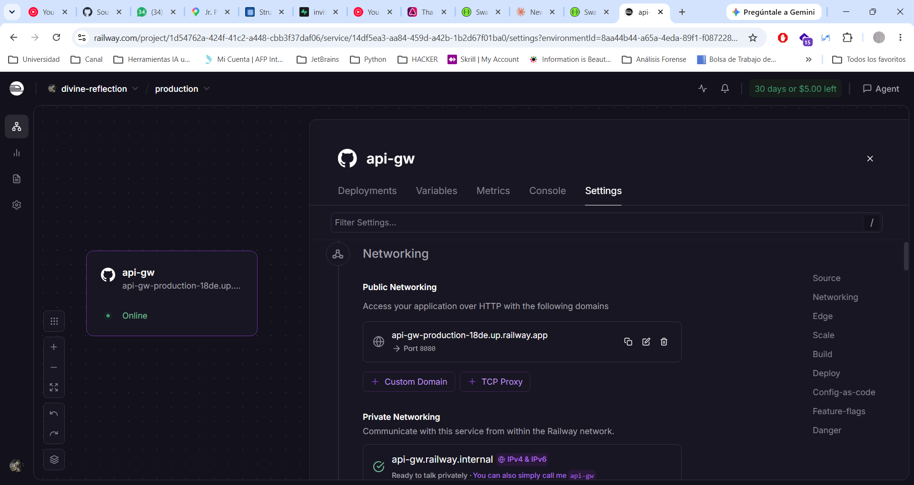
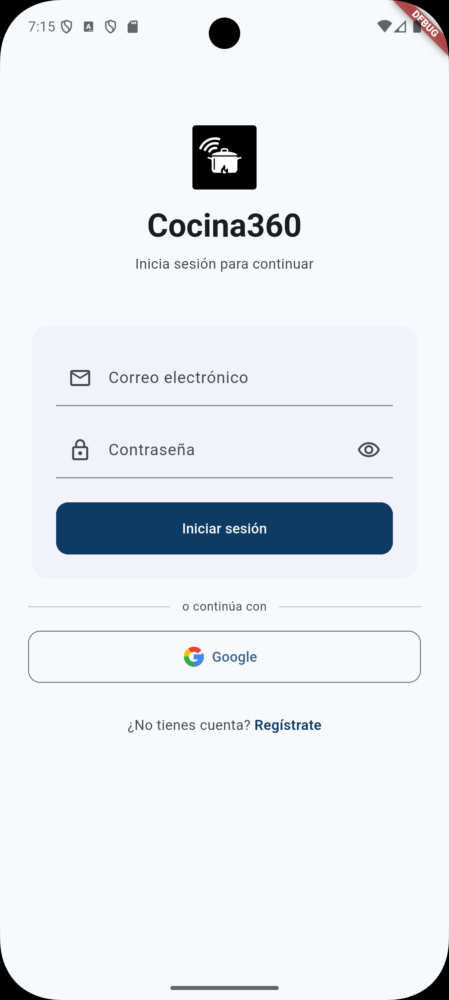
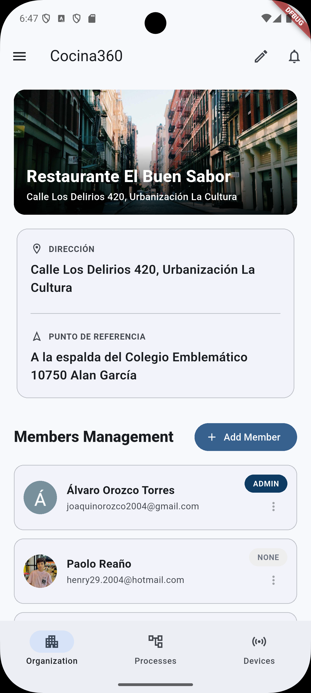
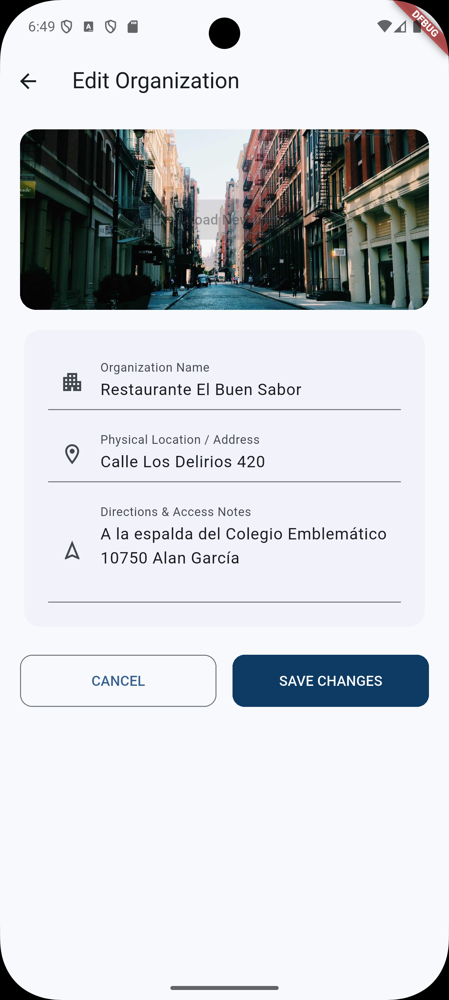
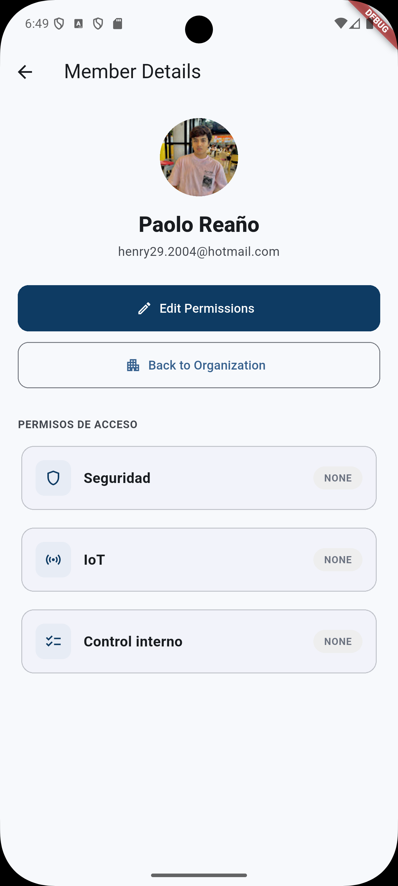
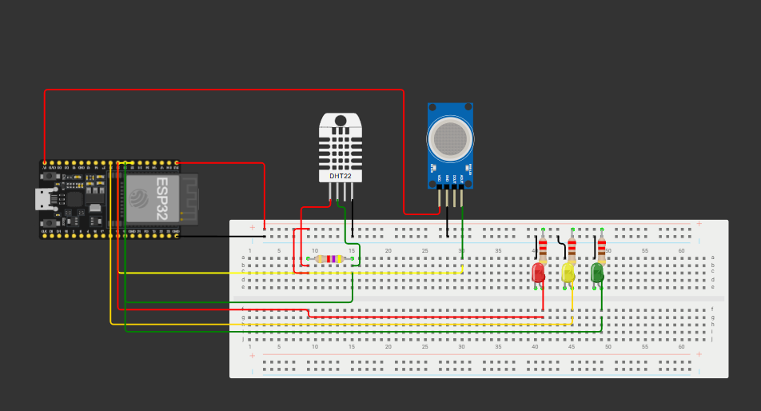
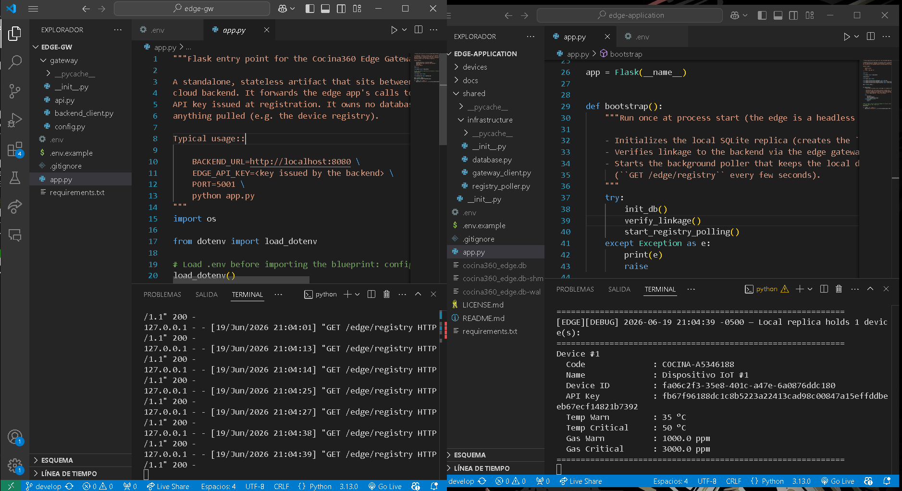
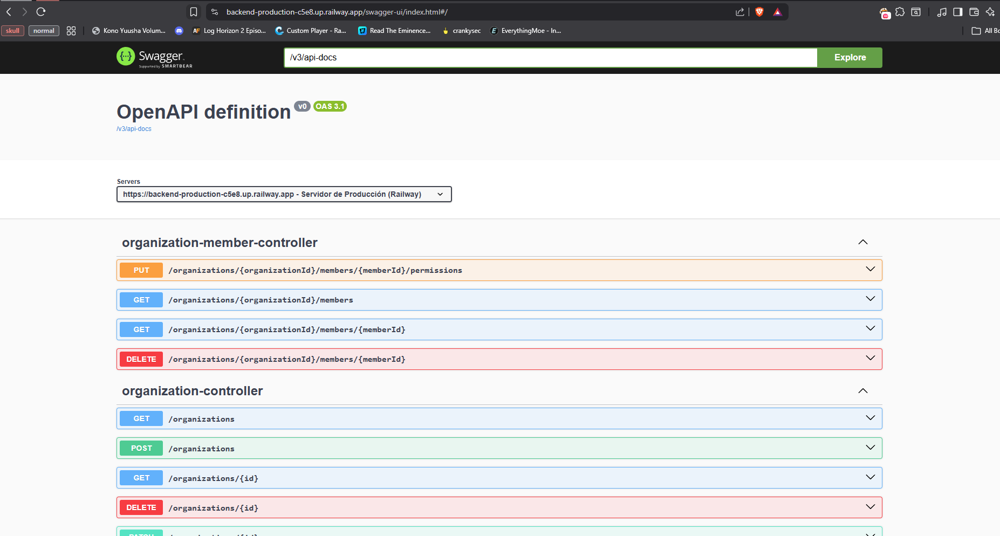

En este Sprint 2, se ha desarrollado y desplegado la capa de infraestructura IoT y los servicios centrales de la solución Cocina360, abarcando desde el dispositivo embebido hasta el gateway, la aplicación edge, la aplicación mobile y el backend.

**API Gateway**

Se implementó el API Gateway como punto de entrada unificado para todos los servicios del backend, gestionando el enrutamiento de peticiones, autenticación y control de acceso entre clientes y microservicios.

+ **Evidencia:**

**Aplicación Mobile**

Se desarrolló la primera versión funcional de la aplicación mobile de Cocina360, permitiendo a los usuarios monitorear en tiempo real los sensores IoT y recibir alertas desde sus dispositivos.

+ **Evidencia:**

**Sistema Embebido (IoT Device)**

Se desarrolló el firmware del dispositivo IoT, incluyendo la captura de datos de sensores y el envío de telemetría hacia el edge gateway mediante protocolos de comunicación adecuados para entornos embebidos.

+ **Evidencia:**

**Aplicación Edge y Edge Gateway**

Se implementaron la aplicación edge y el edge gateway. La aplicación edge preprocesa y normaliza los datos capturados por los dispositivos IoT, mientras que el edge gateway ghace un forward al backend, reenviando las lecturas ya filtradas. Ambos componentes se encuentran actualmente en ejecución local y no han sido desplegados en un entorno cloud.

+ **Evidencia:**

**Backend**

Se extendió la API REST de Cocina360 con nuevos bounded contexts para la gestión de sensores, alertas y telemetría IoT, integrando los datos provenientes del edge gateway.

+ **Evidencia:**

