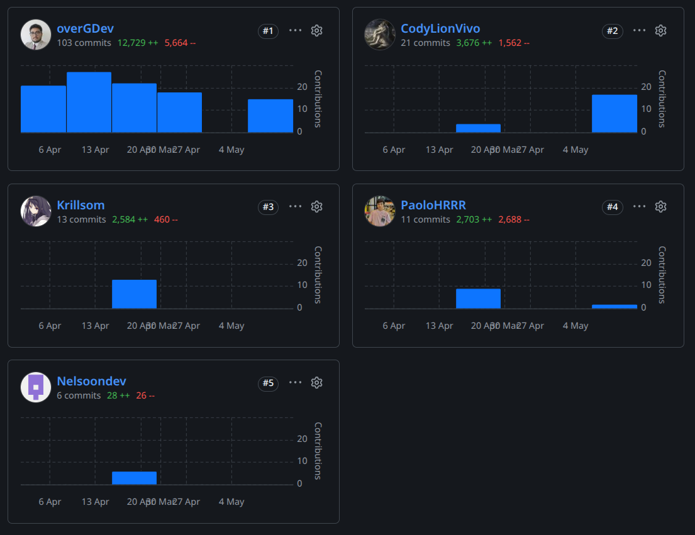
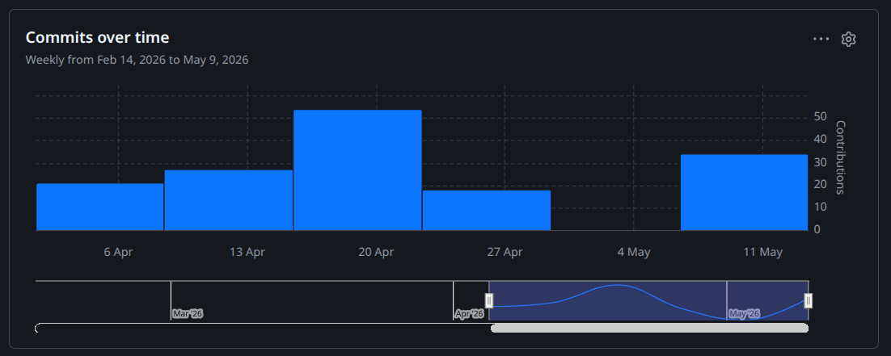

Enlace de acceso al repositorio del informe del proyecto: [https://github.com/Soulware-IoT/report](https://github.com/Soulware-IoT/report)

**AV1**

Para esta entrega del AV1, la división fue principalmente en torno a los grandes bloques de contenido en los capítulos. El capítulo II estuvo a cargo de Nelson y Fabrizio, el capítulo IV a cargo de Henry y Kevin y el resto a cargo de Álvaro.

**COLABORACIÓN**

**COMMITS**

**TB1**

Para esta entrega del TB1, la división fue principalmente según disponibilidad. Los compañeros ocupados con tasks de programción no documentaron en el informe.

**COLABORACIÓN**

**COMMITS**

